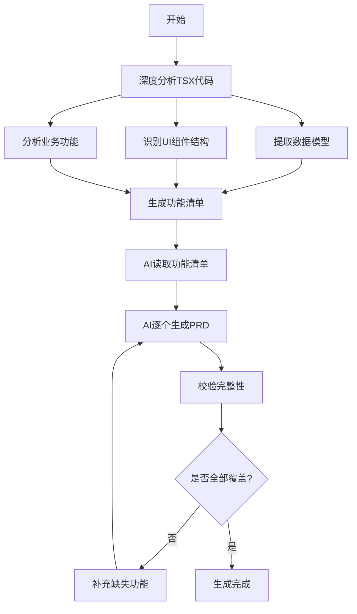
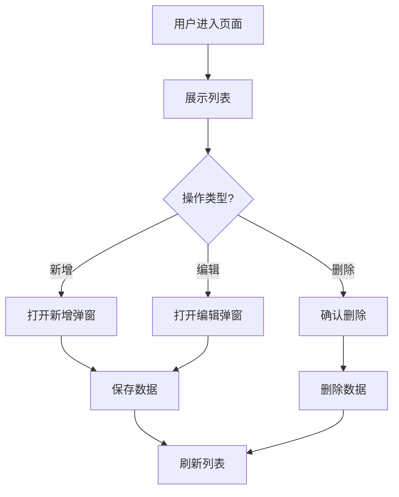

name: "prd-generator"
description: "智能分析项目代码，提取完整功能清单，由AI基于清单生成详细PRD文档。Invoke when user needs to generate PRD documentation for project features."

---

# PRD智能生成器 v2.0

## 功能描述

本技能采用**"深度代码分析 + AI生成"**的双阶段模式：

1. **第一阶段**：JS脚本**深度分析**项目 TSX 代码，生成完整的**模块功能清单**
   - 自动识别 TypeScript 接口定义
   - 提取 useState 状态管理
   - 分析表格、表单、弹窗等 UI 结构
   - 识别 CRUD 操作、搜索筛选等业务功能

2. **第二阶段**：AI基于功能清单，为每个模块生成详细的PRD文档
   - 严格按照清单内容生成，不凭空捏造
   - 完美还原代码中的业务功能、交互流程和逻辑规则

3. **第三阶段**：校验生成的PRD是否覆盖清单中的所有功能

## 工作流程



## 脚本使用说明

本技能脚本位于 `.trae/skills/prd-generator/` 目录下，支持在任何项目中使用。

### 指定项目路径的三种方式

脚本会按以下优先级确定要分析的项目路径：

#### 方式1：环境变量（优先级最高）
```bash
# Windows PowerShell
$env:PROJECT_ROOT="D:\\Projects\\MyProject"; node .trae/skills/prd-generator/generate-prd.js

# Windows CMD
set PROJECT_ROOT=D:\Projects\MyProject && node .trae/skills/prd-generator/generate-prd.js

# Linux/Mac
PROJECT_ROOT=/path/to/project node .trae/skills/prd-generator/generate-prd.js
```

#### 方式2：命令行参数
```bash
# 使用 --root 或 -r 参数
node .trae/skills/prd-generator/generate-prd.js --root /path/to/project

# 或简写
node .trae/skills/prd-generator/generate-prd.js -r /path/to/project
```

#### 方式3：当前工作目录（默认）
```bash
# 先切换到项目目录
cd /path/to/project

# 然后直接运行脚本（使用当前目录作为项目根目录）
node .trae/skills/prd-generator/generate-prd.js
```

### 脚本命令

```bash
# 生成功能清单（深度分析代码）
node .trae/skills/prd-generator/generate-prd.js --root /path/to/project

# 校验PRD完整性
node .trae/skills/prd-generator/generate-prd.js validate --root /path/to/project

# 显示帮助信息
node .trae/skills/prd-generator/generate-prd.js --help
```

## 第一阶段：深度代码分析

### 分析能力

改进后的分析引擎能够：

1. **提取数据模型**
   - TypeScript 接口定义（interface）
   - useState 状态定义
   - Props 类型定义

2. **识别 UI 组件结构**
   - 表格（table）结构及表头
   - 表单（form）字段及类型
   - 弹窗/对话框（modal/dialog）
   - 卡片（card）布局

3. **分析业务功能**
   - 列表展示功能
   - 新增/编辑表单
   - 删除操作
   - 搜索查询
   - 状态切换
   - 分页功能

4. **提取业务规则**
   - 从代码注释中提取规则
   - 从验证逻辑推断规则

5. **识别异常场景**
   - 错误处理（try-catch）
   - 数据验证
   - 重复校验

### 功能清单格式

生成的功能清单文件：`docs/功能清单.md`

```markdown
# 项目功能清单

## 模块概览

| 序号 | 模块名称 | 英文标识 | 功能数量 | 数据模型 | 状态 |
| :--- | :--- | :--- | :--- | :--- | :--- |
| 1 | 账户管理 | AccountManagement | 5 | 2 | 待生成 |
| 2 | 智能体构建器 | AgentBuilder | 8 | 2 | 待生成 |
| ... | ... | ... | ... | ... | ... |

---

## 模块1：账户管理

### 基本信息
- **模块名称**：账户管理
- **英文标识**：AccountManagement
- **业务描述**：提供组织账号治理功能...
- **核心功能**：成员列表管理、角色权限分配...

### 数据模型

#### 实体：ComponentState
| 字段名 | 类型 | 必填 | 说明 |
| :--- | :--- | :--- | :--- |
| users | array | 否 | 用户列表 |
| searchQuery | string | 否 | 搜索关键词 |
| modalType | string | 否 | 弹窗类型 |

### 功能清单

#### FUNC-001：列表展示
- **功能ID**：FUNC-001
- **功能名称**：列表展示
- **功能类型**：列表展示
- **功能描述**：以表格形式展示组织成员列表
- **列表字段**：身份识别、组织部门、权限角色、访问状态、操作控制
- **分页配置**：每页10条

#### FUNC-002：搜索查询
- **功能ID**：FUNC-002
- **功能名称**：搜索查询
- **功能类型**：搜索筛选
- **功能描述**：支持多字段搜索查询
- **搜索字段**：name、email、dept、role

#### FUNC-003：新增/编辑
- **功能ID**：FUNC-003
- **功能名称**：新增/编辑
- **功能类型**：表单提交
- **功能描述**：创建新记录或编辑现有记录
- **表单字段**：
  - 真实姓名（text，必填）
  - 业务邮箱（email，必填，校验：邮箱格式）
  - 登录密码（password，必填）
  - 系统角色等级（select，选项：SuperAdmin/Developer/Auditor/DevOps）

### 业务规则
1. 邮箱作为唯一登入标识，不可重复
2. 停用状态的账号无法访问系统

### 异常场景
| 异常场景 | 系统行为 |
| :--- | :--- |
| 必填字段为空 | 阻止提交并提示填写必填项 |
| 接口异常 | 捕获异常并显示错误提示 |
```

## 第二阶段：AI生成PRD

### AI生成流程

1. **读取功能清单**
   - AI首先阅读 `docs/功能清单.md`
   - 理解所有模块的功能需求
   - 确认数据模型和业务规则

2. **逐个模块生成PRD**
   - 按照模块顺序，为每个功能生成详细PRD
   - 输出位置：`docs/{模块名}/{模块名}.md`

3. **PRD文档结构要求**

每个PRD文档**必须**包含：

```markdown
# {模块名称} PRD文档

## 1. 功能描述

### 1.1 功能概述
{基于功能清单中的业务描述，详细说明功能价值}

### 1.2 用户价值
{描述该功能为用户带来的价值}

### 1.3 使用场景
{描述典型使用场景}

## 2. 业务功能流程图



## 3. 数据模型

### 3.1 实体定义
| 字段名 | 类型 | 必填 | 说明 | 约束 |
| :--- | :--- | :--- | :--- | :--- |
| {字段1} | {类型} | {是否必填} | {说明} | {约束条件} |

### 3.2 数据关系
{描述实体之间的关系}

## 4. 功能详细说明

### 4.1 {功能1名称}

#### 功能描述
{详细描述该功能的业务逻辑，必须基于功能清单}

#### 交互流程
1. {步骤1}
2. {步骤2}
3. {步骤3}

#### 输入/输出
- **输入**：{输入参数}
- **输出**：{输出结果}

#### 界面元素
- {界面元素1}：{说明}
- {界面元素2}：{说明}

### 4.2 {功能2名称}
...

## 5. 业务规则

1. {规则1 - 基于功能清单中的规则}
2. {规则2}
3. {规则3}

## 6. 异常场景处理

| 异常场景 | 系统行为 | 用户提示 |
| :--- | :--- | :--- |
| {异常1} | {系统如何处理} | {提示信息} |
| {异常2} | {系统如何处理} | {提示信息} |

## 7. 权限控制

| 功能 | SuperAdmin | Developer | Auditor | DevOps |
| :--- | :--- | :--- | :--- | :--- |
| {功能1} | ✅ | ✅ | ❌ | ✅ |
| {功能2} | ✅ | ❌ | ❌ | ✅ |

## 8. 性能要求

- {性能要求1}
- {性能要求2}
```

### ⚠️ AI生成要求（重要）

1. **基于功能清单生成**
   - PRD内容必须**严格基于** `docs/功能清单.md` 生成
   - **不能凭空捏造**功能，所有功能点必须在清单中有对应

2. **完美还原业务功能**
   - 功能交互流程必须与代码逻辑一致
   - 数据模型字段必须与代码定义一致
   - 业务规则必须准确反映代码中的校验逻辑

3. **详细的功能说明**
   - 每个功能必须有详细的交互流程说明
   - 必须包含输入/输出定义
   - 必须描述界面元素和布局

4. **完整的异常处理**
   - 必须覆盖功能清单中的所有异常场景
   - 说明系统行为和用户提示

## 第三阶段：校验完整性

### 校验脚本

运行校验脚本检查PRD完整性：

```bash
# 校验PRD是否完整
node .trae/skills/prd-generator/generate-prd.js validate --root /path/to/project
```

### 校验报告

生成 `docs/PRD校验报告.md`：

```markdown
# PRD完整性校验报告

> 校验时间：2024-01-15 10:30:00

## ✅ 账户管理

- 状态：通过
- PRD文件：存在
- 完整度：100%
  - 功能描述：✓
  - 数据模型：✓
  - 流程图表：✓
  - 功能详细说明：✓
  - 业务规则：✓

## ⚠️ 智能体构建器

- 状态：未通过
- PRD文件：存在但内容不完整
- 完整度：40%
  - 功能描述：✓
  - 数据模型：✗
  - 流程图表：✗
  - 功能详细说明：✗
  - 业务规则：✓

## ❌ 智能体列表

- 状态：未通过
- PRD文件：不存在
- 缺失文件：docs/智能体列表/智能体列表.md

## 校验汇总

| 指标 | 数值 |
| :--- | :--- |
| 总模块数 | 14 |
| 通过 | 12 |
| 未通过 | 2 |
| 通过率 | 86% |

**⚠️ 有 2 个模块未通过校验，请补充生成。**
```

## 完整使用示例

### 示例1：为指定项目生成PRD

```bash
# 1. 为目标项目生成功能清单
node .trae/skills/prd-generator/generate-prd.js --root /path/to/target-project

# 2. AI读取生成的功能清单，逐个模块生成PRD
# （AI操作：基于功能清单生成详细PRD文档）

# 3. 校验PRD完整性
node .trae/skills/prd-generator/generate-prd.js validate --root /path/to/target-project
```

### 示例2：在当前项目中使用

```bash
# 1. 在项目根目录下直接运行
cd /path/to/project
node .trae/skills/prd-generator/generate-prd.js

# 2. AI基于生成的功能清单生成PRD
# （AI操作）

# 3. 校验
node .trae/skills/prd-generator/generate-prd.js validate
```

### 示例3：使用环境变量（CI/CD场景）

```bash
# 在CI/CD流水线中使用
export PROJECT_ROOT=/path/to/project
node .trae/skills/prd-generator/generate-prd.js
node .trae/skills/prd-generator/generate-prd.js validate
```

## 技术实现

### 代码分析引擎

脚本使用 `code-analyzer.js` 模块进行深度代码分析：

```javascript
// 分析组件
const analysis = analyzeComponent(componentName, sourceCode);

// 返回结果包含：
// - 数据模型（接口、useState）
// - 功能列表（表格、表单、弹窗等）
// - 业务规则
// - 异常场景
```

### 分析能力

| 分析项 | 说明 |
| :--- | :--- |
| TypeScript 接口 | 提取 interface 定义的字段和类型 |
| useState 状态 | 识别组件状态及其初始值 |
| 表格结构 | 分析 table 标签和表头 |
| 表单结构 | 提取 input/select/textarea 字段 |
| 弹窗组件 | 识别条件渲染的 modal/dialog |
| 处理函数 | 分析 handleXxx 函数的行为 |
| 预设常量 | 提取 DEPARTMENTS、TEMPLATES 等常量 |

## 注意事项

1. **项目路径**：脚本支持通过环境变量、命令行参数或当前工作目录三种方式指定项目路径

2. **输出目录**：所有生成的文件（功能清单、PRD文档、校验报告）都会保存在指定项目的 `docs/` 目录下

3. **模块识别**：脚本会扫描项目根目录下的 `.tsx` 文件（排除 `index.tsx` 和包含 `Content`/`Template` 的文件）作为功能模块

4. **AI生成要求**：
   - 必须基于功能清单生成PRD
   - 不能凭空捏造功能
   - 必须完美还原代码中的业务逻辑

5. **权限要求**：脚本需要读取项目文件和写入 `docs/` 目录的权限

## 版本历史

### v2.0 (当前版本)
- 新增深度代码分析引擎
- 自动提取 TypeScript 接口和 useState
- 识别表格、表单、弹窗等 UI 结构
- 生成更准确的功能清单

### v1.0
- 基础功能实现
- 硬编码模块配置
- 简单的代码扫描
