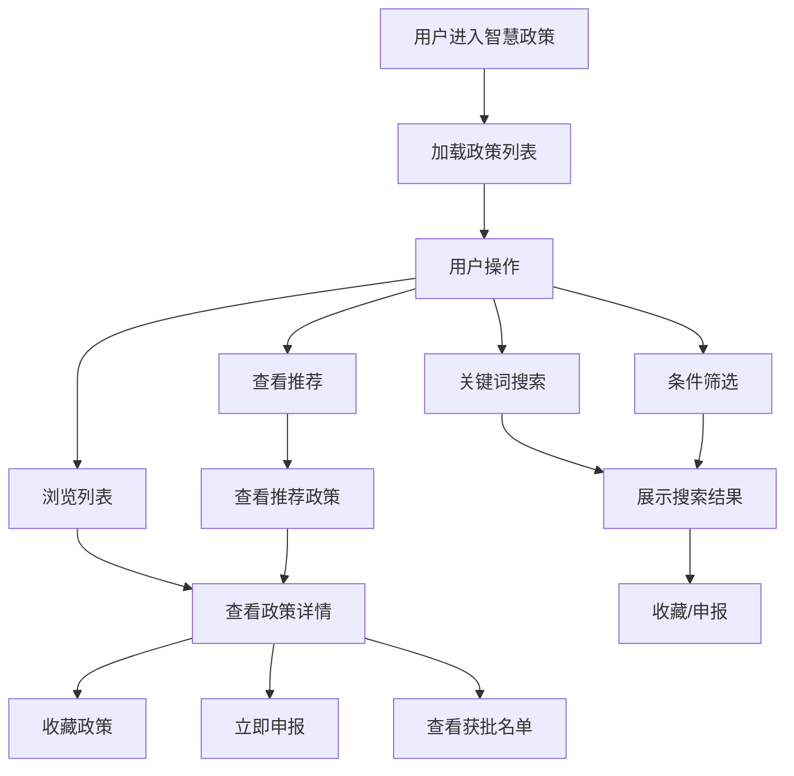

# 智慧政策

> **文档状态**：已完成  
> **最后更新**：2026-03-24  
> **文档作者**：张博  
> **所属模块**：政策中心

---

## 修订记录

| 版本号 | 修订日期 | 修订内容 | 修订人 | 审核人 |
| :--- | :--- | :--- | :--- | :--- |
| v1.0.0 | 2026-03-24 | 初始版本，完成智慧政策基础功能PRD | 张博 | - |
| v1.0.1 | 2026-03-28 | 新增AI语义搜索功能，优化推荐算法 | 张博 | 李明 |
| v1.1.0 | 2026-04-05 | 增加政策获批名单查询，完善申报流程 | 张博 | 王芳 |

---

## 1. 功能描述

智慧政策功能提供政策智能搜索、多维度筛选、AI智能推荐、政策详情查看等功能，帮助企业快速找到匹配的政策信息。

### 1.1 业务背景

企业在发展过程中需要及时了解和申请各类政府扶持政策，但面临政策信息分散、筛选困难、申报流程复杂等问题。智慧政策功能通过智能算法和数据分析，为企业提供精准的政策匹配服务。

### 1.2 业务功能流程图



---

## 2. 列表展示

### 2.1 列表字段

| 字段名称 | 字段说明 | 是否可编辑 | 字段类型 | 说明 |
| :--- | :--- | :--- | :--- | :--- |
| 政策标题 | 政策名称 | 否 | 文本 | 点击可查看详情 |
| 政策类型 | 政策分类 | 否 | 标签 | 如：财税、人才、科技等 |
| 适用地区 | 政策适用地域 | 否 | 文本 | 省市区信息 |
| 适用行业 | 政策适用行业 | 否 | 标签 | 多个行业标签 |
| 发布日期 | 政策发布时间 | 否 | 日期 | YYYY-MM-DD格式 |
| 截止日期 | 政策申报截止 | 否 | 日期 | 已过期的政策标红显示 |
| 匹配度 | 与企业的匹配程度 | 否 | 进度条 | 0-100%的匹配度 |
| 操作 | 操作按钮 | 否 | 按钮组 | 查看、收藏、申报 |

### 2.2 筛选功能

#### 2.2.1 筛选条件

| 筛选条件 | 筛选类型 | 选项说明 |
| :--- | :--- | :--- |
| 政策类型 | 多选 | 财税优惠、人才引进、科技创新、产业扶持、融资支持、其他 |
| 适用地区 | 级联选择 | 省-市-区三级联动 |
| 适用行业 | 多选 | 制造业、服务业、科技、金融、农业等 |
| 发布时间 | 日期范围 | 最近7天、最近30天、最近90天、自定义 |
| 申报状态 | 单选 | 申报中、即将截止、已截止 |
| 匹配程度 | 单选 | 高匹配(>80%)、中匹配(50-80%)、低匹配(<50%) |

#### 2.2.2 筛选规则

| 规则编号 | 规则名称 | 规则描述 |
| :--- | :--- | :--- |
| BR-001 | 多选逻辑 | 同条件多选为"或"关系，不同条件为"与"关系 |
| BR-002 | 筛选记忆 | 筛选条件保存在URL参数，刷新后保持 |
| BR-003 | 结果计数 | 实时显示筛选后的结果数量 |
| BR-004 | 快速清除 | 提供"清除全部"按钮一键重置筛选 |

---

## 3. 搜索功能

### 3.1 搜索方式

| 搜索方式 | 说明 | 适用场景 |
| :--- | :--- | :--- |
| 关键词搜索 | 输入关键词模糊匹配政策标题、内容 | 明确知道政策名称或关键词 |
| AI语义搜索 | 自然语言描述需求，AI匹配政策 | 不确定具体政策名称 |
| 高级搜索 | 组合多个条件进行精确搜索 | 需要精确筛选 |

### 3.2 搜索字段

| 字段名称 | 是否必填 | 字段类型 | 说明 |
| :--- | :--- | :--- | :--- |
| 搜索关键词 | 是 | 文本输入 | 支持模糊搜索 |
| 搜索范围 | 否 | 单选 | 标题、内容、全文 |

### 3.3 AI语义搜索

#### 3.3.1 功能说明
用户可以用自然语言描述企业情况和需求，AI自动分析并推荐匹配的政策。

#### 3.3.2 示例输入
- "我们是一家科技型中小企业，想要申请研发补贴"
- "高新技术企业有什么税收优惠政策"
- "刚成立的公司有哪些扶持政策"

#### 3.3.3 AI处理流程
```
1. 接收用户自然语言输入
2. 提取关键信息（企业类型、行业、需求）
3. 分析政策库匹配度
4. 返回匹配的政策列表及推荐理由
```

---

## 4. 政策详情

### 4.1 详情内容

| 内容区块 | 说明 | 展示方式 |
| :--- | :--- | :--- |
| 政策标题 | 政策完整名称 | 页面标题 |
| 政策文号 | 政策文件编号 | 文本展示 |
| 发布机构 | 发布政策的政府部门 | 文本展示 |
| 发布时间 | 政策发布日期 | 日期展示 |
| 有效期限 | 政策有效期 | 日期范围 |
| 适用对象 | 政策适用企业类型 | 标签展示 |
| 政策内容 | 政策详细内容 | 富文本/HTML |
| 申报条件 | 申请政策的条件要求 | 列表展示 |
| 申报材料 | 需要提交的材料清单 | 列表+下载 |
| 申报流程 | 申请步骤说明 | 流程图/步骤 |
| 联系方式 | 咨询联系电话/地址 | 文本展示 |

### 4.2 详情操作

| 操作名称 | 操作说明 | 触发条件 |
| :--- | :--- | :--- |
| 收藏政策 | 将政策加入收藏 | 点击收藏按钮 |
| 立即申报 | 进入申报流程 | 点击申报按钮 |
| 查看获批 | 查看已获批企业名单 | 点击获批名单按钮 |
| 分享政策 | 分享政策链接 | 点击分享按钮 |
| 打印政策 | 打印政策内容 | 点击打印按钮 |

---

## 5. 智能推荐

### 5.1 推荐逻辑

| 推荐维度 | 权重 | 说明 |
| :--- | :--- | :--- |
| 企业行业匹配 | 30% | 政策适用行业与企业行业匹配度 |
| 企业规模匹配 | 20% | 政策适用规模与企业规模匹配度 |
| 地区匹配 | 20% | 政策适用地区与企业注册地匹配度 |
| 资质匹配 | 20% | 政策要求资质与企业持有资质匹配度 |
| 时间紧迫度 | 10% | 政策截止日期的紧迫程度 |

### 5.2 推荐展示

| 字段名称 | 说明 |
| :--- | :--- |
| 政策标题 | 推荐政策名称 |
| 匹配度分数 | 显示匹配百分比 |
| 推荐理由 | AI生成的推荐理由 |
| 截止日期 | 申报截止日期倒计时 |
| 操作按钮 | 查看详情、立即申报 |

---

## 6. 数据模型

### 6.1 政策实体

```typescript
interface Policy {
  id: string;                    // 政策ID
  title: string;                 // 政策标题
  documentNo: string;            // 政策文号
  type: string;                  // 政策类型
  publishOrg: string;            // 发布机构
  publishDate: string;           // 发布日期
  effectiveDate: string;         // 生效日期
  expiryDate: string;            // 截止日期
  region: string[];              // 适用地区
  industry: string[];            // 适用行业
  enterpriseType: string[];      // 适用企业类型
  content: string;               // 政策内容
  conditions: string[];          // 申报条件
  materials: Material[];         // 申报材料
  process: ProcessStep[];        // 申报流程
  contact: ContactInfo;          // 联系方式
  matchScore?: number;           // 匹配度分数
  isFavorite?: boolean;          // 是否已收藏
}

interface Material {
  name: string;                  // 材料名称
  templateUrl?: string;          // 模板下载链接
  required: boolean;             // 是否必填
}

interface ProcessStep {
  order: number;                 // 步骤序号
  title: string;                 // 步骤标题
  description: string;           // 步骤描述
}

interface ContactInfo {
  phone?: string;                // 联系电话
  email?: string;                // 联系邮箱
  address?: string;              // 办公地址
  website?: string;              // 官方网站
}
```

### 6.2 搜索参数

```typescript
interface PolicySearchParams {
  keyword?: string;              // 搜索关键词
  types?: string[];              // 政策类型
  regions?: string[];            // 适用地区
  industries?: string[];         // 适用行业
  dateRange?: [string, string];  // 发布时间范围
  status?: string;               // 申报状态
  matchLevel?: string;           // 匹配程度
  pageNum?: number;              // 页码
  pageSize?: number;             // 每页数量
  sortBy?: string;               // 排序字段
  sortOrder?: 'asc' | 'desc';    // 排序方式
}
```

---

## 7. 接口需求

| 接口名称 | 请求方式 | 接口路径 | 功能说明 |
| :--- | :--- | :--- | :--- |
| 获取政策列表 | POST | /api/policy/search | 搜索政策列表 |
| 获取政策详情 | GET | /api/policy/:id | 获取政策详细信息 |
| AI智能搜索 | POST | /api/policy/ai-search | AI语义搜索政策 |
| 获取推荐政策 | GET | /api/policy/recommendations | 获取智能推荐政策 |
| 收藏政策 | POST | /api/policy/:id/favorite | 收藏政策 |
| 取消收藏 | DELETE | /api/policy/:id/favorite | 取消收藏政策 |
| 获取获批名单 | GET | /api/policy/:id/approved | 获取政策获批企业名单 |
| 获取政策类型 | GET | /api/policy/types | 获取政策类型列表 |
| 获取地区列表 | GET | /api/regions | 获取地区级联数据 |
| 获取行业列表 | GET | /api/industries | 获取行业列表 |

---

## 8. 业务规则

### 8.1 数据规则

| 规则编号 | 规则名称 | 规则描述 |
| :--- | :--- | :--- |
| BR-005 | 政策唯一性 | 政策文号在系统中必须唯一 |
| BR-006 | 日期有效性 | 截止日期必须晚于发布日期 |
| BR-007 | 地区必填 | 政策必须至少指定一个适用地区 |
| BR-008 | 状态自动计算 | 政策状态根据当前日期自动计算 |

### 8.2 展示规则

| 规则编号 | 规则名称 | 规则描述 |
| :--- | :--- | :--- |
| BR-009 | 过期标识 | 已过期的政策显示"已截止"标签 |
| BR-010 | 即将截止 | 7天内截止的政策高亮显示 |
| BR-011 | 默认排序 | 默认按匹配度和发布时间排序 |
| BR-012 | 分页展示 | 每页默认20条，支持切换10/20/50 |

### 8.3 权限规则

| 规则编号 | 规则名称 | 规则描述 |
| :--- | :--- | :--- |
| BR-013 | 查看权限 | 所有登录用户可查看政策 |
| BR-014 | 收藏权限 | 所有登录用户可收藏政策 |
| BR-015 | 申报权限 | 认证企业可申报政策 |

---

## 9. 异常场景处理

| 异常场景 | 场景说明 | 系统行为 | 提醒方式 | 操作选项 |
| :--- | :--- | :--- | :--- | :--- |
| 搜索无结果 | 筛选条件过于严格 | 显示空状态提示 | 页面提示 | 清除筛选条件 |
| 政策详情加载失败 | 网络或服务器异常 | 显示错误页面 | Toast提示 | 重试按钮 |
| 收藏失败 | 网络异常 | 保持原状态 | Toast提示 | 重试按钮 |
| AI搜索超时 | AI服务响应慢 | 返回普通搜索结果 | Toast提示 | 使用普通搜索 |
| 政策已过期 | 访问已截止政策 | 正常展示但禁用申报 | 页面提示 | 查看其他政策 |

---

## 10. 性能要求

| 性能指标 | 要求 | 说明 |
| :--- | :--- | :--- |
| 列表加载时间 | ≤ 1s | 政策列表首次加载 |
| 搜索响应时间 | ≤ 500ms | 关键词搜索响应 |
| AI搜索响应 | ≤ 3s | AI语义搜索响应 |
| 详情加载时间 | ≤ 500ms | 政策详情页加载 |
| 列表滚动性能 | 60fps | 长列表滚动流畅度 |

---

**文档结束**
