# 产品需求文档 (PRD)

> 项目名称：金智通企业服务平台
> 生成时间：2026/3/24 03:44:28
> 文档版本：v1.0

## 1. 项目概述

### 1.1 项目简介

金智通企业服务平台是一个综合性的企业服务管理系统...

### 1.2 功能模块

| 序号 | 模块名称 | 功能数量 |
| :--- | :--- | :--- |
| 1 | 申报管理 | 8 |
| 2 | 申报管理(新) | 4 |
| 3 | 企业门户 | 1 |
| 4 | 首页 | 12 |
| 5 | 产业管理 | 18 |
| 6 | 法律护航 | 13 |
| 7 | 登录 | 2 |
| 8 | 企业认证 | 6 |
| 9 | 智慧政策 | 7 |
| 10 | 注册 | 3 |
| 11 | 重置密码 | 5 |
| 12 | 金融服务 | 20 |
| 13 | 系统管理 | 25 |
| 14 | system-management | 3 |

---

## 15. 申报管理

### 15.1 功能描述

申报管理模块提供...

### 15.2 业务流程

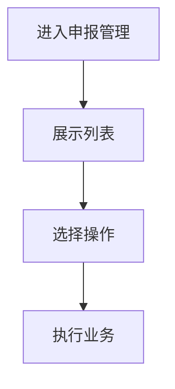

### 15.3 页面组件

| 组件名称 | 文件路径 | 功能说明 |
| :--- | :--- | :--- |
| ApplicationManagementDashboard | src\pages\application\ApplicationManagementDashboard.tsx | 表格展示、表单提交、分页功能、导入导出、状态管理、路由导航 |
| ApplySuccess | src\pages\application\ApplySuccess.tsx | 导入导出、路由导航 |
| ApplyWizardWithLayout | src\pages\application\ApplyWizardWithLayout.tsx | 表格展示、表单提交、弹窗表单、搜索筛选、分页功能、导入导出、状态管理、路由导航 |
| QualificationDrawer | src\pages\application\components\QualificationDrawer.tsx | 搜索筛选、导入导出、状态管理 |
| QualificationSelector | src\pages\application\components\QualificationSelector.tsx | 表单提交、搜索筛选、导入导出、状态管理 |
| index | src\pages\application\index.tsx | 表单提交、弹窗表单、搜索筛选、分页功能、导入导出、状态管理、路由导航、数据接口 |
| OptimizedMyApplications | src\pages\application\OptimizedMyApplications.tsx | 表单提交、搜索筛选、导入导出、状态管理 |
| PolicyDetail | src\pages\application\PolicyDetail.tsx | 表格展示、查看详情、表单提交、弹窗表单、搜索筛选、分页功能、导入导出、状态管理、路由导航 |

---

## 16. 申报管理(新)

### 16.1 功能描述

申报管理(新)模块提供...

### 16.2 业务流程

```mermaid
flowchart TD
    A[进入申报管理(新)] --> B[展示列表]
    B --> C[选择操作]
    C --> D[执行业务]
```

### 16.3 页面组件

| 组件名称 | 文件路径 | 功能说明 |
| :--- | :--- | :--- |
| ApplicationCard | src\pages\application-new\components\ApplicationCard.tsx | 导入导出 |
| ProgressBar | src\pages\application-new\components\ProgressBar.tsx | 表单提交、导入导出 |
| StatusBadge | src\pages\application-new\components\StatusBadge.tsx | 导入导出 |
| index | src\pages\application-new\management\index.tsx | 表格展示、表单提交、搜索筛选、分页功能、导入导出、状态管理、路由导航 |

---

## 17. 企业门户

### 17.1 功能描述

企业门户模块提供...

### 17.2 业务流程

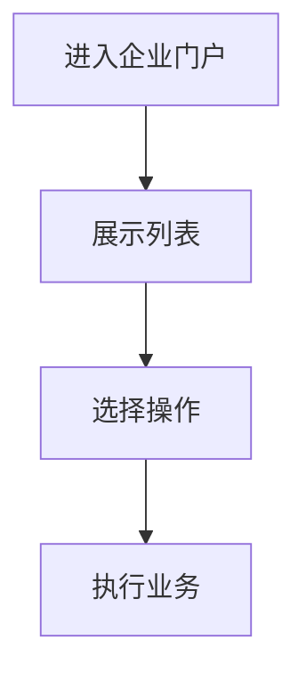

### 17.3 页面组件

| 组件名称 | 文件路径 | 功能说明 |
| :--- | :--- | :--- |
| index | src\pages\enterprise\CertifiedHome\index.tsx | 表单提交、搜索筛选、导入导出、路由导航 |

---

## 18. 首页

### 18.1 功能描述

首页模块提供...

### 18.2 业务流程

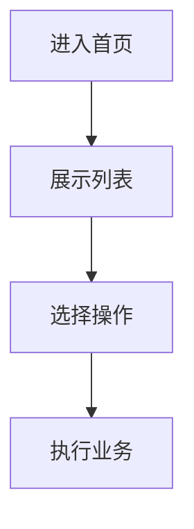

### 18.3 页面组件

| 组件名称 | 文件路径 | 功能说明 |
| :--- | :--- | :--- |
| BannerSection | src\pages\home\components\BannerSection.tsx | 表单提交、弹窗表单、导入导出、状态管理、路由导航 |
| DataOverviewSection | src\pages\home\components\DataOverviewSection.tsx | 导入导出 |
| EnterpriseCertificationModal | src\pages\home\components\EnterpriseCertificationModal.tsx | 表单提交、弹窗表单、导入导出、状态管理、路由导航、数据接口 |
| EnterpriseGuideSection | src\pages\home\components\EnterpriseGuideSection.tsx | 导入导出、路由导航 |
| ImportantRemindersSection | src\pages\home\components\ImportantRemindersSection.tsx | 搜索筛选、导入导出 |
| PageHeader | src\pages\home\components\PageHeader.tsx | 导入导出、状态管理 |
| PersonalizedRecommendationSection | src\pages\home\components\PersonalizedRecommendationSection.tsx | 导入导出、状态管理、路由导航、数据接口 |
| QuickActionsSection | src\pages\home\components\QuickActionsSection.tsx | 表单提交、导入导出 |
| QuickToolsSection | src\pages\home\components\QuickToolsSection.tsx | 搜索筛选、导入导出、状态管理 |
| SystemDynamicsSection | src\pages\home\components\SystemDynamicsSection.tsx | 导入导出、状态管理 |
| homeDataConfig | src\pages\home\config\homeDataConfig.tsx | 表单提交、导入导出 |
| index | src\pages\home\index.tsx | 导入导出、路由导航、数据接口 |

---

## 19. 产业管理

### 19.1 功能描述

产业管理模块提供...

### 19.2 业务流程

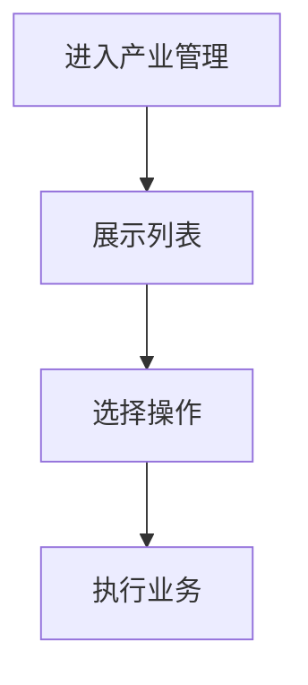

### 19.3 页面组件

| 组件名称 | 文件路径 | 功能说明 |
| :--- | :--- | :--- |
| BusinessHallBanner | src\pages\industry\service-match\components\BusinessHallBanner.tsx | 导入导出 |
| ComparisonModal | src\pages\industry\service-match\components\ComparisonModal.tsx | 表格展示、分页功能、导入导出 |
| ConnectModal | src\pages\industry\service-match\components\ConnectModal.tsx | 表单提交、弹窗表单、导入导出、状态管理、数据接口 |
| HallHeader | src\pages\industry\service-match\components\HallHeader.tsx | 搜索筛选、导入导出、状态管理 |
| LatestRequirements | src\pages\industry\service-match\components\LatestRequirements.tsx | 导入导出、状态管理 |
| PrivacyControlPanel | src\pages\industry\service-match\components\PrivacyControlPanel.tsx | 导入导出 |
| ProfessionalServiceCategories | src\pages\industry\service-match\components\ProfessionalServiceCategories.tsx | 导入导出 |
| ServiceCategoryNav | src\pages\industry\service-match\components\ServiceCategoryNav.tsx | 导入导出 |
| ServiceMatchCard | src\pages\industry\service-match\components\ServiceMatchCard.tsx | 导入导出 |
| SupplyServiceCard | src\pages\industry\service-match\components\SupplyServiceCard.tsx | 导入导出 |
| MatchDetail | src\pages\industry\service-match\MatchDetail.tsx | 导入导出、状态管理、路由导航、数据接口 |
| MyMatches | src\pages\industry\service-match\MyMatches.tsx | 导入导出、状态管理、路由导航 |
| MyMessages | src\pages\industry\service-match\MyMessages.tsx | 搜索筛选、导入导出、状态管理 |
| MyServices | src\pages\industry\service-match\MyServices.tsx | 表格展示、删除功能、搜索筛选、分页功能、导入导出、状态管理、路由导航、数据接口 |
| ProcurementHall | src\pages\industry\service-match\ProcurementHall.tsx | 表单提交、弹窗表单、搜索筛选、导入导出、状态管理、路由导航、数据接口 |
| ServiceMatchHome | src\pages\industry\service-match\ServiceMatchHome.tsx | 表单提交、弹窗表单、搜索筛选、导入导出、状态管理、路由导航、数据接口 |
| ServicePublish | src\pages\industry\service-match\ServicePublish.tsx | 表单提交、弹窗表单、搜索筛选、导入导出、状态管理、路由导航 |
| SupplyBusinessHall | src\pages\industry\service-match\SupplyBusinessHall.tsx | 表单提交、弹窗表单、搜索筛选、导入导出、状态管理、路由导航、数据接口 |

---

## 20. 法律护航

### 20.1 功能描述

法律护航模块提供...

### 20.2 业务流程

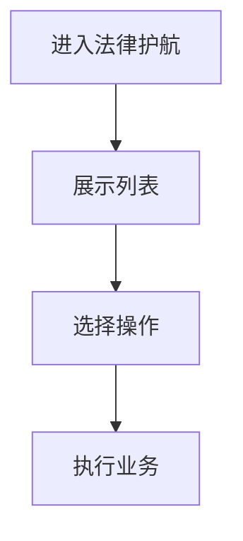

### 20.3 页面组件

| 组件名称 | 文件路径 | 功能说明 |
| :--- | :--- | :--- |
| index | src\pages\legal\RegulationDetailEnhanced\index.tsx | 表单提交、弹窗表单、搜索筛选、导入导出、状态管理、路由导航 |
| index | src\pages\legal\RegulationIntegrated\index.tsx | 表格展示、表单提交、弹窗表单、搜索筛选、分页功能、导入导出、状态管理、路由导航 |
| index | src\pages\legal\RegulationInterpretation\index.tsx | 表单提交、弹窗表单、导入导出、状态管理 |
| index | src\pages\legal\RegulationQueryEnhanced\index.tsx | 表格展示、搜索筛选、分页功能、导入导出、状态管理、路由导航 |
| index | src\pages\legal\TimelinessManagement\index.tsx | 表格展示、表单提交、弹窗表单、分页功能、导入导出、状态管理 |
| index | src\pages\legal-support\AILawyer\index.tsx | 表单提交、弹窗表单、搜索筛选、导入导出、状态管理、路由导航 |
| FeaturesSection | src\pages\legal-support\components\FeaturesSection.tsx | 导入导出 |
| PageHeader | src\pages\legal-support\components\PageHeader.tsx | 导入导出 |
| QuickEntriesSection | src\pages\legal-support\components\QuickEntriesSection.tsx | 导入导出 |
| StatisticsSection | src\pages\legal-support\components\StatisticsSection.tsx | 导入导出 |
| featuresConfig | src\pages\legal-support\config\featuresConfig.tsx | 搜索筛选、导入导出 |
| quickEntriesConfig | src\pages\legal-support\config\quickEntriesConfig.tsx | 搜索筛选、导入导出 |
| index | src\pages\legal-support\index.tsx | 导入导出、路由导航 |

---

## 21. 登录

### 21.1 功能描述

登录模块提供...

### 21.2 业务流程

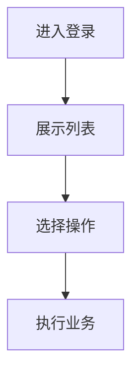

### 21.3 页面组件

| 组件名称 | 文件路径 | 功能说明 |
| :--- | :--- | :--- |
| LoginLeft | src\pages\login\components\LoginLeft.tsx | 导入导出 |
| index | src\pages\login\index.tsx | 表单提交、导入导出 |

---

## 22. 企业认证

### 22.1 功能描述

企业认证模块提供...

### 22.2 业务流程

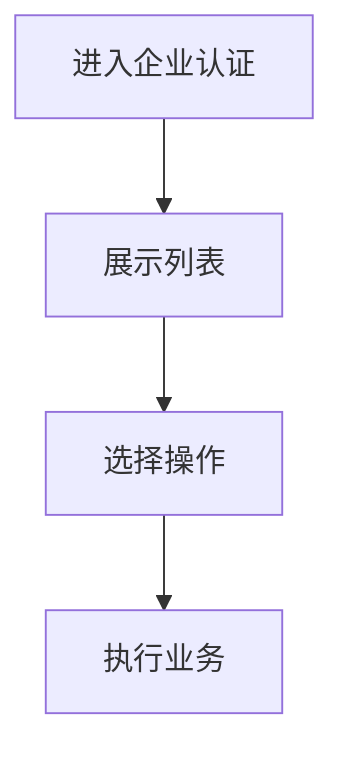

### 22.3 页面组件

| 组件名称 | 文件路径 | 功能说明 |
| :--- | :--- | :--- |
| AuditResultPage | src\pages\onboarding\components\AuditResultPage.tsx | 导入导出、路由导航 |
| ConfirmSubmitForm | src\pages\onboarding\components\ConfirmSubmitForm.tsx | 表单提交、导入导出、状态管理 |
| EnterpriseProfileForm | src\pages\onboarding\components\EnterpriseProfileForm.tsx | 表单提交、导入导出、状态管理 |
| RealNameVerifyForm | src\pages\onboarding\components\RealNameVerifyForm.tsx | 表单提交、导入导出 |
| OnboardingProfilePage | src\pages\onboarding\OnboardingProfilePage.tsx | 表单提交、导入导出、状态管理、路由导航 |
| WelcomeGuidePage | src\pages\onboarding\WelcomeGuidePage.tsx | 导入导出、路由导航 |

---

## 23. 智慧政策

### 23.1 功能描述

智慧政策模块提供...

### 23.2 业务流程

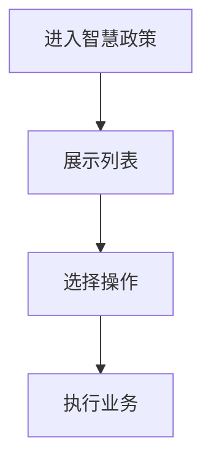

### 23.3 页面组件

| 组件名称 | 文件路径 | 功能说明 |
| :--- | :--- | :--- |
| AIPolicySearch | src\pages\policy\AIPolicySearch.tsx | 表单提交、搜索筛选、分页功能、导入导出、状态管理、数据接口 |
| SmartPolicyFilter | src\pages\policy\components\SmartPolicyFilter.tsx | 搜索筛选、导入导出、状态管理 |
| SmartPolicyMatch | src\pages\policy\components\SmartPolicyMatch.tsx | 搜索筛选、导入导出、状态管理、路由导航 |
| SmartPolicyResults | src\pages\policy\components\SmartPolicyResults.tsx | 搜索筛选、分页功能、导入导出、状态管理、路由导航、数据接口 |
| EnhancedPolicyDetail | src\pages\policy\EnhancedPolicyDetail.tsx | 表格展示、表单提交、弹窗表单、搜索筛选、分页功能、导入导出、状态管理、路由导航、数据接口 |
| EnhancedPolicySearch | src\pages\policy\EnhancedPolicySearch.tsx | 搜索筛选、导入导出、状态管理、路由导航 |
| PolicyApprovedList | src\pages\policy\PolicyApprovedList.tsx | 表格展示、搜索筛选、分页功能、导入导出、状态管理、路由导航 |

---

## 24. 注册

### 24.1 功能描述

注册模块提供...

### 24.2 业务流程

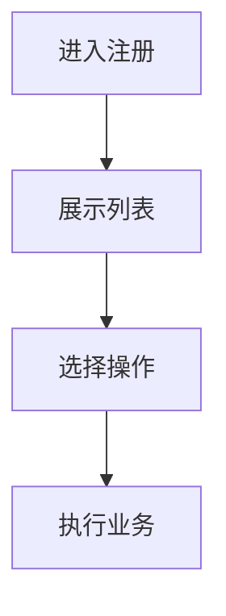

### 24.3 页面组件

| 组件名称 | 文件路径 | 功能说明 |
| :--- | :--- | :--- |
| PlatformIntro | src\pages\register\components\PlatformIntro.tsx | 表单提交、导入导出 |
| RegisterForm | src\pages\register\components\RegisterForm.tsx | 表单提交、导入导出、状态管理 |
| index | src\pages\register\index.tsx | 表单提交、导入导出 |

---

## 25. 重置密码

### 25.1 功能描述

重置密码模块提供...

### 25.2 业务流程

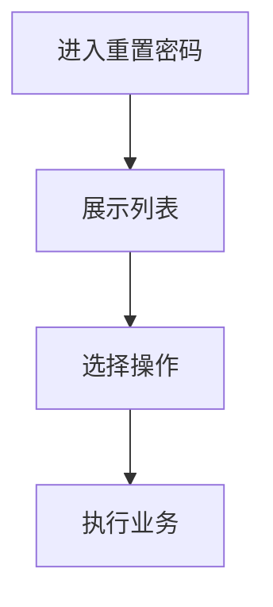

### 25.3 页面组件

| 组件名称 | 文件路径 | 功能说明 |
| :--- | :--- | :--- |
| CompletionStep | src\pages\reset-password\components\CompletionStep.tsx | 导入导出 |
| PasswordResetStep | src\pages\reset-password\components\PasswordResetStep.tsx | 表单提交、导入导出 |
| PhoneVerificationStep | src\pages\reset-password\components\PhoneVerificationStep.tsx | 表单提交、导入导出 |
| stepConfig | src\pages\reset-password\config\stepConfig.tsx | 导入导出 |
| index | src\pages\reset-password\index.tsx | 表单提交、导入导出、状态管理 |

---

## 26. 金融服务

### 26.1 功能描述

金融服务模块提供...

### 26.2 业务流程

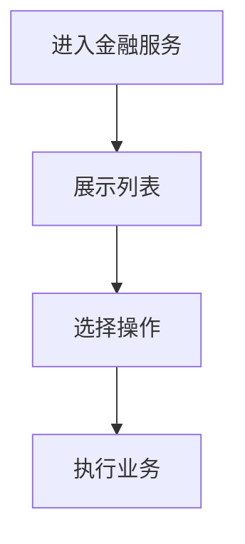

### 26.3 页面组件

| 组件名称 | 文件路径 | 功能说明 |
| :--- | :--- | :--- |
| DiagnosisFlow | src\pages\supply-chain-finance\components\DiagnosisFlow.tsx | 导入导出 |
| DiagnosisHistory | src\pages\supply-chain-finance\components\DiagnosisHistory.tsx | 导入导出、路由导航 |
| PageHeader | src\pages\supply-chain-finance\components\PageHeader.tsx | 导入导出、路由导航 |
| QuickEntryGrid | src\pages\supply-chain-finance\components\QuickEntryGrid.tsx | 导入导出、路由导航 |
| quickEntries | src\pages\supply-chain-finance\config\quickEntries.tsx | 导入导出 |
| index | src\pages\supply-chain-finance\index.tsx | 导入导出 |
| CompareModal | src\pages\supply-chain-finance\modules\DiagnosisAnalysis\components\CompareModal.tsx | 导入导出 |
| EmptyState | src\pages\supply-chain-finance\modules\DiagnosisAnalysis\components\EmptyState.tsx | 搜索筛选、导入导出、路由导航 |
| OptionCard | src\pages\supply-chain-finance\modules\DiagnosisAnalysis\components\OptionCard.tsx | 导入导出 |
| index | src\pages\supply-chain-finance\modules\DiagnosisAnalysis\index.tsx | 搜索筛选、导入导出、状态管理、路由导航 |
| index | src\pages\supply-chain-finance\modules\FinancingApplicationSuccess\config\index.tsx | 导入导出、数据接口 |
| index | src\pages\supply-chain-finance\modules\FinancingApplicationSuccess\index.tsx | 导入导出、状态管理、路由导航 |
| index | src\pages\supply-chain-finance\modules\FinancingDiagnosis\index.tsx | 表单提交、导入导出、状态管理 |
| OptionCard | src\pages\supply-chain-finance\modules\FinancingDiagnosisResult\components\OptionCard.tsx | 表单提交、导入导出、状态管理、路由导航 |
| ReportModal | src\pages\supply-chain-finance\modules\FinancingDiagnosisResult\components\ReportModal.tsx | 导入导出 |
| Sidebar | src\pages\supply-chain-finance\modules\FinancingDiagnosisResult\components\Sidebar.tsx | 导入导出 |
| index | src\pages\supply-chain-finance\modules\FinancingDiagnosisResult\config\index.tsx | 导入导出、数据接口 |
| index | src\pages\supply-chain-finance\modules\FinancingDiagnosisResult\index.tsx | 搜索筛选、导入导出、状态管理 |
| index | src\pages\supply-chain-finance\modules\FinancingOptionDetail\index.tsx | 表格展示、表单提交、弹窗表单、分页功能、导入导出、状态管理、路由导航 |
| index | src\pages\supply-chain-finance\modules\RiskAssessment\index.tsx | 表格展示、表单提交、分页功能、导入导出、状态管理、路由导航 |

---

## 27. 系统管理

### 27.1 功能描述

系统管理模块提供...

### 27.2 业务流程


### 27.3 页面组件

| 组件名称 | 文件路径 | 功能说明 |
| :--- | :--- | :--- |
| DataConsistencyReport | src\pages\system\CompanyManagement\components\DataConsistencyReport.tsx | 表格展示、分页功能、导入导出 |
| ProfileEditModal | src\pages\system\CompanyManagement\components\ProfileEditModal.tsx | 表单提交、弹窗表单、搜索筛选、导入导出、数据接口 |
| ProfileOverviewCard | src\pages\system\CompanyManagement\components\ProfileOverviewCard.tsx | 导入导出、数据接口 |
| index | src\pages\system\CompanyManagement\index.tsx | 表单提交、弹窗表单、导入导出、状态管理 |
| ExportModal | src\pages\system\MyFavorites\components\ExportModal.tsx | 表单提交、弹窗表单、导入导出 |
| FavoriteListItem | src\pages\system\MyFavorites\components\FavoriteListItem.tsx | 表单提交、导入导出 |
| typeConfig | src\pages\system\MyFavorites\config\typeConfig.tsx | 导入导出 |
| index | src\pages\system\MyFavorites\index.tsx | 表单提交、弹窗表单、搜索筛选、分页功能、导入导出、路由导航 |
| LogDetailModal | src\pages\system\PersonalCenter\components\LogDetailModal.tsx | 导入导出 |
| NicknameEditModal | src\pages\system\PersonalCenter\components\NicknameEditModal.tsx | 表单提交、弹窗表单、导入导出 |
| OperationLogTab | src\pages\system\PersonalCenter\components\OperationLogTab.tsx | 表格展示、删除功能、查看详情、搜索筛选、分页功能、导入导出 |
| PersonalInfoTab | src\pages\system\PersonalCenter\components\PersonalInfoTab.tsx | 表单提交、导入导出 |
| PhoneEditModal | src\pages\system\PersonalCenter\components\PhoneEditModal.tsx | 表单提交、弹窗表单、导入导出 |
| SettingsTab | src\pages\system\PersonalCenter\components\SettingsTab.tsx | 表格展示、表单提交、分页功能、导入导出 |
| UserProfileCard | src\pages\system\PersonalCenter\components\UserProfileCard.tsx | 导入导出 |
| index | src\pages\system\PersonalCenter\index.tsx | 表单提交、弹窗表单、导入导出、数据接口 |
| RoleFormModal | src\pages\system\role-management\components\RoleFormModal.tsx | 表单提交、弹窗表单、导入导出 |
| index | src\pages\system\role-management\index.tsx | 表格展示、编辑功能、删除功能、表单提交、弹窗表单、搜索筛选、分页功能、导入导出 |
| SearchBar | src\pages\system\UserManagement\components\SearchBar.tsx | 搜索筛选、导入导出、状态管理 |
| UserDetailModal | src\pages\system\UserManagement\components\UserDetailModal.tsx | 导入导出 |
| UserFormModal | src\pages\system\UserManagement\components\UserFormModal.tsx | 表格展示、表单提交、弹窗表单、导入导出 |
| UserTable | src\pages\system\UserManagement\components\UserTable.tsx | 表格展示、编辑功能、删除功能、查看详情、分页功能、导入导出 |
| tableColumns | src\pages\system\UserManagement\config\tableColumns.tsx | 表格展示、编辑功能、删除功能、查看详情、导入导出 |
| index | src\pages\system\UserManagement\index.tsx | 表格展示、编辑功能、删除功能、查看详情、表单提交、弹窗表单、搜索筛选、分页功能、导入导出、状态管理、路由导航 |
| statusUtils | src\pages\system\UserManagement\utils\statusUtils.tsx | 导入导出 |

---

## 28. system-management

### 28.1 功能描述

system-management模块提供...

### 28.2 业务流程

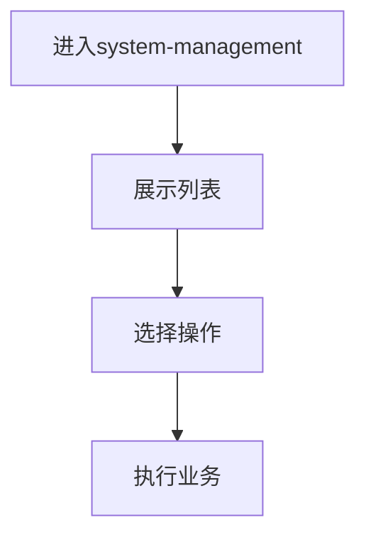

### 28.3 页面组件

| 组件名称 | 文件路径 | 功能说明 |
| :--- | :--- | :--- |
| ModuleCard | src\pages\system-management\components\ModuleCard.tsx | 导入导出、路由导航 |
| PageHeader | src\pages\system-management\components\PageHeader.tsx | 导入导出 |
| index | src\pages\system-management\index.tsx | 导入导出 |

---

