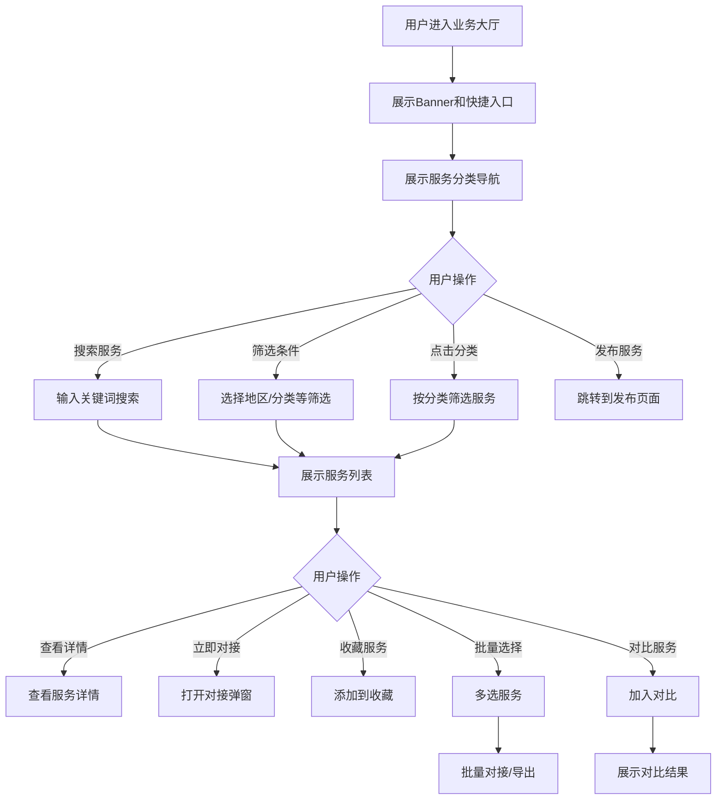

# 业务大厅

#### 1. 功能描述
提供企业服务展示和对接平台，支持企业发布服务供给信息，其他用户可以浏览、搜索、筛选服务，并进行对接联系。包含智能推荐、批量操作、数据脱敏等功能。

##### 1.1 业务功能流程图

#### 2. 业务规则

##### 2.1 数据脱敏规则
| 规则编号 | 规则名称 | 规则描述 | 适用用户等级 |
| :--- | :--- | :--- | :--- |
| BR-001 | 企业名称脱敏 | 企业名称显示前2字，其余用*代替 | 游客 |
| BR-002 | 联系电话脱敏 | 手机号显示前3后4，中间用****代替 | 游客、普通会员 |
| BR-003 | 邮箱脱敏 | 邮箱部分字符用*代替 | 游客、普通会员、VIP |
| BR-004 | 地址脱敏 | 详细地址不显示 | 游客、普通会员 |
| BR-005 | 价格脱敏 | 价格显示为"面议" | 游客、普通会员 |

##### 2.2 用户等级权限
| 规则编号 | 规则名称 | 规则描述 |
| :--- | :--- | :--- |
| BR-006 | 游客权限 | 只能查看脱敏后的基本信息 |
| BR-007 | 普通会员 | 可查看部分联系方式，价格需申请 |
| BR-008 | VIP会员 | 可查看完整联系方式和价格 |
| BR-009 | 管理员 | 可查看所有信息，无限制 |

##### 2.3 批量操作规则
| 规则编号 | 规则名称 | 规则描述 |
| :--- | :--- | :--- |
| BR-010 | 批量选择 | 支持多选服务进行批量操作 |
| BR-011 | 批量对接 | 选中服务可批量发起对接 |
| BR-012 | 批量导出 | 选中服务信息可导出CSV |
| BR-013 | 对比限制 | 最多可同时对比3个服务 |

##### 2.4 排序规则
| 规则编号 | 规则名称 | 规则描述 |
| :--- | :--- | :--- |
| BR-014 | 匹配度排序 | 按服务与用户需求匹配度排序 |
| BR-015 | 评分排序 | 按企业评分高低排序 |
| BR-016 | 时间排序 | 按发布时间倒序排序 |

#### 3. 数据模型

##### 3.1 实体：Service（服务信息）

| 字段名 | 类型 | 必填 | 说明 |
| :--- | :--- | :--- | :--- |
| id | string | 是 | 服务唯一标识 |
| companyName | string | 是 | 企业名称 |
| serviceName | string | 是 | 服务名称 |
| serviceDescription | string | 是 | 服务描述 |
| serviceCategories | string[] | 是 | 服务分类标签 |
| professionalTags | string[] | 是 | 专业标签 |
| region | string | 是 | 所在地区 |
| publishTime | string | 是 | 发布时间 |
| rating | number | 是 | 评分（1-5） |
| completedProjects | number | 是 | 完成项目数 |
| responseTime | string | 是 | 响应时间 |
| certifications | string[] | 是 | 资质认证 |
| capabilities | string[] | 是 | 服务能力 |
| priceRange | string | 是 | 价格区间 |
| isVerified | boolean | 是 | 是否认证 |
| isFeatured | boolean | 是 | 是否推荐 |
| viewCount | number | 是 | 浏览次数 |
| successRate | number | 是 | 成功率 |
| contactInfo | object | 是 | 联系信息 |
| contactInfo.phone | string | 是 | 联系电话 |
| contactInfo.email | string | 是 | 邮箱 |
| contactInfo.address | string | 是 | 地址 |
| businessScope | string | 是 | 业务范围 |
| establishedYear | number | 是 | 成立年份 |
| teamSize | string | 是 | 团队规模 |

##### 3.2 实体：FilterCriteria（筛选条件）

| 字段名 | 类型 | 必填 | 说明 |
| :--- | :--- | :--- | :--- |
| region | string | 否 | 地区筛选 |
| category | string | 否 | 分类筛选 |
| keyword | string | 否 | 关键词搜索 |

#### 4. 功能详述

##### 4.1 Banner区域

**功能说明**：
- 展示业务大厅欢迎信息和功能介绍
- 提供快捷操作入口

**快捷入口**：
| 入口名称 | 功能说明 | 跳转页面 |
| :--- | :--- | :--- |
| 发布服务 | 发布新的服务供给 | 服务发布页 |
| 我的服务 | 管理已发布的服务 | 我的业务管理页 |
| 消息中心 | 查看对接消息 | 消息中心页 |

##### 4.2 服务分类导航

**功能说明**：
- 展示服务分类快捷入口
- 点击分类快速筛选服务

**分类列表**：
| 分类名称 | 说明 |
| :--- | :--- |
| 技术服务 | IT开发、系统集成等技术类服务 |
| 咨询服务 | 管理咨询、财务咨询等专业服务 |
| 营销服务 | 市场推广、品牌策划等营销服务 |
| 人力资源 | 招聘、培训等HR服务 |
| 法律服务 | 法律咨询、合同审核等服务 |
| 财税服务 | 会计、税务、审计等服务 |

##### 4.3 搜索和筛选功能

**搜索功能**：
| 字段名称 | 字段说明 | 是否必填 | 字段类型 | 说明 |
| :--- | :--- | :--- | :--- | :--- |
| 关键词 | 搜索内容 | 否 | 文本输入 | 支持企业名称、服务名称模糊搜索 |

**筛选条件**：
| 筛选维度 | 选项类型 | 选项内容 |
| :--- | :--- | :--- |
| 地区 | 下拉选择 | 北京、上海、广州、深圳、杭州、苏州等 |
| 分类 | 标签选择 | 技术服务、咨询服务、营销服务等 |
| 认证状态 | 单选 | 已认证、未认证、全部 |

##### 4.4 服务列表展示

**列表字段**：
| 字段名称 | 字段说明 | 是否可编辑 | 字段类型 | 说明 |
| :--- | :--- | :--- | :--- | :--- |
| 企业名称 | 提供服务的企业 | 否 | 文本 | 根据用户等级脱敏显示 |
| 服务名称 | 服务标题 | 否 | 文本 | 服务的主要名称 |
| 服务描述 | 详细描述 | 否 | 文本 | 服务的具体内容 |
| 服务分类 | 分类标签 | 否 | 标签组 | 如["技术服务", "软件开发"] |
| 所在地区 | 企业地区 | 否 | 文本 | 如"北京市" |
| 评分 | 用户评分 | 否 | 星级 | 1-5星评分 |
| 完成项目 | 项目数量 | 否 | 数字 | 已完成的项目数 |
| 响应时间 | 平均响应 | 否 | 文本 | 如"2小时内" |
| 资质认证 | 认证标签 | 否 | 标签组 | 如["ISO9001", "高新技术企业"] |
| 价格区间 | 服务价格 | 否 | 文本 | 根据用户等级脱敏显示 |
| 认证标识 | 是否认证 | 否 | 图标 | 已认证显示认证图标 |
| 浏览量 | 查看次数 | 否 | 数字 | 用户浏览统计 |
| 成功率 | 成功比率 | 否 | 百分比 | 如"85%" |

**排序方式**：
| 排序方式 | 说明 |
| :--- | :--- |
| 匹配度 | 默认排序，按与用户需求匹配度 |
| 企业资质 | 按企业评分和认证状态排序 |
| 发布时间 | 按发布时间倒序 |

##### 4.5 批量操作功能

**功能说明**：
- 支持多选服务进行批量操作
- 选中后底部显示操作栏

**批量操作按钮**：
| 按钮 | 功能 | 说明 |
| :--- | :--- | :--- |
| 批量对接 | 批量发起对接 | 对选中的服务批量发送对接请求 |
| 批量导出 | 导出CSV | 将选中服务信息导出为CSV文件 |
| 取消选择 | 清空选择 | 取消所有选中状态 |

**导出字段**：
| 字段名称 | 说明 |
| :--- | :--- |
| 企业/需求名称 | 企业或服务名称 |
| 所在地区 | 地区信息 |
| 匹配度 | 匹配百分比 |
| 业务标签 | 标签列表 |
| 需求/业务描述 | 描述信息 |
| 更新时间 | 最后更新时间 |
| 质量评分 | 评分信息 |

##### 4.6 服务对比功能

**功能说明**：
- 支持选择多个服务进行对比
- 最多对比3个服务
- 对比维度包括基本信息、服务能力、价格等

**对比维度**：
| 对比项 | 说明 |
| :--- | :--- |
| 企业名称 | 对比企业基本信息 |
| 服务范围 | 对比服务内容 |
| 资质认证 | 对比认证情况 |
| 评分评价 | 对比用户评分 |
| 价格区间 | 对比服务价格 |
| 响应时间 | 对比服务响应速度 |
| 成功案例 | 对比项目经验 |

##### 4.7 智能推荐区域

**功能说明**：
- 展示系统智能推荐的服务
- 基于用户行为和偏好推荐

**推荐卡片信息**：
| 字段名称 | 说明 |
| :--- | :--- |
| 企业名称 | 推荐的企业名称 |
| 服务范围 | 服务内容简介 |
| 评分 | 用户评分（星级） |
| 推荐标签 | "推荐"标识 |

**交互逻辑**：
- 点击推荐卡片查看详情
- 支持"换一批"刷新推荐
- 推荐结果基于算法动态生成

##### 4.8 对接功能

**功能说明**：
- 用户可以发起与服务提供方的对接
- 支持单个对接和批量对接

**对接流程**：
1. 用户点击"立即对接"按钮
2. 弹出对接申请弹窗
3. 填写对接需求和联系方式
4. 提交对接申请
5. 等待对方响应

#### 5. 异常场景处理

| 异常场景 | 场景说明 | 系统行为 | 提醒方式 | 操作选项 |
| :--- | :--- | :--- | :--- | :--- |
| 搜索无结果 | 筛选条件过于严格 | 显示空状态 | 提示"暂无相关企业信息" | 建议放宽筛选条件 |
| 接口异常 | 数据加载失败 | 显示错误提示 | 提示"获取数据失败" | 重试或返回 |
| 加载中 | 数据正在加载 | 显示骨架屏 | 显示加载动画 | 等待 |
| 导出失败 | CSV生成失败 | 显示错误提示 | 提示"导出失败" | 重试或取消 |
| 对接失败 | 对接申请发送失败 | 显示错误提示 | 提示"操作失败" | 重试 |

#### 6. 权限控制

| 功能 | 游客 | 普通会员 | VIP会员 | 管理员 |
| :--- | :--- | :--- | :--- | :--- |
| 浏览服务列表 | ✓ | ✓ | ✓ | ✓ |
| 查看服务详情 | 部分 | 部分 | ✓ | ✓ |
| 搜索筛选 | ✓ | ✓ | ✓ | ✓ |
| 发起对接 | ✗ | ✓ | ✓ | ✓ |
| 批量操作 | ✗ | ✓ | ✓ | ✓ |
| 服务对比 | ✓ | ✓ | ✓ | ✓ |
| 查看完整信息 | ✗ | 部分 | ✓ | ✓ |
| 发布服务 | ✗ | ✓ | ✓ | ✓ |

#### 7. 数据关联

| 关联功能 | 关联方式 | 说明 |
| :--- | :--- | :--- |
| 服务发布 | 跳转页面 | 点击发布跳转到服务发布页 |
| 服务详情 | 点击跳转 | 点击服务卡片查看详情 |
| 我的服务 | 跳转页面 | 点击我的服务跳转到管理页 |
| 消息中心 | 跳转页面 | 点击查看消息跳转到消息页 |
| 采购大厅 | 切换页面 | 切换到需求方视角 |
