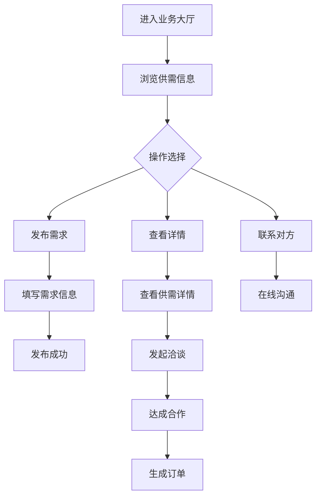

# 业务大厅

> **文档状态**：已完成  
> **最后更新**：2026-03-24  
> **文档作者**：张博  
> **所属模块**：产业管理

---

## 修订记录

| 版本号 | 修订日期 | 修订内容 | 修订人 | 审核人 |
| :--- | :--- | :--- | :--- | :--- |
| v1.0.0 | 2026-03-24 | 初始版本，完成业务大厅基础功能PRD | 张博 | - |
| v1.0.1 | 2026-03-28 | 优化供需匹配算法，增加智能推荐 | 张博 | 李明 |
| v1.1.0 | 2026-04-05 | 新增在线洽谈功能，完善订单管理 | 张博 | 王芳 |

---

## 1. 功能描述

业务大厅功能为企业提供供需信息发布、浏览、匹配服务，支持企业发布业务需求、寻找合作伙伴、在线洽谈、订单管理等功能。

### 1.1 业务背景

企业在发展过程中需要寻找供应商、客户、合作伙伴。业务大厅作为B2B供需对接平台，帮助企业高效匹配业务需求，拓展商业机会。

### 1.2 业务功能流程图



---

## 2. 供需列表

### 2.1 列表字段

| 字段名称 | 字段说明 | 是否可编辑 | 字段类型 |
| :--- | :--- | :--- | :--- |
| 信息标题 | 供需信息标题 | 否 | 文本 |
| 信息类型 | 供应/需求 | 否 | 标签 |
| 行业分类 | 所属行业 | 否 | 标签 |
| 所在地区 | 企业所在地区 | 否 | 文本 |
| 发布时间 | 信息发布时间 | 否 | 日期 |
| 浏览量 | 被浏览次数 | 否 | 数字 |
| 匹配度 | 与企业的匹配程度 | 否 | 进度条 |
| 操作 | 操作按钮 | 否 | 按钮组 |

### 2.2 筛选条件

| 筛选条件 | 筛选类型 | 选项说明 |
| :--- | :--- | :--- |
| 信息类型 | 单选 | 全部、供应、需求 |
| 行业分类 | 多选 | 制造业、服务业、科技等 |
| 所在地区 | 级联选择 | 省-市-区 |
| 发布时间 | 单选 | 今天、本周、本月、全部 |
| 认证状态 | 单选 | 全部、已认证企业 |

---

## 3. 发布供需

### 3.1 发布表单字段

| 字段名称 | 是否必填 | 字段类型 | 说明 |
| :--- | :--- | :--- | :--- |
| 信息类型 | 是 | 单选 | 供应/需求 |
| 信息标题 | 是 | 文本 | 简洁明了的标题 |
| 行业分类 | 是 | 多选 | 所属行业 |
| 业务描述 | 是 | 文本域 | 详细描述业务内容 |
| 期望价格 | 否 | 数字 | 价格区间 |
| 合作方式 | 是 | 多选 | 长期合作、一次性等 |
| 联系方式 | 是 | 文本 | 联系人及电话 |
| 有效期 | 是 | 日期 | 信息有效期 |

---

## 4. 在线洽谈

### 4.1 洽谈功能

| 功能 | 说明 |
| :--- | :--- |
| 即时通讯 | 在线文字聊天 |
| 文件传输 | 支持发送图片、文档 |
| 语音通话 | 语音沟通（可选） |
| 视频通话 | 视频会议（可选） |
| 洽谈记录 | 保存洽谈历史 |

---

## 5. 数据模型

```typescript
interface BusinessRequirement {
  id: string;
  type: 'supply' | 'demand';
  title: string;
  industry: string[];
  region: string;
  description: string;
  priceRange?: [number, number];
  cooperationType: string[];
  contactInfo: ContactInfo;
  validUntil: string;
  publisher: string;
  publishTime: string;
  viewCount: number;
  status: 'active' | 'expired' | 'completed';
}

interface ContactInfo {
  name: string;
  phone: string;
  email?: string;
}
```

---

## 6. 接口需求

| 接口名称 | 请求方式 | 接口路径 | 功能说明 |
| :--- | :--- | :--- | :--- |
| 获取供需列表 | GET | /api/business/requirements | 获取供需信息列表 |
| 发布供需 | POST | /api/business/requirements | 发布供需信息 |
| 获取供需详情 | GET | /api/business/requirements/:id | 获取供需详情 |
| 发起洽谈 | POST | /api/business/negotiation | 发起在线洽谈 |
| 获取洽谈记录 | GET | /api/business/negotiation/:id | 获取洽谈记录 |

---

**文档结束**
