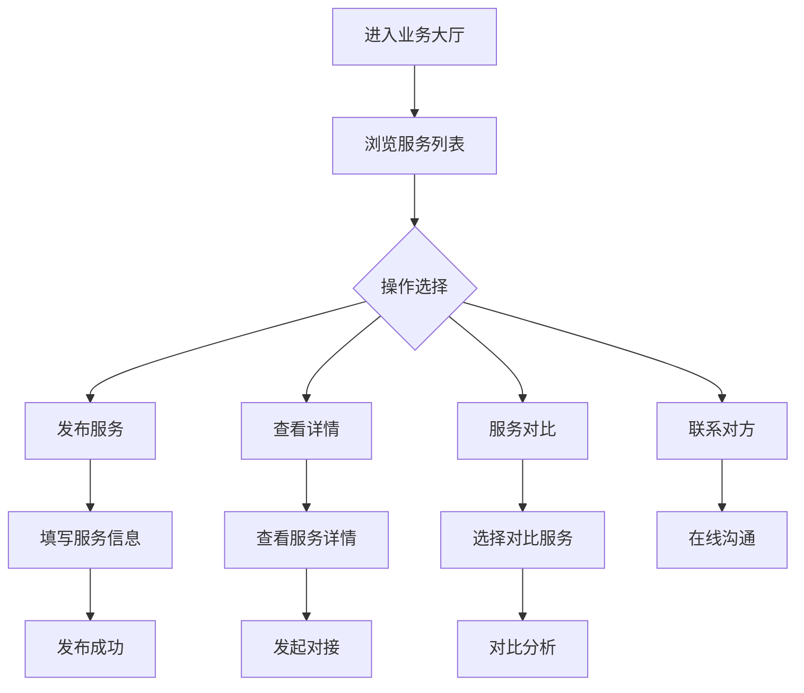

# 业务大厅

> **文档状态**：已完成  
> **最后更新**：2026-03-24  
> **文档作者**：张博  
> **所属模块**：产业管理

---

## 修订记录

| 版本号 | 修订日期 | 修订内容 | 修订人 | 审核人 |
| :--- | :--- | :--- | :--- | :--- |
| v1.0.0 | 2026-03-24 | 初始版本，完成业务大厅基础功能PRD | 张博 | - |
| v1.1.0 | 2026-03-24 | 更新PRD，与实际代码保持一致，删除消息中心功能 | 张博 | - |

---

## 1. 功能描述

业务大厅功能为企业提供供需信息发布、浏览、匹配服务，支持企业发布业务服务、寻找合作伙伴、服务对比、在线对接等功能。

### 1.1 业务背景

企业在发展过程中需要寻找供应商、客户、合作伙伴。业务大厅作为B2B供需对接平台，帮助企业高效匹配业务需求，拓展商业机会。

### 1.2 业务功能流程图



---

## 2. 服务列表

### 2.1 列表字段

| 字段名称 | 字段说明 | 是否可编辑 | 字段类型 | 说明 |
| :--- | :--- | :--- | :--- | :--- |
| 企业名称 | 服务提供企业名称 | 否 | 文本 | 显示公司名称 |
| 服务名称 | 服务标题 | 否 | 文本 | 简洁明了的服务标题 |
| 服务类别 | 服务所属分类 | 否 | 标签 | 如检测认证、安全合规等 |
| 专业标签 | 服务专业标签 | 否 | 标签组 | 多个专业标签展示 |
| 所在地区 | 企业所在地区 | 否 | 文本 | 省市区信息 |
| 发布时间 | 服务发布时间 | 否 | 文本 | 如"2小时前" |
| 评分 | 服务评分 | 否 | 评分 | 1-5星评分 |
| 完成项目 | 已完成项目数 | 否 | 数字 | 累计完成项目数量 |
| 响应时间 | 平均响应时间 | 否 | 文本 | 如"2小时内" |
| 认证状态 | 企业认证状态 | 否 | 标签 | 已认证/未认证 |
| 浏览量 | 被浏览次数 | 否 | 数字 | 累计浏览次数 |
| 成功率 | 对接成功率 | 否 | 数字 | 百分比显示 |

### 2.2 筛选条件

| 筛选条件 | 筛选类型 | 选项说明 |
| :--- | :--- | :--- |
| 关键词搜索 | 文本输入 | 支持企业名称、服务名称搜索 |
| 所在地区 | 下拉选择 | 北京、上海、广州、深圳、杭州、苏州 |
| 服务类别 | 单选 | 检测认证、安全合规、医疗器械、环保工程等 |
| 排序方式 | 单选 | 匹配度、时间、质量 |
| 认证状态 | 单选 | 全部、已认证企业 |

### 2.3 列表操作

| 操作名称 | 操作类型 | 功能说明 |
| :--- | :--- | :--- |
| 查看详情 | 点击 | 进入服务详情页面 |
| 选择对比 | 复选框 | 选择服务进行对比分析 |
| 立即对接 | 按钮 | 发起服务对接请求 |
| 收藏 | 图标 | 收藏感兴趣的服务 |

---

## 3. 服务详情

### 3.1 详情展示内容

| 内容区块 | 说明 |
| :--- | :--- |
| 企业基本信息 | 公司名称、认证状态、标签 |
| 服务信息 | 服务名称、服务描述、服务范围 |
| 企业能力 | 成立年份、团队规模、完成项目数 |
| 资质认证 | 企业获得的各项认证 |
| 服务能力 | 具体服务能力列表 |
| 价格信息 | 服务价格区间 |
| 联系方式 | 联系人、电话、邮箱、地址 |
| 成功案例 | 历史服务案例展示 |

---

## 4. 发布服务

### 4.1 发布表单字段

| 字段名称 | 是否必填 | 字段类型 | 说明 |
| :--- | :--- | :--- | :--- |
| 服务类型 | 是 | 单选 | 供应/需求 |
| 服务标题 | 是 | 文本 | 简洁明了的标题 |
| 行业分类 | 是 | 多选 | 所属行业分类 |
| 服务描述 | 是 | 文本域 | 详细描述服务内容 |
| 服务范围 | 是 | 文本 | 具体服务范围说明 |
| 价格区间 | 否 | 文本 | 如"20万元起/项目" |
| 服务周期 | 否 | 文本 | 如"3-6个月" |
| 计价方式 | 否 | 文本 | 计费方式说明 |
| 联系方式 | 是 | 文本 | 联系人及电话 |
| 有效期 | 是 | 日期 | 信息有效期 |

---

## 5. 服务对比

### 5.1 对比功能

| 功能 | 说明 |
| :--- | :--- |
| 多选对比 | 支持选择2-3个服务进行对比 |
| 对比维度 | 价格、响应时间、完成项目、评分、资质等 |
| 对比报告 | 生成对比分析报告 |
| 可视化展示 | 图表形式展示对比结果 |

---

## 6. 数据模型

```typescript
interface SupplyService {
  id: string;
  companyName: string;
  companyLogo?: string;
  serviceName: string;
  serviceDescription: string;
  serviceCategories: string[];
  professionalTags: string[];
  region: string;
  publishTime: string;
  rating: number;
  completedProjects: number;
  responseTime: string;
  certifications: string[];
  capabilities: string[];
  priceRange?: string;
  isVerified: boolean;
  isFeatured: boolean;
  viewCount: number;
  successRate: number;
  contactInfo: {
    phone: string;
    email: string;
    address: string;
  };
  businessScope: string;
  establishedYear: number;
  teamSize: string;
  caseStudies?: {
    title: string;
    description: string;
    client: string;
    duration: string;
    result: string;
  }[];
}
```

---

## 7. 接口需求

| 接口名称 | 请求方式 | 接口路径 | 功能说明 |
| :--- | :--- | :--- | :--- |
| 获取服务列表 | GET | /api/industry/publications | 获取服务信息列表 |
| 获取推荐服务 | GET | /api/industry/recommendations | 获取推荐服务列表 |
| 发布服务 | POST | /api/industry/publications | 发布服务信息 |
| 获取服务详情 | GET | /api/industry/publications/:id | 获取服务详情 |
| 发起对接 | POST | /api/industry/connections | 发起服务对接请求 |

---

## 8. 页面结构

### 8.1 顶部操作栏

| 元素 | 说明 |
| :--- | :--- |
| 页面标题 | 业务大厅 |
| 副标题 | 企业需求信息发布与对接平台 |
| 我的服务按钮 | 跳转到我的业务管理页面 |
| 发布业务按钮 | 打开发布服务表单 |

### 8.2 搜索筛选区

| 元素 | 说明 |
| :--- | :--- |
| 关键词搜索框 | 支持企业名称、服务名称搜索 |
| 地区筛选 | 下拉选择所在地区 |
| 排序选择 | 匹配度/时间/质量排序 |
| 刷新按钮 | 刷新列表数据 |

### 8.3 服务列表区

| 元素 | 说明 |
| :--- | :--- |
| 服务卡片列表 | 展示服务基本信息 |
| 分页器 | 列表分页控制 |
| 批量操作 | 批量选择、对比功能 |

---

## 9. 异常场景处理

| 异常场景 | 场景说明 | 系统行为 | 提醒方式 | 操作选项 |
| :--- | :--- | :--- | :--- | :--- |
| 未认证用户访问 | 用户未完成企业认证 | 拦截访问，提示需要认证 | Modal弹窗 | 立即认证/暂不 |
| 数据加载失败 | 网络异常或接口错误 | 显示错误提示，提供重试按钮 | Message提示 | 重试/返回 |
| 搜索结果为空 | 无匹配的服务信息 | 显示空状态页面 | 页面提示 | 清除筛选/发布服务 |
| 对接请求失败 | 对方设置或系统错误 | 提示失败原因 | Message提示 | 重试/联系客服 |

---

**文档结束**
