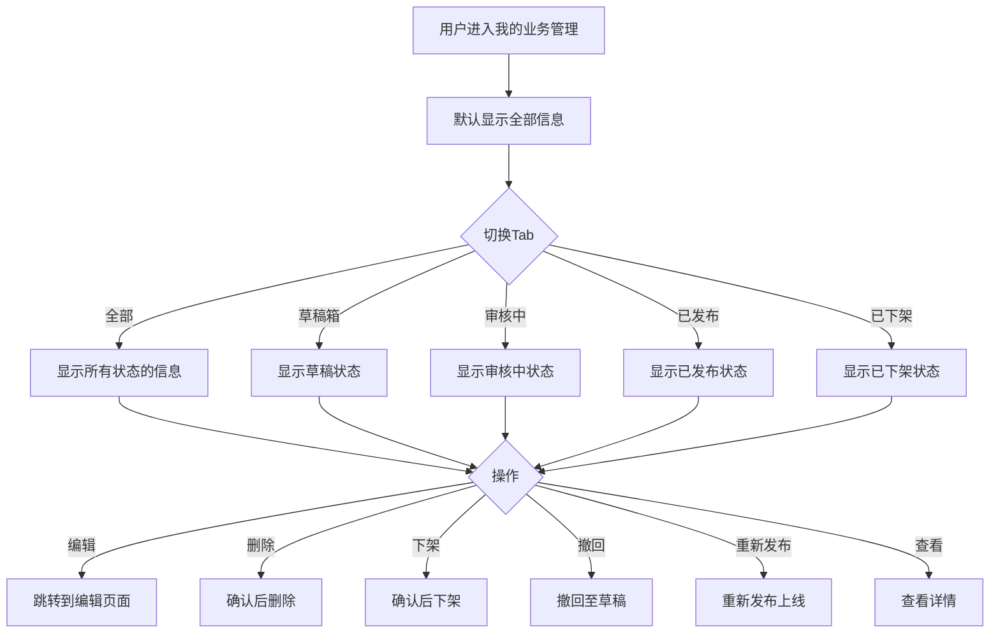

# 我的业务管理

#### 1. 功能描述
提供用户发布的服务和需求的统一管理功能，支持查看、编辑、删除、下架、重新发布等操作。按状态分类展示（草稿、审核中、已发布、已下架），方便用户管理自己的业务信息。

##### 1.1 业务功能流程图

#### 2. 业务规则

##### 2.1 状态流转规则
| 规则编号 | 规则名称 | 规则描述 | 状态流转 |
| :--- | :--- | :--- | :--- |
| BR-001 | 草稿发布 | 草稿可以编辑后提交审核 | 草稿 → 审核中 |
| BR-002 | 审核通过 | 审核通过后自动发布上线 | 审核中 → 已发布 |
| BR-003 | 审核撤回 | 审核中可以撤回至草稿 | 审核中 → 草稿 |
| BR-004 | 发布下架 | 已发布的信息可以手动下架 | 已发布 → 已下架 |
| BR-005 | 重新发布 | 已下架的信息可以重新发布 | 已下架 → 已发布 |
| BR-006 | 草稿删除 | 草稿状态可以直接删除 | 草稿 → 删除 |

##### 2.2 操作权限规则
| 规则编号 | 规则名称 | 规则描述 |
| :--- | :--- | :--- |
| BR-007 | 草稿操作 | 草稿支持编辑、删除 |
| BR-008 | 审核中操作 | 审核中支持查看、撤回 |
| BR-009 | 已发布操作 | 已发布支持查看、编辑、下架 |
| BR-010 | 已下架操作 | 已下架支持查看、重新发布 |

##### 2.3 数据展示规则
| 规则编号 | 规则名称 | 规则描述 |
| :--- | :--- | :--- |
| BR-011 | 分页展示 | 每页默认展示10条数据 |
| BR-012 | 排序规则 | 按更新时间倒序排列 |
| BR-013 | 类型标识 | 区分业务供给和采购需求 |
| BR-014 | 范围标识 | 区分公开和仅匹配可见 |

#### 3. 数据模型

##### 3.1 实体：Publication（发布信息）

| 字段名 | 类型 | 必填 | 说明 |
| :--- | :--- | :--- | :--- |
| id | string | 是 | 信息唯一标识 |
| title | string | 是 | 信息标题 |
| type | enum | 是 | 类型：supply（业务供给）/ demand（采购需求） |
| visibilityScope | enum | 是 | 可见范围：public（公开）/ match（仅匹配可见） |
| status | enum | 是 | 状态：draft（草稿）/ auditing（审核中）/ published（已发布）/ offline（已下架） |
| publishTime | string | 否 | 发布时间 |
| createTime | string | 否 | 创建时间 |
| updateTime | string | 是 | 更新时间 |

#### 4. 功能详述

##### 4.1 Tab切换功能

**功能说明**：
- 支持按状态筛选查看信息
- 默认显示"全部"Tab

**Tab列表**：
| Tab名称 | 说明 | 显示内容 |
| :--- | :--- | :--- |
| 全部 | 显示所有状态 | 草稿+审核中+已发布+已下架 |
| 草稿箱 | 未提交的信息 | 草稿状态的信息 |
| 审核中 | 待审核的信息 | 审核中状态的信息 |
| 已发布 | 已上线的信息 | 已发布状态的信息 |
| 已下架 | 手动下架的信息 | 已下架状态的信息 |

##### 4.2 列表展示

**列表字段**：
| 字段名称 | 字段说明 | 是否可编辑 | 字段类型 | 说明 |
| :--- | :--- | :--- | :--- | :--- |
| 序号 | 列表序号 | 否 | 数字 | 从1开始的序号 |
| 信息标题 | 标题内容 | 否 | 文本 | 信息的主要标题 |
| 类型 | 信息类型 | 否 | 标签 | 业务供给（蓝色）/ 采购需求（橙色） |
| 展示范围 | 可见范围 | 否 | 文本 | 公开 / 仅匹配可见 |
| 状态 | 当前状态 | 否 | 标签 | 草稿/审核中/已发布/已下架 |
| 更新时间 | 最后更新 | 否 | 日期时间 | 格式：YYYY-MM-DD HH:mm:ss |
| 操作 | 操作按钮 | - | - | 根据状态显示不同操作 |

**状态标签样式**：
| 状态 | 标签颜色 | 说明 |
| :--- | :--- | :--- |
| 草稿 | 默认灰色 | 未提交的草稿 |
| 审核中 | 蓝色processing | 等待审核 |
| 已发布 | 绿色success | 已上线展示 |
| 已下架 | 灰色default | 已手动下架 |

##### 4.3 操作功能

**草稿状态操作**：
| 操作 | 图标 | 功能说明 |
| :--- | :--- | :--- |
| 编辑 | EditOutlined | 跳转到编辑页面修改内容 |
| 删除 | DeleteOutlined | 删除该条草稿信息 |

**审核中状态操作**：
| 操作 | 图标 | 功能说明 |
| :--- | :--- | :--- |
| 查看 | EyeOutlined | 查看信息详情 |
| 撤回 | UndoOutlined | 撤回至草稿状态 |

**已发布状态操作**：
| 操作 | 图标 | 功能说明 |
| :--- | :--- | :--- |
| 查看 | EyeOutlined | 查看信息详情 |
| 修改 | EditOutlined | 修改信息内容 |
| 下架 | VerticalAlignBottomOutlined | 下架该信息 |

**已下架状态操作**：
| 操作 | 图标 | 功能说明 |
| :--- | :--- | :--- |
| 查看 | EyeOutlined | 查看信息详情 |
| 重新发布 | ReloadOutlined | 重新发布上线 |

##### 4.4 删除功能

**功能说明**：
- 仅草稿状态支持删除
- 删除前需要二次确认

**操作流程**：
1. 用户点击"删除"按钮
2. 弹出确认对话框，提示"删除后无法恢复，确定要删除吗？"
3. 用户点击"删除"确认
4. 系统执行删除操作
5. 刷新列表，显示成功提示"删除成功"

##### 4.5 下架功能

**功能说明**：
- 仅已发布状态支持下架
- 下架后信息不再展示

**操作流程**：
1. 用户点击"下架"按钮
2. 弹出确认对话框，提示"下架后信息将不再展示，确定要下架吗？"
3. 用户点击"确认"确认下架
4. 系统执行下架操作
5. 刷新列表，显示成功提示"已下架"

##### 4.6 撤回功能

**功能说明**：
- 仅审核中状态支持撤回
- 撤回后回到草稿状态

**操作流程**：
1. 用户点击"撤回"按钮
2. 弹出确认对话框，提示"撤回后将回到草稿状态，确定要撤回吗？"
3. 用户点击"确认"确认撤回
4. 系统执行撤回操作
5. 刷新列表，显示成功提示"已撤回"

##### 4.7 重新发布功能

**功能说明**：
- 仅已下架状态支持重新发布
- 重新发布后直接上线

**操作流程**：
1. 用户点击"重新发布"按钮
2. 弹出确认对话框，提示"重新发布后将直接上线，确定要重新发布吗？"
3. 用户点击"确认"确认发布
4. 系统执行发布操作，更新时间戳
5. 刷新列表，显示成功提示"发布成功"

#### 5. 异常场景处理

| 异常场景 | 场景说明 | 系统行为 | 提醒方式 | 操作选项 |
| :--- | :--- | :--- | :--- | :--- |
| 列表为空 | 该状态下无数据 | 显示空状态 | 显示"暂无相关信息" | 提示去发布 |
| 接口异常 | 数据加载失败 | 显示错误提示 | 提示"获取数据失败" | 重试 |
| 删除失败 | 删除操作失败 | 显示错误提示 | 提示"删除失败" | 重试 |
| 下架失败 | 下架操作失败 | 显示错误提示 | 提示"下架失败" | 重试 |
| 撤回失败 | 撤回操作失败 | 显示错误提示 | 提示"撤回失败" | 重试 |
| 发布失败 | 重新发布失败 | 显示错误提示 | 提示"发布失败" | 重试 |

#### 6. 权限控制

| 功能 | 游客 | 普通会员 | VIP会员 | 管理员 |
| :--- | :--- | :--- | :--- | :--- |
| 查看列表 | ✗ | ✓ | ✓ | ✓ |
| 编辑信息 | ✗ | ✓（仅自己） | ✓（仅自己） | ✓（全部） |
| 删除草稿 | ✗ | ✓（仅自己） | ✓（仅自己） | ✓（全部） |
| 下架信息 | ✗ | ✓（仅自己） | ✓（仅自己） | ✓（全部） |
| 重新发布 | ✗ | ✓（仅自己） | ✓（仅自己） | ✓（全部） |

#### 7. 数据关联

| 关联功能 | 关联方式 | 说明 |
| :--- | :--- | :--- |
| 信息发布 | 跳转页面 | 点击编辑/新建跳转到发布页 |
| 信息详情 | 点击跳转 | 点击查看跳转到详情页 |
| 业务大厅 | 页面切换 | 查看供给信息展示效果 |
| 采购大厅 | 页面切换 | 查看需求信息展示效果 |
