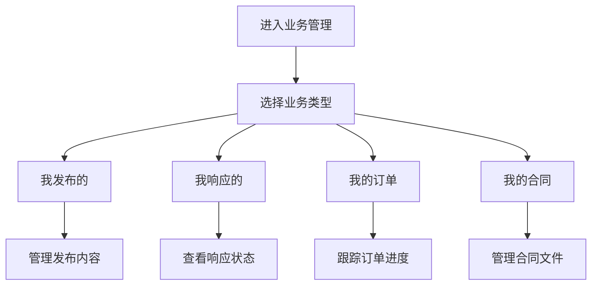

# 我的业务管理

> **文档状态**：已完成  
> **最后更新**：2026-03-24  
> **文档作者**：张博  
> **所属模块**：产业管理

---

## 修订记录

| 版本号 | 修订日期 | 修订内容 | 修订人 | 审核人 |
| :--- | :--- | :--- | :--- | :--- |
| v1.0.0 | 2026-03-24 | 初始版本，完成我的业务管理基础功能PRD | 张博 | - |
| v1.0.1 | 2026-03-28 | 优化订单管理，增加合同管理 | 张博 | 李明 |
| v1.1.0 | 2026-04-05 | 新增业务统计，完善评价系统 | 张博 | 王芳 |

---

## 1. 功能描述

我的业务管理功能为用户提供个人业务的全生命周期管理，包括我发布的供需、我响应的需求、订单管理、合同管理、评价管理等。

### 1.1 业务背景

用户在平台上进行供需对接后，需要对业务进行持续跟踪和管理。我的业务管理功能帮助用户统一管理所有业务往来，提高业务管理效率。

### 1.2 业务功能流程图



---

## 2. 我发布的

### 2.1 列表字段

| 字段名称 | 字段说明 | 是否可编辑 | 字段类型 |
| :--- | :--- | :--- | :--- |
| 信息标题 | 供需信息标题 | 否 | 文本 |
| 信息类型 | 供应/需求 | 否 | 标签 |
| 发布时间 | 发布时间 | 否 | 日期 |
| 浏览量 | 浏览次数 | 否 | 数字 |
| 响应数 | 收到响应数量 | 否 | 数字 |
| 状态 | 当前状态 | 否 | 标签 |
| 操作 | 操作按钮 | 否 | 按钮组 |

### 2.2 状态说明

| 状态 | 说明 | 可操作 |
| :--- | :--- | :--- |
| 进行中 | 信息正在展示 | 编辑/下架/查看响应 |
| 已下架 | 已手动下架 | 重新上架/删除 |
| 已过期 | 超过有效期 | 续期/删除 |
| 已完成 | 已达成合作 | 查看详情/评价 |

---

## 3. 我响应的

### 3.1 列表字段

| 字段名称 | 字段说明 | 是否可编辑 | 字段类型 |
| :--- | :--- | :--- | :--- |
| 需求标题 | 响应的需求标题 | 否 | 文本 |
| 响应时间 | 提交响应时间 | 否 | 日期 |
| 报价金额 | 响应报价 | 否 | 数字 |
| 响应状态 | 当前状态 | 否 | 标签 |
| 需求方 | 发布需求的企业 | 否 | 文本 |
| 操作 | 操作按钮 | 否 | 按钮组 |

### 3.2 响应状态

| 状态 | 说明 |
| :--- | :--- |
| 待查看 | 需求方尚未查看 |
| 已查看 | 需求方已查看 |
| 已联系 | 需求方已联系 |
| 被采纳 | 响应被采纳 |
| 未采纳 | 响应未被采纳 |

---

## 4. 订单管理

### 4.1 订单列表字段

| 字段名称 | 字段说明 | 是否可编辑 | 字段类型 |
| :--- | :--- | :--- | :--- |
| 订单编号 | 唯一订单号 | 否 | 文本 |
| 订单标题 | 订单内容摘要 | 否 | 文本 |
| 合作方 | 对方企业名称 | 否 | 文本 |
| 订单金额 | 订单金额 | 否 | 数字 |
| 订单状态 | 当前状态 | 否 | 标签 |
| 创建时间 | 订单创建时间 | 否 | 日期 |
| 操作 | 操作按钮 | 否 | 按钮组 |

### 4.2 订单状态

| 状态 | 说明 | 流转方向 |
| :--- | :--- | :--- |
| 待确认 | 等待双方确认 | → 已确认/已取消 |
| 已确认 | 双方已确认 | → 进行中 |
| 进行中 | 订单执行中 | → 已完成 |
| 已完成 | 订单已完成 | → 已评价 |
| 已取消 | 订单已取消 | - |
| 已评价 | 已完成评价 | - |

---

## 5. 合同管理

### 5.1 合同列表字段

| 字段名称 | 字段说明 | 是否可编辑 | 字段类型 |
| :--- | :--- | :--- | :--- |
| 合同编号 | 唯一合同号 | 否 | 文本 |
| 合同标题 | 合同名称 | 否 | 文本 |
| 合作方 | 合同对方企业 | 否 | 文本 |
| 签订日期 | 合同签订时间 | 否 | 日期 |
| 到期日期 | 合同到期时间 | 否 | 日期 |
| 合同状态 | 当前状态 | 否 | 标签 |
| 操作 | 操作按钮 | 否 | 按钮组 |

### 5.2 合同操作

| 操作 | 说明 |
| :--- | :--- |
| 查看 | 在线查看合同内容 |
| 下载 | 下载合同PDF文件 |
| 续签 | 合同到期前发起续签 |
| 终止 | 提前终止合同 |

---

## 6. 数据模型

```typescript
interface MyBusiness {
  published: BusinessItem[];
  responded: ResponseItem[];
  orders: Order[];
  contracts: Contract[];
}

interface Order {
  id: string;
  orderNo: string;
  title: string;
  partner: string;
  amount: number;
  status: OrderStatus;
  createTime: string;
  completeTime?: string;
}

type OrderStatus = 
  | 'pending_confirm' 
  | 'confirmed' 
  | 'in_progress' 
  | 'completed' 
  | 'cancelled' 
  | 'evaluated';

interface Contract {
  id: string;
  contractNo: string;
  title: string;
  partner: string;
  signDate: string;
  expiryDate: string;
  status: 'active' | 'expired' | 'terminated';
  fileUrl: string;
}
```

---

## 7. 接口需求

| 接口名称 | 请求方式 | 接口路径 | 功能说明 |
| :--- | :--- | :--- | :--- |
| 获取我的发布 | GET | /api/business/my-published | 获取我发布的供需 |
| 获取我的响应 | GET | /api/business/my-responses | 获取我响应的记录 |
| 获取我的订单 | GET | /api/business/my-orders | 获取我的订单 |
| 获取我的合同 | GET | /api/business/my-contracts | 获取我的合同 |
| 更新订单状态 | PUT | /api/business/orders/:id/status | 更新订单状态 |
| 下载合同 | GET | /api/business/contracts/:id/download | 下载合同文件 |

---

**文档结束**
