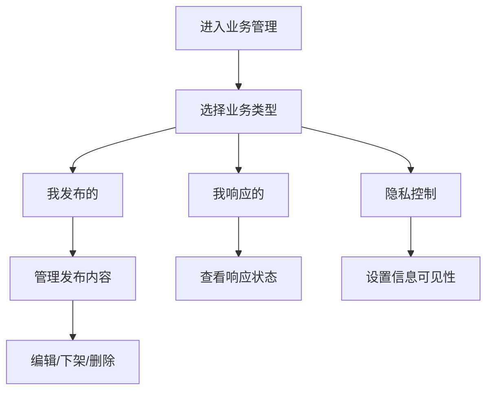

# 我的业务管理

> **文档状态**：已完成  
> **最后更新**：2026-03-24  
> **文档作者**：张博  
> **所属模块**：产业管理

---

## 修订记录

| 版本号 | 修订日期 | 修订内容 | 修订人 | 审核人 |
| :--- | :--- | :--- | :--- | :--- |
| v1.0.0 | 2026-03-24 | 初始版本，完成我的业务管理基础功能PRD | 张博 | - |
| v1.1.0 | 2026-03-24 | 更新PRD，与实际代码保持一致，增加隐私控制功能 | 张博 | - |

---

## 1. 功能描述

我的业务管理功能为用户提供个人业务的全生命周期管理，包括我发布的供需信息、我响应的需求、业务状态跟踪、隐私控制等。

### 1.1 业务背景

用户在平台上进行供需对接后，需要对业务进行持续跟踪和管理。我的业务管理功能帮助用户统一管理所有业务往来，提高业务管理效率。

### 1.2 业务功能流程图



---

## 2. 我发布的

### 2.1 列表字段

| 字段名称 | 字段说明 | 是否可编辑 | 字段类型 |
| :--- | :--- | :--- | :--- |
| 信息标题 | 供需信息标题 | 否 | 文本 |
| 信息类型 | 业务供给/采购需求 | 否 | 标签 |
| 发布时间 | 发布时间 | 否 | 日期 |
| 浏览量 | 浏览次数 | 否 | 数字 |
| 响应数 | 收到响应数量 | 否 | 数字 |
| 可见性 | 信息公开范围 | 否 | 标签 |
| 状态 | 当前状态 | 否 | 标签 |
| 操作 | 操作按钮 | 否 | 按钮组 |

### 2.2 状态说明

| 状态 | 说明 | 颜色 | 可操作 |
| :--- | :--- | :--- | :--- |
| 草稿 | 未发布，仅自己可见 | 默认 | 编辑/发布/删除 |
| 审核中 | 已提交审核，等待审核 | 蓝色 | 撤回 |
| 已发布 | 审核通过，正在展示 | 绿色 | 编辑/下架/查看响应 |
| 已下架 | 已手动下架 | 橙色 | 重新发布/删除 |
| 已过期 | 超过有效期 | 红色 | 续期/删除 |

### 2.3 可见性设置

| 可见性 | 说明 |
| :--- | :--- |
| 公开 | 所有用户可见 |
| 仅匹配 | 仅匹配用户可见（脱敏展示） |
| 私密 | 仅自己可见 |

---

## 3. 我响应的

### 3.1 列表字段

| 字段名称 | 字段说明 | 是否可编辑 | 字段类型 |
| :--- | :--- | :--- | :--- |
| 需求标题 | 响应的需求标题 | 否 | 文本 |
| 响应时间 | 提交响应时间 | 否 | 日期 |
| 响应状态 | 当前状态 | 否 | 标签 |
| 需求方 | 发布需求的企业 | 否 | 文本 |
| 操作 | 操作按钮 | 否 | 按钮组 |

### 3.2 响应状态

| 状态 | 说明 | 颜色 |
| :--- | :--- | :--- |
| 待查看 | 需求方尚未查看 | 默认 |
| 已查看 | 需求方已查看 | 蓝色 |
| 已联系 | 需求方已联系 | 绿色 |
| 被采纳 | 响应被采纳 | 绿色 |
| 未采纳 | 响应未被采纳 | 红色 |

---

## 4. 隐私控制

### 4.1 隐私设置项

| 设置项 | 说明 | 默认值 |
| :--- | :--- | :--- |
| 企业名称可见性 | 控制企业名称的展示范围 | 匹配可见 |
| 联系方式可见性 | 控制联系方式的展示范围 | 对接后可见 |
| 需求描述可见性 | 控制需求详细描述的展示范围 | 匹配可见 |
| 预算金额可见性 | 控制预算信息的展示范围 | 区间模糊 |

### 4.2 可见性级别

| 级别 | 说明 |
| :--- | :--- |
| 完全公开 | 所有用户可见完整信息 |
| 匹配可见 | 仅匹配用户可见完整信息，其他用户脱敏展示 |
| 对接后可见 | 仅对接成功后可见完整信息 |
| 完全私密 | 仅自己可见，其他用户不可见 |

---

## 5. 操作功能

### 5.1 发布管理操作

| 操作 | 适用状态 | 功能说明 |
| :--- | :--- | :--- |
| 编辑 | 草稿、已发布 | 修改发布内容 |
| 发布 | 草稿 | 提交审核或直接发布 |
| 撤回 | 审核中 | 撤回审核申请 |
| 下架 | 已发布 | 手动下架信息 |
| 重新发布 | 已下架、已过期 | 重新发布信息 |
| 删除 | 草稿、已下架、已过期 | 永久删除信息 |
| 续期 | 已过期 | 延长有效期 |

### 5.2 操作确认

| 操作 | 确认提示 |
| :--- | :--- |
| 删除 | "删除后无法恢复，确定要删除吗？" |
| 下架 | "下架后信息将不再展示，确定要下架吗？" |
| 撤回 | "撤回后将回到草稿状态，确定要撤回吗？" |
| 重新发布 | "重新发布后将直接上线，确定要重新发布吗？" |

---

## 6. 数据模型

```typescript
interface MyServiceItem {
  id: string;
  title: string;              // 信息标题
  type: 'supply' | 'demand';  // 信息类型
  publisherName: string;      // 发布者名称
  publisherId: string;        // 发布者ID
  description: string;        // 描述
  tags: string[];             // 标签
  region: string;             // 地区
  budget: number;             // 预算
  budgetUnit: string;         // 预算单位
  details: {
    quantity: number;         // 数量
    quantityUnit: string;     // 数量单位
  };
  visibilityScope: 'public' | 'match' | 'private';  // 可见性范围
  status: 'draft' | 'auditing' | 'published' | 'active' | 'offline' | 'expired';  // 状态
  publishTime: string;        // 发布时间
  createTime: string;         // 创建时间
  viewCount: number;          // 浏览量
  responseCount: number;      // 响应数
}

interface MyResponseItem {
  id: string;
  requirementId: string;      // 需求ID
  requirementTitle: string;   // 需求标题
  responseTime: string;       // 响应时间
  status: 'pending' | 'viewed' | 'contacted' | 'accepted' | 'rejected';  // 响应状态
  publisherName: string;      // 需求方名称
  message: string;            // 响应留言
}
```

---

## 7. 接口需求

| 接口名称 | 请求方式 | 接口路径 | 功能说明 |
| :--- | :--- | :--- | :--- |
| 获取我的发布列表 | GET | /api/industry/my-publications | 获取我发布的供需信息 |
| 获取我的响应列表 | GET | /api/industry/my-responses | 获取我响应的需求列表 |
| 删除发布 | DELETE | /api/industry/publications/:id | 删除发布的供需信息 |
| 下架发布 | POST | /api/industry/publications/:id/offline | 下架发布的供需信息 |
| 撤回发布 | PUT | /api/industry/publications/:id | 撤回审核中的信息 |
| 重新发布 | PUT | /api/industry/publications/:id | 重新发布信息 |
| 更新隐私设置 | PUT | /api/industry/privacy-settings | 更新隐私控制设置 |

---

## 8. 页面结构

### 8.1 顶部操作栏

| 元素 | 说明 |
| :--- | :--- |
| 页面标题 | 我的业务管理 |
| 副标题 | 管理您的所有业务信息 |
| 发布业务按钮 | 跳转到发布页面 |

### 8.2 Tab切换区

| Tab项 | 说明 |
| :--- | :--- |
| 我发布的 | 我发布的供需信息 |
| 我响应的 | 我响应的需求信息 |
| 隐私控制 | 隐私设置管理 |

### 8.3 列表操作区

| 元素 | 说明 |
| :--- | :--- |
| 刷新按钮 | 刷新列表数据 |
| 筛选条件 | 按状态、类型筛选 |
| 批量操作 | 批量删除、下架 |

### 8.4 数据列表区

| 元素 | 说明 |
| :--- | :--- |
| 业务信息卡片 | 展示业务基本信息 |
| 状态标签 | 显示当前状态 |
| 操作按钮组 | 编辑、下架、删除等操作 |
| 分页器 | 列表分页控制 |

---

## 9. 异常场景处理

| 异常场景 | 场景说明 | 系统行为 | 提醒方式 | 操作选项 |
| :--- | :--- | :--- | :--- | :--- |
| 数据加载失败 | 网络异常或接口错误 | 显示错误提示，提供重试按钮 | Message提示 | 重试/返回 |
| 操作失败 | 删除/下架等操作失败 | 提示失败原因 | Message提示 | 重试/取消 |
| 无数据 | 当前Tab下无数据 | 显示空状态页面 | 页面提示 | 立即发布/返回 |
| 权限不足 | 用户无权限执行操作 | 拦截操作，提示权限不足 | Modal弹窗 | 升级权限/取消 |

---

**文档结束**
