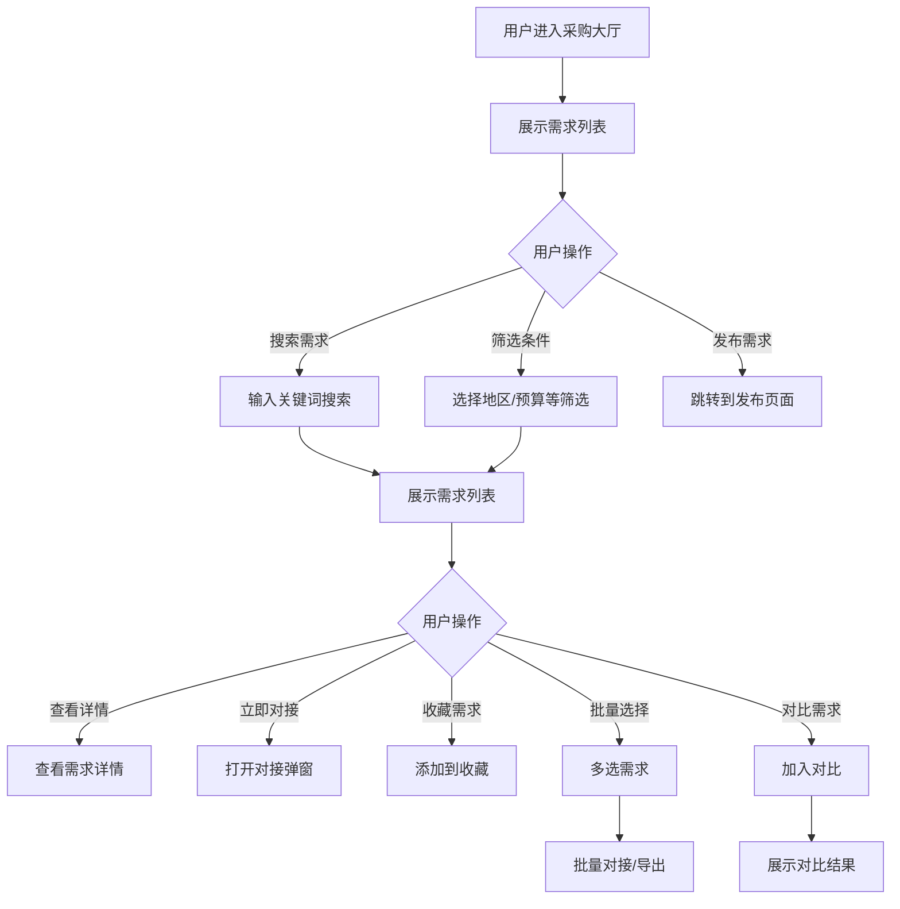

# 采购大厅

#### 1. 功能描述
提供企业采购需求发布和对接平台，支持企业发布采购需求信息，供应商可以浏览、搜索、筛选需求，并进行对接联系。包含智能匹配、批量操作、需求对比等功能。

##### 1.1 业务功能流程图

#### 2. 业务规则

##### 2.1 需求发布规则
| 规则编号 | 规则名称 | 规则描述 | 适用范围 |
| :--- | :--- | :--- | :--- |
| BR-001 | 需求必填项 | 标题、描述、预算、数量为必填项 | 发布需求 |
| BR-002 | 预算范围 | 预算需填写数值和单位 | 发布需求 |
| BR-003 | 有效期 | 需求需设置有效期截止时间 | 发布需求 |
| BR-004 | 审核机制 | 发布的需求需经过审核才能展示 | 发布需求 |

##### 2.2 数据展示规则
| 规则编号 | 规则名称 | 规则描述 |
| :--- | :--- | :--- |
| BR-005 | 需求状态 | 展示需求的当前状态（招募中/已截止/已完成） |
| BR-006 | 匹配度计算 | 根据供应商资质和需求匹配度计算匹配分数 |
| BR-007 | 隐私保护 | 部分敏感信息对未认证用户隐藏 |

##### 2.3 批量操作规则
| 规则编号 | 规则名称 | 规则描述 |
| :--- | :--- | :--- |
| BR-008 | 批量选择 | 支持多选需求进行批量操作 |
| BR-009 | 批量对接 | 选中需求可批量发起对接 |
| BR-010 | 批量导出 | 选中需求信息可导出CSV |
| BR-011 | 对比限制 | 最多可同时对比3个需求 |

##### 2.4 排序规则
| 规则编号 | 规则名称 | 规则描述 |
| :--- | :--- | :--- |
| BR-012 | 匹配度排序 | 按需求与供应商匹配度排序（默认） |
| BR-013 | 时间排序 | 按发布时间倒序排序 |
| BR-014 | 资质排序 | 按发布企业资质排序 |

#### 3. 数据模型

##### 3.1 实体：ProcurementRequirement（采购需求）

| 字段名 | 类型 | 必填 | 说明 |
| :--- | :--- | :--- | :--- |
| id | string | 是 | 需求唯一标识 |
| name | string | 是 | 需求标题/企业名称 |
| scope | string | 是 | 需求描述/业务范围 |
| tags | string[] | 是 | 标签数组 |
| advantageTags | string[] | 是 | 优势标签 |
| region | string | 是 | 所在地区 |
| updateTime | string | 是 | 更新时间 |
| score | number | 是 | 评分（1-5） |
| matchDegree | number | 是 | 匹配度（0-100%） |
| qualification | string | 是 | 资质认证状态 |
| budget | string | 是 | 预算金额 |
| quantity | string | 是 | 采购数量 |
| deadline | string | 否 | 截止日期 |
| isMasked | boolean | 是 | 是否脱敏 |
| status | enum | 是 | 需求状态：recruiting/closed/completed |

##### 3.2 实体：FilterCriteria（筛选条件）

| 字段名 | 类型 | 必填 | 说明 |
| :--- | :--- | :--- | :--- |
| region | string | 否 | 地区筛选 |
| budgetRange | string | 否 | 预算范围筛选 |
| category | string | 否 | 分类筛选 |
| keyword | string | 否 | 关键词搜索 |

#### 4. 功能详述

##### 4.1 搜索和筛选功能

**搜索功能**：
| 字段名称 | 字段说明 | 是否必填 | 字段类型 | 说明 |
| :--- | :--- | :--- | :--- | :--- |
| 关键词 | 搜索内容 | 否 | 文本输入 | 支持需求标题、企业名称模糊搜索 |

**筛选条件**：
| 筛选维度 | 选项类型 | 选项内容 |
| :--- | :--- | :--- |
| 地区 | 下拉选择 | 北京、上海、广州、深圳、杭州、苏州等 |
| 预算范围 | 下拉选择 | 10万以下、10-50万、50-100万、100万以上 |
| 需求分类 | 标签选择 | 技术服务、设备采购、原材料、服务等 |
| 截止日期 | 日期选择 | 选择截止日期范围 |

##### 4.2 需求列表展示

**列表字段**：
| 字段名称 | 字段说明 | 是否可编辑 | 字段类型 | 说明 |
| :--- | :--- | :--- | :--- | :--- |
| 需求标题 | 采购需求名称 | 否 | 文本 | 需求的标题 |
| 企业名称 | 发布企业 | 否 | 文本 | 根据权限脱敏显示 |
| 需求描述 | 详细描述 | 否 | 文本 | 采购的具体内容 |
| 业务标签 | 标签组 | 否 | 标签 | 如["IT设备", "服务器"] |
| 所在地区 | 企业地区 | 否 | 文本 | 如"北京市" |
| 匹配度 | 匹配分数 | 否 | 百分比 | 与当前用户的匹配度 |
| 预算金额 | 采购预算 | 否 | 文本 | 如"50万"或"面议" |
| 采购数量 | 需求数量 | 否 | 文本 | 如"100台" |
| 资质认证 | 认证状态 | 否 | 标签 | 已认证/未认证 |
| 更新时间 | 最后更新 | 否 | 日期 | 如"2024-03-19" |
| 截止日期 | 招募截止 | 否 | 日期 | 需求有效期 |
| 需求状态 | 当前状态 | 否 | 标签 | 招募中/已截止/已完成 |

**排序方式**：
| 排序方式 | 说明 |
| :--- | :--- |
| 匹配度 | 默认排序，按与供应商匹配度高低 |
| 发布时间 | 按发布时间倒序 |
| 企业资质 | 按企业评分和认证状态排序 |

##### 4.3 批量操作功能

**功能说明**：
- 支持多选需求进行批量操作
- 选中后底部显示操作栏

**批量操作按钮**：
| 按钮 | 功能 | 说明 |
| :--- | :--- | :--- |
| 批量对接 | 批量发起对接 | 对选中的需求批量发送对接请求 |
| 批量导出 | 导出CSV | 将选中需求信息导出为CSV文件 |
| 取消选择 | 清空选择 | 取消所有选中状态 |

**导出字段**：
| 字段名称 | 说明 |
| :--- | :--- |
| 企业/需求名称 | 需求标题或企业名称 |
| 所在地区 | 地区信息 |
| 匹配度 | 匹配百分比 |
| 业务标签 | 标签列表 |
| 需求描述 | 描述信息 |
| 更新时间 | 最后更新时间 |
| 质量评分 | 评分信息 |

##### 4.4 需求对比功能

**功能说明**：
- 支持选择多个需求进行对比
- 最多对比3个需求
- 对比维度包括基本信息、预算、数量等

**对比维度**：
| 对比项 | 说明 |
| :--- | :--- |
| 需求标题 | 对比需求基本信息 |
| 采购内容 | 对比需求范围 |
| 预算金额 | 对比预算情况 |
| 采购数量 | 对比数量需求 |
| 资质要求 | 对比对供应商的要求 |
| 截止日期 | 对比有效期 |
| 所在地区 | 对比地区分布 |

##### 4.5 对接功能

**功能说明**：
- 供应商可以发起与需求方的对接
- 支持单个对接和批量对接

**对接流程**：
1. 供应商点击"立即对接"按钮
2. 弹出对接申请弹窗
3. 填写公司简介、优势说明、报价方案
4. 提交对接申请
5. 等待需求方响应

**对接信息**：
| 字段名称 | 是否必填 | 说明 |
| :--- | :--- | :--- |
| 公司名称 | 是 | 供应商企业名称 |
| 联系人 | 是 | 对接联系人姓名 |
| 联系电话 | 是 | 联系电话 |
| 优势说明 | 是 | 为什么适合这个需求 |
| 报价方案 | 否 | 初步报价 |
| 附件 | 否 | 资质证明等附件 |

#### 5. 异常场景处理

| 异常场景 | 场景说明 | 系统行为 | 提醒方式 | 操作选项 |
| :--- | :--- | :--- | :--- | :--- |
| 搜索无结果 | 筛选条件过于严格 | 显示空状态 | 提示"暂无相关需求信息" | 建议放宽筛选条件 |
| 接口异常 | 数据加载失败 | 显示错误提示 | 提示"获取数据失败" | 重试或返回 |
| 加载中 | 数据正在加载 | 显示骨架屏 | 显示加载动画 | 等待 |
| 导出失败 | CSV生成失败 | 显示错误提示 | 提示"导出失败" | 重试或取消 |
| 对接失败 | 对接申请发送失败 | 显示错误提示 | 提示"操作失败" | 重试 |
| 需求已截止 | 对接已截止的需求 | 禁止操作 | 提示"该需求已截止" | 查看其他需求 |

#### 6. 权限控制

| 功能 | 游客 | 普通会员 | VIP会员 | 管理员 |
| :--- | :--- | :--- | :--- | :--- |
| 浏览需求列表 | ✓ | ✓ | ✓ | ✓ |
| 查看需求详情 | 部分 | 部分 | ✓ | ✓ |
| 搜索筛选 | ✓ | ✓ | ✓ | ✓ |
| 发起对接 | ✗ | ✓ | ✓ | ✓ |
| 批量操作 | ✗ | ✓ | ✓ | ✓ |
| 需求对比 | ✓ | ✓ | ✓ | ✓ |
| 查看完整信息 | ✗ | 部分 | ✓ | ✓ |
| 发布需求 | ✗ | ✓ | ✓ | ✓ |

#### 7. 数据关联

| 关联功能 | 关联方式 | 说明 |
| :--- | :--- | :--- |
| 需求发布 | 跳转页面 | 点击发布跳转到需求发布页 |
| 需求详情 | 点击跳转 | 点击需求卡片查看详情 |
| 我的需求 | 跳转页面 | 点击我的需求跳转到管理页 |
| 消息中心 | 跳转页面 | 点击查看消息跳转到消息页 |
| 业务大厅 | 切换页面 | 切换到供给方视角 |
