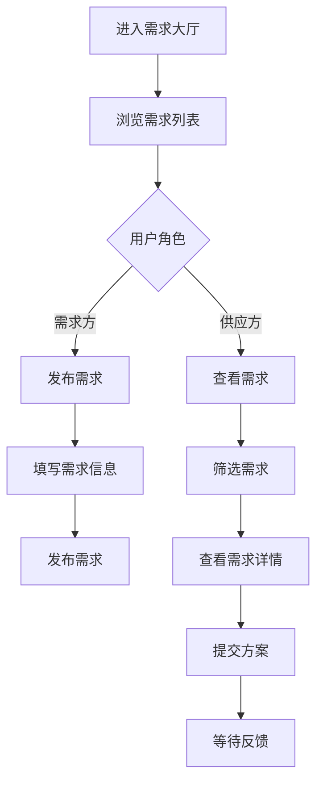

# 需求大厅

> **文档状态**：已完成  
> **最后更新**：2026-03-24  
> **文档作者**：张博  
> **所属模块**：产业管理

---

## 修订记录

| 版本号 | 修订日期 | 修订内容 | 修订人 | 审核人 |
| :--- | :--- | :--- | :--- | :--- |
| v1.0.0 | 2026-03-24 | 初始版本，完成需求大厅基础功能PRD | 张博 | - |
| v1.0.1 | 2026-03-28 | 优化需求匹配，增加需求分析 | 张博 | 李明 |
| v1.1.0 | 2026-04-05 | 新增需求订阅功能，完善推送机制 | 张博 | 王芳 |

---

## 1. 功能描述

需求大厅功能专注于企业需求信息的聚合与分发，帮助企业发布需求、发现需求、快速响应，实现精准的需求对接。

### 1.1 业务背景

企业在经营过程中会产生各种需求，如原材料采购、技术服务、人才招聘等。需求大厅汇集各类企业需求，帮助供应商发现商机，帮助需求方找到合适的供应方。

### 1.2 业务功能流程图



---

## 2. 需求列表

### 2.1 列表字段

| 字段名称 | 字段说明 | 是否可编辑 | 字段类型 |
| :--- | :--- | :--- | :--- |
| 需求标题 | 需求信息标题 | 否 | 文本 |
| 需求类型 | 采购/服务/合作 | 否 | 标签 |
| 预算金额 | 预算范围 | 否 | 文本 |
| 所在地区 | 需求方地区 | 否 | 文本 |
| 截止日期 | 需求有效期 | 否 | 日期 |
| 响应数量 | 已响应数量 | 否 | 数字 |
| 紧急程度 | 普通/紧急 | 否 | 标签 |
| 操作 | 操作按钮 | 否 | 按钮组 |

### 2.2 筛选条件

| 筛选条件 | 筛选类型 | 选项说明 |
| :--- | :--- | :--- |
| 需求类型 | 多选 | 采购、服务、技术、人才、其他 |
| 预算范围 | 单选 | 不限、10万以下、10-50万、50-100万、100万以上 |
| 所在地区 | 级联选择 | 省-市-区 |
| 截止日期 | 单选 | 3天内、7天内、30天内、不限 |
| 紧急程度 | 单选 | 全部、紧急、普通 |

---

## 3. 发布需求

### 3.1 发布表单字段

| 字段名称 | 是否必填 | 字段类型 | 说明 |
| :--- | :--- | :--- | :--- |
| 需求标题 | 是 | 文本 | 简洁描述需求 |
| 需求类型 | 是 | 单选 | 采购/服务/技术/人才/其他 |
| 需求描述 | 是 | 文本域 | 详细描述需求内容 |
| 预算金额 | 否 | 数字 | 预算范围 |
| 期望交付 | 是 | 日期 | 期望交付时间 |
| 截止日期 | 是 | 日期 | 需求有效期 |
| 紧急程度 | 是 | 单选 | 普通/紧急 |
| 附件 | 否 | 文件 | 需求相关附件 |

---

## 4. 需求响应

### 4.1 响应流程

| 步骤 | 说明 |
| :--- | :--- |
| 查看需求 | 浏览需求详情 |
| 评估匹配 | 评估自身能力与需求匹配度 |
| 提交方案 | 填写响应方案和价格 |
| 等待反馈 | 等待需求方查看和反馈 |
| 洽谈沟通 | 双方进一步沟通 |
| 达成合作 | 确认合作意向 |

### 4.2 响应表单字段

| 字段名称 | 是否必填 | 字段类型 | 说明 |
| :--- | :--- | :--- | :--- |
| 响应方案 | 是 | 文本域 | 解决方案描述 |
| 报价金额 | 是 | 数字 | 报价价格 |
| 交付周期 | 是 | 文本 | 预计交付时间 |
| 公司优势 | 否 | 文本域 | 公司优势说明 |
| 案例展示 | 否 | 文件 | 相关案例附件 |

---

## 5. 数据模型

```typescript
interface Requirement {
  id: string;
  title: string;
  type: string;
  description: string;
  budget?: number;
  expectedDelivery: string;
  deadline: string;
  urgency: 'normal' | 'urgent';
  region: string;
  publisher: string;
  attachments?: Attachment[];
  responseCount: number;
  status: 'active' | 'expired' | 'completed';
  publishTime: string;
}

interface RequirementResponse {
  id: string;
  requirementId: string;
  responder: string;
  solution: string;
  price: number;
  deliveryTime: string;
  advantages?: string;
  attachments?: Attachment[];
  status: 'pending' | 'viewed' | 'contacted' | 'accepted' | 'rejected';
  submitTime: string;
}
```

---

## 6. 接口需求

| 接口名称 | 请求方式 | 接口路径 | 功能说明 |
| :--- | :--- | :--- | :--- |
| 获取需求列表 | GET | /api/requirements | 获取需求列表 |
| 发布需求 | POST | /api/requirements | 发布新需求 |
| 获取需求详情 | GET | /api/requirements/:id | 获取需求详情 |
| 提交响应 | POST | /api/requirements/:id/respond | 提交需求响应 |
| 获取我的需求 | GET | /api/requirements/my | 获取我发布的需求 |
| 获取我的响应 | GET | /api/requirements/my-responses | 获取我的响应记录 |

---

**文档结束**
