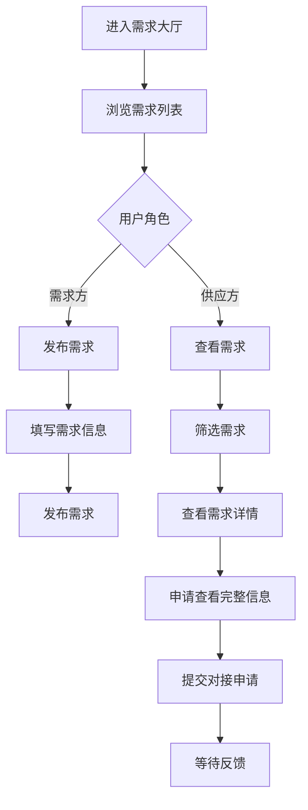

# 需求大厅

> **文档状态**：已完成  
> **最后更新**：2026-03-24  
> **文档作者**：张博  
> **所属模块**：产业管理

---

## 修订记录

| 版本号 | 修订日期 | 修订内容 | 修订人 | 审核人 |
| :--- | :--- | :--- | :--- | :--- |
| v1.0.0 | 2026-03-24 | 初始版本，完成需求大厅基础功能PRD | 张博 | - |
| v1.1.0 | 2026-03-24 | 更新PRD，与实际代码保持一致，增加数据脱敏说明 | 张博 | - |

---

## 1. 功能描述

需求大厅功能专注于企业需求信息的聚合与分发，帮助企业发布需求、发现需求、快速响应，实现精准的需求对接。系统对敏感信息进行脱敏处理，保护企业隐私。

### 1.1 业务背景

企业在经营过程中会产生各种需求，如原材料采购、技术服务、人才招聘等。需求大厅汇集各类企业需求，帮助供应商发现商机，帮助需求方找到合适的供应方。

### 1.2 业务功能流程图



---

## 2. 需求列表

### 2.1 列表字段

| 字段名称 | 字段说明 | 是否可编辑 | 字段类型 | 脱敏处理 |
| :--- | :--- | :--- | :--- | :--- |
| 需求标题 | 需求信息标题 | 否 | 文本 | 部分脱敏 |
| 优势标签 | 需求优势标签 | 否 | 标签组 | 无 |
| 所属地区 | 需求方地区 | 否 | 文本 | 无 |
| 需求描述 | 详细需求描述 | 否 | 文本 | 部分脱敏 |
| 更新时间 | 最后更新时间 | 否 | 日期 | 无 |
| 匹配度 | 与企业的匹配程度 | 否 | 进度条 | 无 |
| 认证状态 | 企业认证状态 | 否 | 标签 | 无 |
| 预算金额 | 预算范围 | 否 | 文本 | 区间模糊化 |
| 需求量 | 需求数量 | 否 | 文本 | 无 |
| 截止时间 | 需求有效期 | 否 | 日期 | 无 |
| 联系方式 | 联系人电话 | 否 | 文本 | 完全脱敏 |

### 2.2 筛选条件

| 筛选条件 | 筛选类型 | 选项说明 |
| :--- | :--- | :--- |
| 关键词搜索 | 文本输入 | 支持需求标题、描述搜索 |
| 所在地区 | 下拉选择 | 北京、上海、广州、深圳、杭州、苏州 |
| 排序方式 | 单选 | 匹配度、时间、质量 |
| 认证状态 | 单选 | 全部、已认证企业 |

### 2.3 列表操作

| 操作名称 | 操作类型 | 功能说明 |
| :--- | :--- | :--- |
| 查看详情 | 点击 | 进入需求详情页面 |
| 选择对比 | 复选框 | 选择需求进行对比分析 |
| 立即对接 | 按钮 | 发起需求对接请求 |
| 刷新列表 | 按钮 | 刷新需求列表数据 |

---

## 3. 数据脱敏规则

### 3.1 企业名称脱敏

| 原始格式 | 脱敏后格式 | 示例 |
| :--- | :--- | :--- |
| 北京某某科技有限公司 | 北京**科技有限公司 | 北京某某科技有限公司 → 北京**科技有限公司 |
| 某某集团 | **集团 | 华为集团 → **集团 |

### 3.2 需求描述脱敏

| 原始格式 | 脱敏后格式 | 示例 |
| :--- | :--- | :--- |
| 完整描述文本 | 部分文字替换为* | "需要采购100台服务器" → "需要采购**台服务器" |

### 3.3 预算金额脱敏

| 原始格式 | 脱敏后格式 | 示例 |
| :--- | :--- | :--- |
| 具体金额 | 区间范围 | "50万元" → "30-80万元" |
| 面议 | 面议 | 面议 → 面议 |

### 3.4 联系方式脱敏

| 原始格式 | 脱敏后格式 | 示例 |
| :--- | :--- | :--- |
| 13800138000 | 138****8000 | 中间4位隐藏 |
| email@company.com | ***@***.com | 完全隐藏 |

---

## 4. 发布需求

### 4.1 发布表单字段

| 字段名称 | 是否必填 | 字段类型 | 说明 |
| :--- | :--- | :--- | :--- |
| 需求标题 | 是 | 文本 | 简洁描述需求 |
| 需求类型 | 是 | 单选 | 采购/服务/技术/人才/其他 |
| 需求描述 | 是 | 文本域 | 详细描述需求内容 |
| 预算金额 | 否 | 数字 | 预算范围 |
| 预算单位 | 否 | 单选 | 元/万元/件/套等 |
| 需求量 | 否 | 数字 | 需求数量 |
| 数量单位 | 否 | 单选 | 个/件/套/吨等 |
| 期望交付 | 是 | 日期 | 期望交付时间 |
| 截止日期 | 是 | 日期 | 需求有效期 |
| 紧急程度 | 是 | 单选 | 普通/紧急 |
| 所在地区 | 是 | 级联选择 | 省-市-区 |
| 附件 | 否 | 文件 | 需求相关附件 |

---

## 5. 需求响应

### 5.1 响应流程

| 步骤 | 说明 |
| :--- | :--- |
| 查看需求 | 浏览需求列表，查看脱敏后的需求信息 |
| 申请查看 | 申请查看完整的需求信息（需认证） |
| 评估匹配 | 评估自身能力与需求匹配度 |
| 提交对接 | 填写对接申请信息 |
| 等待反馈 | 等待需求方查看和反馈 |
| 洽谈沟通 | 双方进一步沟通 |

### 5.2 对接申请

| 字段名称 | 是否必填 | 字段类型 | 说明 |
| :--- | :--- | :--- | :--- |
| 申请说明 | 是 | 文本域 | 说明自身优势和解决方案 |
| 报价方案 | 否 | 文本 | 提供的价格方案 |
| 交付周期 | 否 | 文本 | 预计交付时间 |
| 联系方式 | 是 | 文本 | 联系人及电话 |

---

## 6. 数据统计

### 6.1 统计指标

| 指标名称 | 说明 |
| :--- | :--- |
| 总需求数 | 平台累计发布的需求数量 |
| 今日新增 | 今日新发布的需求数量 |
| 成功对接 | 已成功对接的需求数量 |
| 待响应 | 等待响应的需求数量 |

---

## 7. 数据模型

```typescript
interface ProcurementRequirement {
  id: string;
  name: string;              // 脱敏后的企业名称
  originalName: string;      // 原始企业名称
  isMasked: boolean;         // 是否脱敏
  advantageTags: string[];   // 优势标签
  tags: string[];            // 所有标签
  region: string;            // 所在地区
  scope: string;             // 脱敏后的需求描述
  originalScope: string;     // 原始需求描述
  updateTime: string;        // 更新时间
  score: number;             // 评分
  matchDegree: number;       // 匹配度
  qualification: string;     // 认证状态
  budget: string;            // 脱敏后的预算
  originalBudget: number;    // 原始预算
  quantity: string;          // 需求量
  deadline: string;          // 截止时间
  contactPhone: string;      // 脱敏后的电话
  contactEmail: string;      // 脱敏后的邮箱
}
```

---

## 8. 接口需求

| 接口名称 | 请求方式 | 接口路径 | 功能说明 |
| :--- | :--- | :--- | :--- |
| 获取需求列表 | GET | /api/industry/publications | 获取需求信息列表（脱敏） |
| 发布需求 | POST | /api/industry/publications | 发布需求信息 |
| 获取需求详情 | GET | /api/industry/publications/:id | 获取需求详情 |
| 申请查看完整信息 | POST | /api/industry/access-request | 申请查看完整信息 |
| 提交对接申请 | POST | /api/industry/connections | 提交对接申请 |

---

## 9. 页面结构

### 9.1 顶部操作栏

| 元素 | 说明 |
| :--- | :--- |
| 页面标题 | 需求大厅 |
| 副标题 | 企业需求信息发布与对接平台 |
| 我的需求按钮 | 跳转到我的业务管理页面 |
| 发布需求按钮 | 打开发布需求表单 |

### 9.2 搜索筛选区

| 元素 | 说明 |
| :--- | :--- |
| 关键词搜索框 | 支持需求标题、描述搜索 |
| 地区筛选 | 下拉选择所在地区 |
| 排序选择 | 匹配度/时间/质量排序 |
| 刷新按钮 | 刷新列表数据 |

### 9.3 需求列表区

| 元素 | 说明 |
| :--- | :--- |
| 需求卡片列表 | 展示脱敏后的需求信息 |
| 分页器 | 列表分页控制 |
| 批量操作 | 批量选择、对比功能 |

### 9.4 数据统计区

| 元素 | 说明 |
| :--- | :--- |
| 总需求数 | 显示总需求数量 |
| 今日新增 | 显示今日新增数量 |
| 成功对接 | 显示成功对接数量 |
| 待响应 | 显示待响应数量 |

---

## 10. 异常场景处理

| 异常场景 | 场景说明 | 系统行为 | 提醒方式 | 操作选项 |
| :--- | :--- | :--- | :--- | :--- |
| 未认证用户访问 | 用户未完成企业认证 | 显示脱敏信息，限制部分功能 | 页面提示 | 立即认证/继续浏览 |
| 数据加载失败 | 网络异常或接口错误 | 显示错误提示，提供重试按钮 | Message提示 | 重试/返回 |
| 搜索结果为空 | 无匹配的需求信息 | 显示空状态页面 | 页面提示 | 清除筛选/发布需求 |
| 申请查看被拒绝 | 申请查看完整信息被拒绝 | 提示拒绝原因 | Message提示 | 重新申请/联系客服 |

---

**文档结束**
