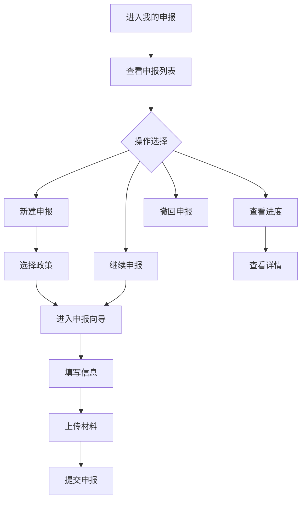

# 我的申报

> **文档状态**：已完成  
> **最后更新**：2026-03-24  
> **文档作者**：张博  
> **所属模块**：政策中心

---

## 修订记录

| 版本号 | 修订日期 | 修订内容 | 修订人 | 审核人 |
| :--- | :--- | :--- | :--- | :--- |
| v1.0.0 | 2026-03-24 | 初始版本，完成我的申报基础功能PRD | 张博 | - |
| v1.0.1 | 2026-03-28 | 优化申报向导，增加自动保存功能 | 张博 | 李明 |
| v1.1.0 | 2026-04-05 | 新增草稿管理，完善申报流程 | 张博 | 王芳 |

---

## 1. 功能描述

我的申报功能为个人用户提供申报项目的查看、管理和操作功能，包括申报向导、进度查询、材料上传、申报撤回等功能。

### 1.1 业务背景

企业员工需要便捷地管理自己的申报任务，包括创建新申报、继续未完成的申报、查看申报进度、上传申报材料等。我的申报功能提供一站式的个人申报管理服务。

### 1.2 业务功能流程图



---

## 2. 申报向导

### 2.1 向导步骤

| 步骤 | 步骤名称 | 说明 | 必填 |
| :--- | :--- | :--- | :--- |
| 1 | 选择政策 | 选择要申报的政策 | 是 |
| 2 | 填写基本信息 | 填写企业/项目基本信息 | 是 |
| 3 | 填写申报信息 | 填写政策要求的专项信息 | 是 |
| 4 | 上传材料 | 上传申报材料 | 是 |
| 5 | 确认提交 | 确认信息并提交 | 是 |

### 2.2 向导功能

| 功能 | 说明 |
| :--- | :--- |
| 步骤导航 | 顶部显示步骤进度条 |
| 上一步/下一步 | 步骤间导航 |
| 保存草稿 | 随时保存当前进度 |
| 自动保存 | 每30秒自动保存 |
| 步骤校验 | 进入下一步前校验当前步骤 |
| 返回修改 | 已完成的步骤可返回修改 |

---

## 3. 列表展示

### 3.1 列表字段

| 字段名称 | 字段说明 | 是否可编辑 | 字段类型 |
| :--- | :--- | :--- | :--- |
| 政策名称 | 申报的政策名称 | 否 | 文本 |
| 当前步骤 | 申报当前所在步骤 | 否 | 文本 |
| 申报状态 | 整体申报状态 | 否 | 标签 |
| 进度 | 完成百分比 | 否 | 进度条 |
| 创建时间 | 申报创建时间 | 否 | 日期 |
| 最后更新 | 最后更新时间 | 否 | 日期 |
| 操作 | 操作按钮 | 否 | 按钮组 |

### 3.2 状态说明

| 状态 | 说明 | 可操作 |
| :--- | :--- | :--- |
| 草稿 | 未提交的申报 | 编辑/删除 |
| 已提交 | 已提交待审核 | 查看/撤回 |
| 审核中 | 正在审核 | 查看 |
| 需补充 | 需要补充材料 | 补充材料 |
| 已通过 | 审核通过 | 查看 |
| 已驳回 | 审核未通过 | 查看/重新申报 |
| 已撤回 | 已主动撤回 | 查看/重新提交 |

---

## 4. 数据模型

```typescript
interface MyApplication {
  id: string;
  policyId: string;
  policyTitle: string;
  currentStep: number;
  totalSteps: number;
  status: MyApplicationStatus;
  progress: number;
  formData: Record<string, any>;
  materials: Material[];
  createDate: string;
  updateDate: string;
  submitDate?: string;
}

type MyApplicationStatus = 
  | 'draft' 
  | 'submitted' 
  | 'under_review'
  | 'supplement_required'
  | 'approved' 
  | 'rejected'
  | 'withdrawn';
```

---

## 5. 接口需求

| 接口名称 | 请求方式 | 接口路径 | 功能说明 |
| :--- | :--- | :--- | :--- |
| 获取我的申报 | GET | /api/my-applications | 获取个人申报列表 |
| 创建申报 | POST | /api/applications | 创建新申报 |
| 保存草稿 | PUT | /api/applications/:id/draft | 保存申报草稿 |
| 提交申报 | PUT | /api/applications/:id/submit | 提交申报 |
| 撤回申报 | PUT | /api/applications/:id/withdraw | 撤回申报 |
| 删除草稿 | DELETE | /api/applications/:id | 删除草稿 |

---

**文档结束**
