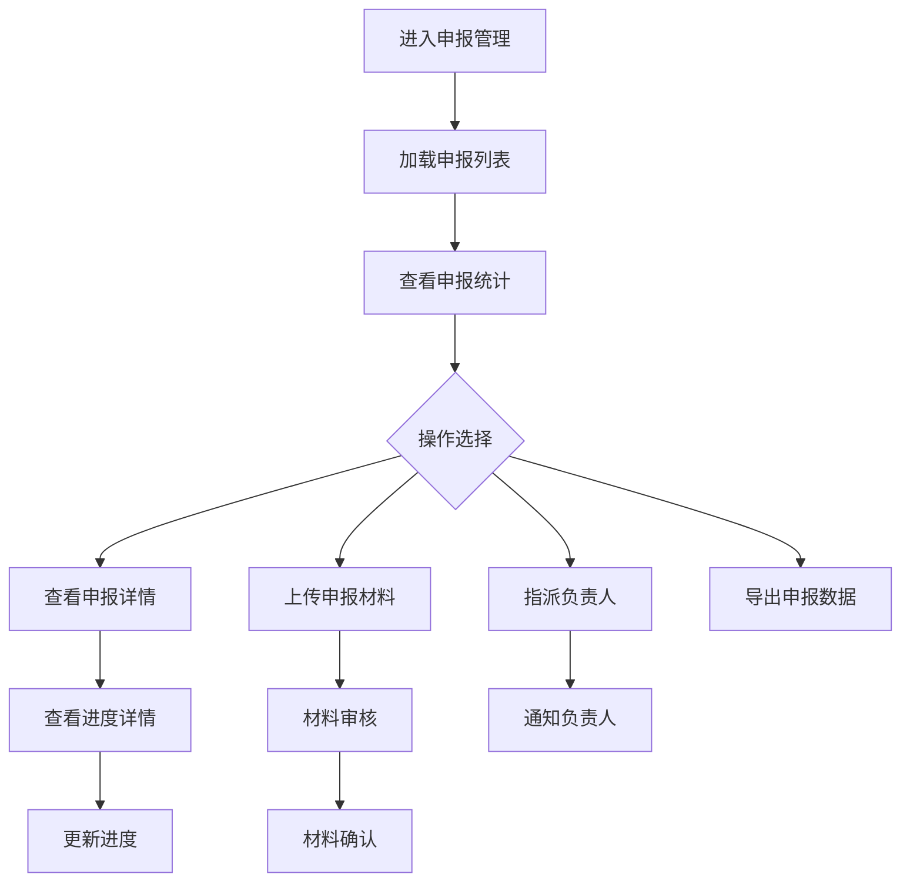

# 申报管理

> **文档状态**：已完成  
> **最后更新**：2026-03-24  
> **文档作者**：张博  
> **所属模块**：政策中心

---

## 修订记录

| 版本号 | 修订日期 | 修订内容 | 修订人 | 审核人 |
| :--- | :--- | :--- | :--- | :--- |
| v1.0.0 | 2026-03-24 | 初始版本，完成申报管理基础功能PRD | 张博 | - |
| v1.0.1 | 2026-03-28 | 优化材料管理功能，增加批量操作 | 张博 | 李明 |
| v1.1.0 | 2026-04-05 | 新增团队指派功能，完善统计分析 | 张博 | 王芳 |

---

## 1. 功能描述

申报管理功能为企业管理员提供全面的申报项目管理能力，包括申报进度跟踪、材料管理、团队协作、统计分析等功能。

### 1.1 业务背景

企业申报政府项目时，往往涉及多个部门协作、大量材料准备、复杂的进度跟踪。申报管理功能帮助企业统一管理所有申报项目，提高申报效率和成功率。

### 1.2 业务功能流程图



---

## 2. 列表展示

### 2.1 列表字段

| 字段名称 | 字段说明 | 是否可编辑 | 字段类型 | 说明 |
| :--- | :--- | :--- | :--- | :--- |
| 申报编号 | 唯一标识 | 否 | 文本 | 系统自动生成 |
| 政策名称 | 申报的政策 | 否 | 文本 | 点击可查看政策 |
| 申报状态 | 当前状态 | 否 | 标签 | 草稿/已提交/审核中/已通过/已驳回 |
| 进度 | 完成百分比 | 否 | 进度条 | 0-100% |
| 负责人 | 指派负责人 | 是 | 选择器 | 可修改指派 |
| 提交日期 | 提交时间 | 否 | 日期 | --表示未提交 |
| 截止日期 | 申报截止 | 否 | 日期 | 即将过期标红 |
| 材料状态 | 材料完整性 | 否 | 标签 | 完整/缺失/待审核 |
| 操作 | 操作按钮 | 否 | 按钮组 | 查看/编辑/撤回 |

### 2.2 筛选功能

| 筛选条件 | 筛选类型 | 选项说明 |
| :--- | :--- | :--- |
| 申报状态 | 多选 | 草稿、已提交、审核中、已通过、已驳回 |
| 负责人 | 单选 | 企业成员列表 |
| 提交时间 | 日期范围 | 最近7天、30天、90天、自定义 |
| 材料状态 | 多选 | 完整、缺失、待审核 |
| 政策类型 | 多选 | 按政策类型筛选 |

---

## 3. 申报详情

### 3.1 详情内容

| 内容区块 | 说明 |
| :--- | :--- |
| 基本信息 | 申报编号、政策信息、申报日期 |
| 进度时间轴 | 申报进度可视化时间轴 |
| 材料清单 | 申报材料列表及审核状态 |
| 负责人信息 | 当前负责人及历史指派记录 |
| 审核记录 | 审核意见及历史记录 |
| 操作日志 | 申报操作历史 |

### 3.2 进度时间轴

| 节点 | 说明 | 状态 |
| :--- | :--- | :--- |
| 创建申报 | 申报草稿创建 | 已完成 |
| 填写信息 | 填写申报表单 | 已完成/进行中 |
| 上传材料 | 上传申报材料 | 已完成/进行中 |
| 提交申报 | 正式提交 | 已完成/待完成 |
| 初审 | 初步审核 | 待审核/已通过/已驳回 |
| 复审 | 复审环节 | 待审核/已通过/已驳回 |
| 结果通知 | 最终结果 | 待通知/已通过/已驳回 |

---

## 4. 材料管理

### 4.1 材料类型

| 材料类型 | 说明 | 格式要求 |
| :--- | :--- | :--- |
| 营业执照 | 企业营业执照 | PDF/JPG/PNG |
| 资质证书 | 相关资质证明 | PDF/JPG/PNG |
| 财务报表 | 近期财务报表 | PDF/Excel |
| 项目方案 | 申报项目方案 | PDF/Word |
| 其他材料 | 其他支持材料 | 不限 |

### 4.2 材料操作

| 操作 | 说明 | 权限 |
| :--- | :--- | :--- |
| 上传材料 | 上传新文件 | 负责人/管理员 |
| 删除材料 | 删除已上传文件 | 负责人/管理员 |
| 预览材料 | 在线预览文件 | 所有成员 |
| 下载材料 | 下载文件到本地 | 所有成员 |
| 替换材料 | 替换已有文件 | 负责人/管理员 |

---

## 5. 团队指派

### 5.1 指派功能

| 字段名称 | 是否必填 | 字段类型 | 说明 |
| :--- | :--- | :--- | :--- |
| 负责人 | 是 | 选择器 | 企业成员列表 |
| 协助人 | 否 | 多选 | 可多个协助人 |
| 指派备注 | 否 | 文本域 | 指派说明 |
| 截止日期 | 否 | 日期 | 任务截止日期 |

### 5.2 通知机制

| 触发时机 | 通知方式 | 通知内容 |
| :--- | :--- | :--- |
| 指派负责人 | 站内信+短信 | 您被指派为XX申报负责人 |
| 进度更新 | 站内信 | 申报进度更新提醒 |
| 即将截止 | 站内信+短信 | 申报即将截止提醒 |
| 审核结果 | 站内信+短信 | 申报审核结果通知 |

---

## 6. 统计分析

### 6.1 统计维度

| 统计项 | 说明 | 图表类型 |
| :--- | :--- | :--- |
| 申报总数 | 累计申报数量 | 数字卡片 |
| 通过率 | 申报通过比例 | 饼图 |
| 状态分布 | 各状态申报数量 | 柱状图 |
| 月度趋势 | 按月统计申报数 | 折线图 |
| 政策类型分布 | 按类型统计 | 饼图 |
| 负责人工作量 | 各负责人申报数 | 柱状图 |

### 6.2 数据导出

| 导出类型 | 格式 | 内容 |
| :--- | :--- | :--- |
| 申报列表 | Excel | 当前筛选的申报数据 |
| 统计报告 | PDF | 统计分析图表和说明 |
| 材料包 | ZIP | 选中申报的所有材料 |

---

## 7. 数据模型

```typescript
interface Application {
  id: string;
  applicationNo: string;
  policyId: string;
  policyTitle: string;
  status: ApplicationStatus;
  progress: number;
  assignee?: string;
  collaborators?: string[];
  submitDate?: string;
  deadline: string;
  materials: Material[];
  auditRecords: AuditRecord[];
  createDate: string;
  updateDate: string;
}

type ApplicationStatus = 
  | 'draft' 
  | 'submitted' 
  | 'under_review' 
  | 'supplement_required'
  | 'approved' 
  | 'rejected';

interface Material {
  id: string;
  name: string;
  type: string;
  url: string;
  status: 'pending' | 'verified' | 'rejected';
  uploadTime: string;
  uploader: string;
}

interface AuditRecord {
  id: string;
  stage: string;
  result: 'passed' | 'rejected' | 'supplement_required';
  comment: string;
  auditor: string;
  auditTime: string;
}
```

---

## 8. 接口需求

| 接口名称 | 请求方式 | 接口路径 | 功能说明 |
| :--- | :--- | :--- | :--- |
| 获取申报列表 | GET | /api/applications | 获取企业申报列表 |
| 获取申报详情 | GET | /api/applications/:id | 获取申报详细信息 |
| 更新申报进度 | PUT | /api/applications/:id/progress | 更新申报进度 |
| 上传材料 | POST | /api/applications/:id/materials | 上传申报材料 |
| 删除材料 | DELETE | /api/applications/:id/materials/:materialId | 删除材料 |
| 指派负责人 | PUT | /api/applications/:id/assign | 指派负责人 |
| 获取统计数据 | GET | /api/applications/statistics | 获取申报统计 |
| 导出申报数据 | POST | /api/applications/export | 导出申报数据 |

---

## 9. 异常场景处理

| 异常场景 | 系统行为 | 提醒方式 |
| :--- | :--- | :--- |
| 材料上传失败 | 保留已上传文件，提示重试 | Toast提示 |
| 指派失败 | 保持原负责人，提示错误 | Toast提示 |
| 申报已截止 | 禁用编辑和提交操作 | 页面提示 |
| 权限不足 | 隐藏操作按钮 | 无 |

---

**文档结束**
