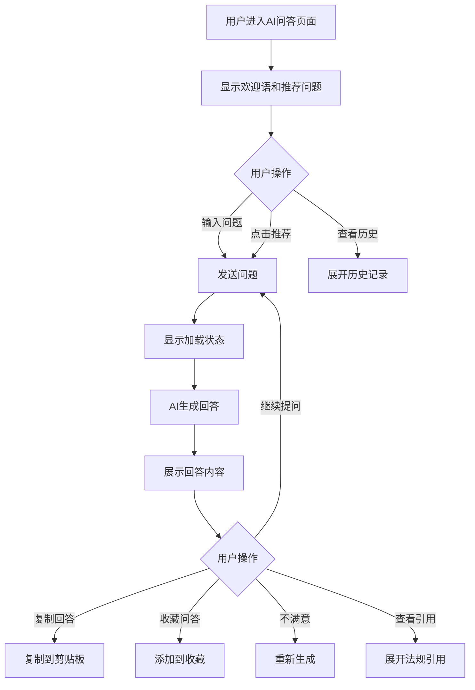

# AI 问答

#### 1. 功能描述
提供AI智能法律问答功能，用户可以通过自然语言提问，AI基于法规知识库给出专业的法律解答和建议。支持多轮对话、历史记录、问题推荐等功能。

##### 1.1 业务功能流程图



#### 2. 业务规则

##### 2.1 问答规则
| 规则编号 | 规则名称 | 规则描述 | 适用范围 |
| :--- | :--- | :--- | :--- |
| BR-001 | 问题长度限制 | 单次提问不超过500字 | 全局 |
| BR-002 | 回答长度限制 | 单次回答不超过2000字 | 全局 |
| BR-003 | 多轮对话 | 支持上下文关联的多轮对话 | 对话中 |
| BR-004 | 引用标注 | 回答中引用的法规需标注来源 | 回答内容 |

##### 2.2 历史记录规则
| 规则编号 | 规则名称 | 规则描述 |
| :--- | :--- | :--- |
| BR-005 | 本地存储 | 对话历史存储在localStorage中 |
| BR-006 | 记录数量 | 最多保存50条历史对话 |
| BR-007 | 会话管理 | 支持新建会话和删除历史 |

##### 2.3 内容安全规则
| 规则编号 | 规则名称 | 规则描述 |
| :--- | :--- | :--- |
| BR-008 | 敏感词过滤 | 对输入内容进行敏感词检测 |
| BR-009 | 免责声明 | 回答末尾附加AI生成内容免责声明 |
| BR-010 | 专业限制 | 仅回答法律相关问题，其他问题礼貌拒绝 |

#### 3. 数据模型

##### 3.1 实体：ChatMessage（对话消息）

| 字段名 | 类型 | 必填 | 说明 |
| :--- | :--- | :--- | :--- |
| id | string | 是 | 消息唯一标识 |
| sessionId | string | 是 | 所属会话ID |
| role | enum | 是 | 角色：user（用户）/ assistant（AI） |
| content | string | 是 | 消息内容 |
| timestamp | number | 是 | 发送时间戳 |
| references | Reference[] | 否 | 引用的法规列表 |
| isLoading | boolean | 否 | 是否正在生成 |

##### 3.2 实体：ChatSession（对话会话）

| 字段名 | 类型 | 必填 | 说明 |
| :--- | :--- | :--- | :--- |
| id | string | 是 | 会话唯一标识 |
| title | string | 是 | 会话标题（首条问题摘要） |
| messages | ChatMessage[] | 是 | 消息列表 |
| createTime | number | 是 | 创建时间 |
| updateTime | number | 是 | 最后更新时间 |

##### 3.3 实体：Reference（法规引用）

| 字段名 | 类型 | 必填 | 说明 |
| :--- | :--- | :--- | :--- |
| id | string | 是 | 法规ID |
| title | string | 是 | 法规标题 |
| article | string | 否 | 具体条款 |
| url | string | 否 | 法规详情页链接 |

#### 4. 功能详述

##### 4.1 欢迎区域

**功能说明**：
- 展示AI助手欢迎语
- 显示功能介绍和使用提示
- 提供推荐问题快捷入口

**欢迎语示例**：
```
您好！我是您的AI法律顾问。
我可以帮您：
• 解答法律问题
• 解读法规条款
• 分析法律风险
• 提供合规建议

请输入您的问题，或点击下方推荐问题开始对话。
```

**推荐问题**：
| 问题类型 | 示例问题 |
| :--- | :--- |
| 劳动用工 | "试用期最长可以约定多久？" |
| 合同纠纷 | "合同违约金一般怎么计算？" |
| 知识产权 | "商标被侵权了怎么办？" |
| 公司治理 | "股东会和董事会有什么区别？" |
| 税务合规 | "小规模纳税人有什么优惠政策？" |

##### 4.2 对话输入区

**功能说明**：
- 提供文本输入框供用户输入问题
- 支持发送按钮和快捷键发送

**输入字段**：
| 字段名称 | 字段说明 | 是否必填 | 字段类型 | 说明 |
| :--- | :--- | :--- | :--- | :--- |
| 问题内容 | 用户提问 | 是 | 多行文本 | 最多500字 |

**交互逻辑**：
- 输入框支持多行文本
- 按Enter发送，Shift+Enter换行
- 输入为空时发送按钮禁用
- 显示字数统计

##### 4.3 消息展示区

**功能说明**：
- 以对话气泡形式展示用户和AI的消息
- 支持Markdown格式渲染
- 代码块、列表等特殊格式支持

**消息样式**：
| 角色 | 位置 | 样式 |
| :--- | :--- | :--- |
| 用户 | 右侧 | 蓝色背景气泡 |
| AI | 左侧 | 白色背景气泡 |

**消息内容支持**：
- 普通文本
- Markdown格式（加粗、斜体、链接等）
- 有序/无序列表
- 代码块
- 引用块

##### 4.4 AI回答功能

**功能说明**：
- AI根据用户问题生成专业法律回答
- 回答包含法规引用和实务建议

**回答结构**：
```
1. 直接回答（简明扼要）
2. 法规依据（引用相关法规）
3. 实务建议（操作指导）
4. 风险提示（注意事项）
5. 免责声明
```

**法规引用展示**：
- 回答中引用的法规以卡片形式展示
- 显示法规标题、相关条款
- 点击可跳转到法规详情页

**示例回答**：
```
根据《劳动合同法》第十九条规定，劳动合同期限三个月以上不满一年的，试用期不得超过一个月。

【法规依据】
• 《劳动合同法》第十九条
• 《劳动合同法》第八十三条

【实务建议】
1. 试用期应包含在劳动合同期限内
2. 同一用人单位与同一劳动者只能约定一次试用期
3. 试用期工资不得低于本单位相同岗位最低档工资的80%

【风险提示】
违法约定试用期的，用人单位可能面临赔偿风险。

---
*以上内容仅供参考，不构成正式法律意见。具体问题请咨询专业律师。*
```

##### 4.5 历史记录功能

**功能说明**：
- 展示用户的历史对话列表
- 支持快速切换和删除历史会话

**历史列表字段**：
| 字段名称 | 字段说明 | 说明 |
| :--- | :--- | :--- |
| 会话标题 | 首条问题摘要 | 如"试用期相关规定" |
| 最后时间 | 更新时间 | 如"2小时前" |
| 消息数量 | 对话轮数 | 如"5条消息" |

**交互逻辑**：
- 点击历史会话加载对话内容
- 支持删除单条历史
- 支持清空全部历史
- 支持新建会话

##### 4.6 快捷操作功能

**功能按钮**：
| 按钮 | 功能 | 说明 |
| :--- | :--- | :--- |
| 复制 | 复制回答 | 将AI回答复制到剪贴板 |
| 收藏 | 收藏问答 | 将当前问答添加到收藏夹 |
| 重新生成 | 重新回答 | 对同一问题重新生成回答 |
| 分享 | 分享对话 | 生成对话分享链接 |

#### 5. 异常场景处理

| 异常场景 | 场景说明 | 系统行为 | 提醒方式 | 操作选项 |
| :--- | :--- | :--- | :--- | :--- |
| 网络异常 | 无法连接到AI服务 | 显示错误提示 | 提示"网络异常，请稍后重试" | 重试或返回 |
| 生成超时 | AI回答生成超时 | 显示超时提示 | 提示"生成超时，请重试" | 重新生成 |
| 敏感内容 | 输入包含敏感词 | 拒绝回答 | 提示"您的问题涉及敏感内容" | 修改问题 |
| 非法律问题 | 问题与法律无关 | 礼貌拒绝 | 提示"我是法律AI助手，请提出法律相关问题" | 重新提问 |
| 服务繁忙 | AI服务负载过高 | 显示排队提示 | 提示"服务繁忙，请稍候" | 等待或取消 |

#### 6. 权限控制

| 功能 | 游客 | 普通用户 | VIP用户 |
| :--- | :--- | :--- | :--- |
| 基础问答 | 限制次数 | 每日20次 | 无限制 |
| 多轮对话 | ✓ | ✓ | ✓ |
| 查看历史 | ✗ | ✓ | ✓ |
| 收藏问答 | ✗ | ✓ | ✓ |
| 优先响应 | ✗ | ✗ | ✓ |
| 深度分析 | ✗ | 限制次数 | 完整功能 |

#### 7. 数据关联

| 关联功能 | 关联方式 | 说明 |
| :--- | :--- | :--- |
| 法规详情 | 引用链接 | 点击引用法规跳转到详情页 |
| 收藏夹 | 收藏功能 | 收藏的问答显示在收藏夹中 |
| 用户中心 | 历史同步 | 登录用户历史记录云端同步 |
