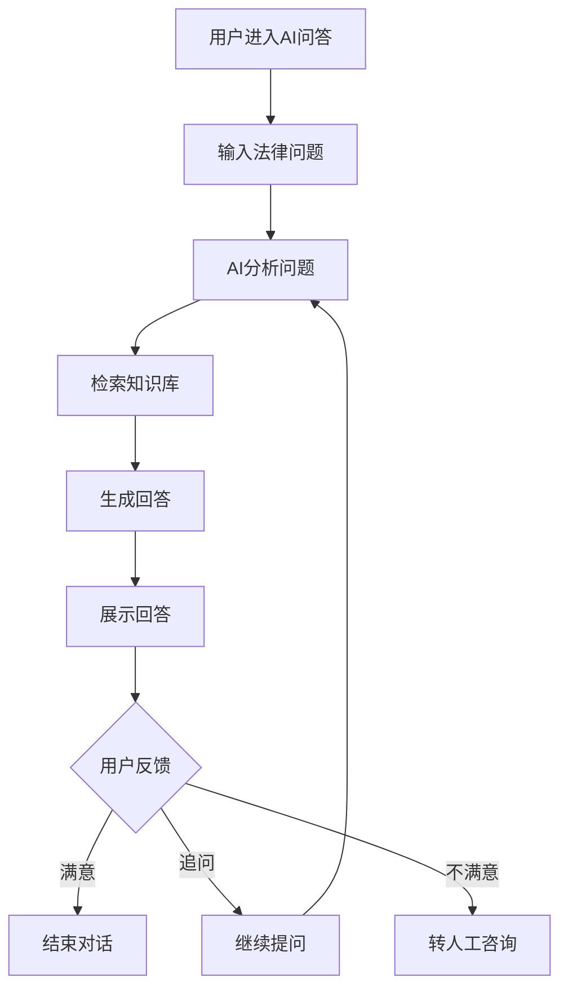

# AI问答

> **文档状态**：已完成  
> **最后更新**：2026-03-24  
> **文档作者**：张博  
> **所属模块**：法律护航

---

## 修订记录

| 版本号 | 修订日期 | 修订内容 | 修订人 | 审核人 |
| :--- | :--- | :--- | :--- | :--- |
| v1.0.0 | 2026-03-24 | 初始版本，完成AI问答基础功能PRD | 张博 | - |
| v1.0.1 | 2026-03-28 | 优化AI回复质量，增加多轮对话 | 张博 | 李明 |
| v1.1.0 | 2026-04-05 | 新增案例推荐功能，完善知识库 | 张博 | 王芳 |

---

## 1. 功能描述

AI问答功能提供智能法律咨询服务，用户可以通过自然语言提问，AI基于法律法规知识库给出专业解答，并提供相关案例推荐。

### 1.1 业务背景

企业在经营过程中经常遇到各种法律问题，需要专业的法律咨询。传统法律咨询成本高、响应慢。AI问答功能通过人工智能技术，为企业提供7x24小时的智能法律咨询服务。

### 1.2 业务功能流程图



---

## 2. 对话界面

### 2.1 界面布局

| 区域 | 位置 | 内容说明 |
| :--- | :--- | :--- |
| 对话历史区 | 左侧 | 历史对话列表 |
| 聊天区 | 中间 | 当前对话内容 |
| 推荐区 | 右侧 | 热门问题、相关法规推荐 |
| 输入区 | 底部 | 问题输入框和发送按钮 |

### 2.2 消息类型

| 消息类型 | 说明 | 展示方式 |
| :--- | :--- | :--- |
| 用户消息 | 用户提问 | 右侧气泡，蓝色背景 |
| AI消息 | AI回答 | 左侧气泡，白色背景 |
| 系统消息 | 系统提示 | 居中灰色文字 |
| 推荐消息 | 相关推荐 | 卡片形式嵌入 |

---

## 3. 问答功能

### 3.1 提问方式

| 提问方式 | 说明 | 示例 |
| :--- | :--- | :--- |
| 直接提问 | 输入法律问题 | "劳动合同到期不续签需要赔偿吗" |
| 场景描述 | 描述具体场景 | "我们公司要裁员，需要注意什么" |
| 文档咨询 | 上传文档咨询 | 上传合同文件询问条款问题 |

### 3.2 AI回答内容

| 内容模块 | 说明 |
| :--- | :--- |
| 问题理解 | AI对用户问题的理解总结 |
| 法律分析 | 基于法律法规的分析解答 |
| 相关法条 | 引用的相关法律条文 |
| 操作建议 | 具体的操作建议和注意事项 |
| 风险提示 | 可能存在的法律风险提示 |
| 相关案例 | 类似案例推荐（如有） |

---

## 4. 知识库

### 4.1 知识库内容

| 知识类型 | 说明 | 数量 |
| :--- | :--- | :--- |
| 法律法规 | 国家法律法规 | 1000+ |
| 司法解释 | 最高法院司法解释 | 500+ |
| 地方法规 | 地方性法规规章 | 2000+ |
| 典型案例 | 法院判决案例 | 10000+ |
| 合同模板 | 标准合同模板 | 200+ |

### 4.2 知识更新

| 更新类型 | 频率 | 说明 |
| :--- | :--- | :--- |
| 法规更新 | 实时 | 新法规发布后自动更新 |
| 案例更新 | 每周 | 新增典型案例 |
| 知识优化 | 每月 | 基于用户反馈优化 |

---

## 5. 数据模型

```typescript
interface ChatSession {
  id: string;
  title: string;
  messages: ChatMessage[];
  createTime: string;
  updateTime: string;
}

interface ChatMessage {
  id: string;
  role: 'user' | 'assistant' | 'system';
  content: string;
  timestamp: string;
  references?: Reference[];
  feedback?: 'helpful' | 'not_helpful';
}

interface Reference {
  type: 'law' | 'case' | 'template';
  title: string;
  url?: string;
  snippet: string;
}
```

---

## 6. 接口需求

| 接口名称 | 请求方式 | 接口路径 | 功能说明 |
| :--- | :--- | :--- | :--- |
| 创建对话 | POST | /api/ai-lawyer/chat | 创建新对话 |
| 发送消息 | POST | /api/ai-lawyer/chat/:id/message | 发送问题 |
| 获取历史 | GET | /api/ai-lawyer/history | 获取对话历史 |
| 获取推荐 | GET | /api/ai-lawyer/recommendations | 获取热门问题 |
| 提交反馈 | POST | /api/ai-lawyer/feedback | 提交回答反馈 |

---

## 7. 异常场景处理

| 异常场景 | 系统行为 | 提醒方式 |
| :--- | :--- | :--- |
| AI服务异常 | 提示服务繁忙，建议稍后重试 | Toast提示 |
| 问题超出范围 | 提示问题不在服务范围，建议转人工 | 消息提示 |
| 网络中断 | 保存输入内容，恢复后自动重试 | 无 |

---

**文档结束**
