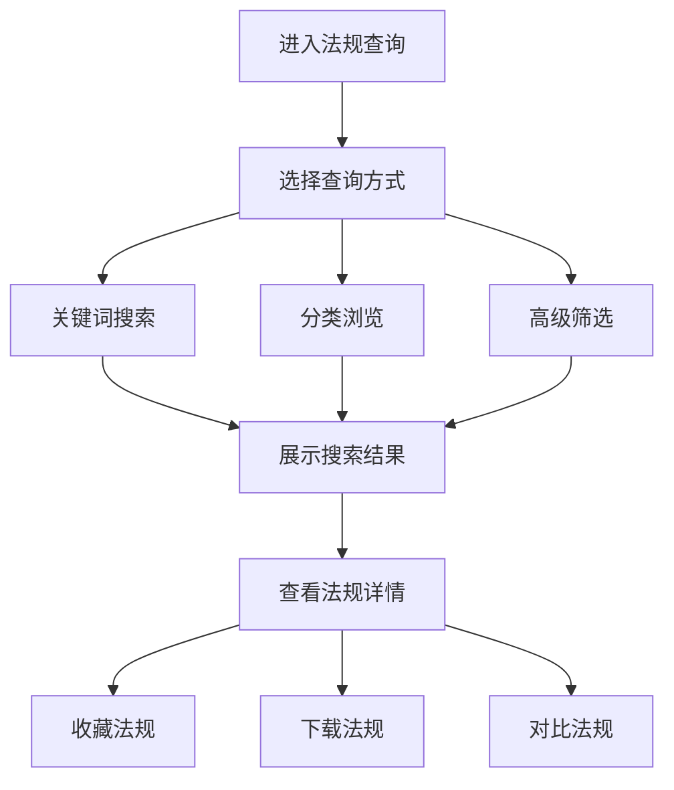

# 法规整合查询

> **文档状态**：已完成  
> **最后更新**：2026-03-24  
> **文档作者**：张博  
> **所属模块**：法律护航

---

## 修订记录

| 版本号 | 修订日期 | 修订内容 | 修订人 | 审核人 |
| :--- | :--- | :--- | :--- | :--- |
| v1.0.0 | 2026-03-24 | 初始版本，完成法规整合查询基础功能PRD | 张博 | - |
| v1.0.1 | 2026-03-28 | 优化搜索算法，增加法规关联 | 张博 | 李明 |
| v1.1.0 | 2026-04-05 | 新增法规对比功能，完善收藏管理 | 张博 | 王芳 |

---

## 1. 功能描述

法规整合查询功能提供全面的法律法规检索服务，支持关键词搜索、分类浏览、高级筛选，并提供法规详情查看、收藏、对比等功能。

### 1.1 业务背景

企业需要及时了解相关法律法规的变化，确保合规经营。法规整合查询功能汇集国家和地方的各类法律法规，提供便捷的检索和查阅服务。

### 1.2 业务功能流程图



---

## 2. 搜索功能

### 2.1 搜索方式

| 搜索方式 | 说明 |
| :--- | :--- |
| 关键词搜索 | 输入关键词搜索法规标题和内容 |
| 分类浏览 | 按法规类型、发布机构分类浏览 |
| 高级搜索 | 组合多个条件进行精确搜索 |

### 2.2 搜索条件

| 条件名称 | 条件类型 | 选项说明 |
| :--- | :--- | :--- |
| 关键词 | 文本输入 | 支持模糊搜索 |
| 法规类型 | 多选 | 法律、行政法规、部门规章、地方性法规等 |
| 发布机构 | 多选 | 全国人大、国务院、各部委、地方政府等 |
| 发布日期 | 日期范围 | 发布时间范围 |
| 效力级别 | 多选 | 现行有效、已废止、已修改 |
| 适用范围 | 多选 | 全国、特定地区 |

---

## 3. 列表展示

### 3.1 列表字段

| 字段名称 | 字段说明 | 是否可编辑 | 字段类型 |
| :--- | :--- | :--- | :--- |
| 法规标题 | 法规完整名称 | 否 | 文本 |
| 发文字号 | 法规文号 | 否 | 文本 |
| 发布机构 | 发布部门 | 否 | 文本 |
| 发布日期 | 发布时间 | 否 | 日期 |
| 效力级别 | 现行状态 | 否 | 标签 |
| 操作 | 操作按钮 | 否 | 按钮组 |

---

## 4. 法规详情

### 4.1 详情内容

| 内容区块 | 说明 |
| :--- | :--- |
| 基本信息 | 标题、文号、发布机构、日期 |
| 法规正文 | 完整法规内容 |
| 相关法规 | 关联的其他法规 |
| 修订记录 | 法规修订历史 |
| 官方链接 | 官方发布链接 |

---

## 5. 数据模型

```typescript
interface Regulation {
  id: string;
  title: string;
  documentNo: string;
  publishOrg: string;
  publishDate: string;
  effectiveDate: string;
  status: 'effective' | 'amended' | 'repealed';
  type: string;
  scope: string;
  content: string;
  relatedRegulations?: string[];
  amendments?: Amendment[];
}

interface Amendment {
  version: string;
  date: string;
  content: string;
}
```

---

## 6. 接口需求

| 接口名称 | 请求方式 | 接口路径 | 功能说明 |
| :--- | :--- | :--- | :--- |
| 搜索法规 | POST | /api/regulations/search | 搜索法规列表 |
| 获取法规详情 | GET | /api/regulations/:id | 获取法规详情 |
| 获取分类 | GET | /api/regulations/categories | 获取法规分类 |
| 收藏法规 | POST | /api/regulations/:id/favorite | 收藏法规 |
| 下载法规 | GET | /api/regulations/:id/download | 下载法规文件 |

---

**文档结束**
