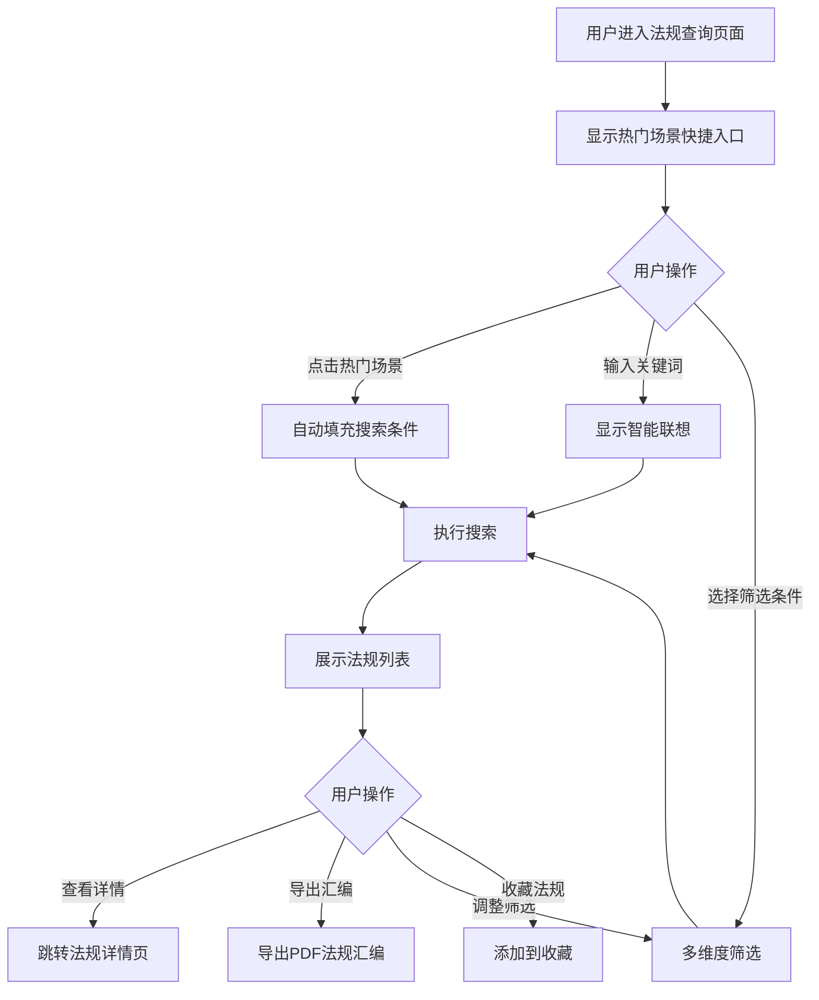

# 法规查询

#### 1. 功能描述
提供法规查询功能，支持多维度筛选、关键词搜索、智能联想、法规列表展示、导出汇编等功能。帮助用户快速查找和获取相关法律法规信息。

##### 1.1 业务功能流程图



#### 2. 业务规则

##### 2.1 数据筛选规则
| 规则编号 | 规则名称 | 规则描述 | 适用范围 |
| :--- | :--- | :--- | :--- |
| BR-001 | 场景筛选 | 支持按业务场景（劳动雇佣、数据合规等）筛选法规 | 全局 |
| BR-002 | 效力层级筛选 | 支持按法规效力层级（法律、行政法规等）多选筛选 | 全局 |
| BR-003 | 法规状态筛选 | 支持按法规状态（现行有效、已修订、已废止）筛选 | 全局 |
| BR-004 | 发布时间筛选 | 支持按发布时间范围筛选法规 | 全局 |
| BR-005 | 关键词搜索 | 支持按标题、场景等字段模糊搜索 | 全局 |

##### 2.2 搜索联想规则
| 规则编号 | 规则名称 | 规则描述 |
| :--- | :--- | :--- |
| BR-006 | 场景联想 | 输入关键词时联想匹配的热门场景 |
| BR-007 | 法规联想 | 输入关键词时联想匹配的法规标题 |
| BR-008 | 扩展联想 | 特定关键词触发扩展联想（如"电商"联想"跨境电商知识产权侵权"） |

##### 2.3 数据排序规则
| 规则编号 | 规则名称 | 规则描述 |
| :--- | :--- | :--- |
| BR-009 | 相关度排序 | 默认按关键词匹配相关度排序 |
| BR-010 | 发布时间排序 | 支持按发布时间倒序排序 |
| BR-011 | 效力层级排序 | 支持按效力层级（法律>行政法规>部门规章）排序 |

##### 2.4 导出规则
| 规则编号 | 规则名称 | 规则描述 |
| :--- | :--- | :--- |
| BR-012 | 导出范围 | 支持导出当前列表全部法规或选中法规 |
| BR-013 | 导出格式 | 导出为PDF格式的法规汇编文件 |
| BR-014 | 文件命名 | 文件名格式：璟智通-{场景名}法规汇编-{日期}.pdf |

#### 3. 数据模型

##### 3.1 实体：RegulationItem（法规项）

| 字段名 | 类型 | 必填 | 说明 |
| :--- | :--- | :--- | :--- |
| id | string | 是 | 法规唯一标识 |
| title | string | 是 | 法规标题 |
| level | string | 是 | 效力层级（法律/行政法规/部门规章等） |
| field | string | 是 | 业务领域 |
| scenario | string | 是 | 业务场景 |
| publishOrg | string | 是 | 发布机关 |
| publishDate | string | 是 | 发布日期（YYYY-MM-DD） |
| effectiveDate | string | 是 | 施行日期（YYYY-MM-DD） |
| status | enum | 是 | 法规状态：effective（现行有效）/ revised（已修订）/ abolished（已废止） |
| tags | string[] | 是 | 标签数组 |
| summary | string | 是 | 法规摘要 |
| keyArticles | string[] | 是 | 核心条款摘要 |
| viewCount | number | 是 | 浏览次数 |
| downloadCount | number | 是 | 下载次数 |
| matchScore | number | 否 | 匹配分数（搜索时使用） |
| isNew | boolean | 否 | 是否为新发布法规 |

##### 3.2 实体：FilterCriteria（筛选条件）

| 字段名 | 类型 | 必填 | 说明 |
| :--- | :--- | :--- | :--- |
| scenario | string | 是 | 企业场景，默认"全部" |
| level | string[] | 是 | 效力层级数组，默认全选 |
| status | enum | 是 | 法规状态：effective / revised / abolished / all |
| timeRange | string | 是 | 时效性筛选 |
| keyword | string | 是 | 搜索关键词 |
| field | string[] | 是 | 业务领域数组 |
| applicableScenario | string[] | 是 | 适用场景数组 |
| publishOrg | string[] | 是 | 发布机关数组 |
| dateRange | [string, string] \| null | 是 | 发布时间范围 |

##### 3.3 实体：SavedFilter（保存的筛选条件）

| 字段名 | 类型 | 必填 | 说明 |
| :--- | :--- | :--- | :--- |
| id | string | 是 | 筛选条件ID |
| name | string | 是 | 筛选条件名称 |
| criteria | FilterCriteria | 是 | 筛选条件对象 |

#### 4. 功能详述

##### 4.1 热门场景快捷入口

**功能说明**：
- 在搜索区域上方显示热门业务场景快捷入口
- 点击场景自动填充搜索条件并执行搜索

**热门场景列表**：
| 场景名称 | 图标 | 颜色 |
| :--- | :--- | :--- |
| 劳动雇佣 | TeamOutlined | #1890ff |
| 数据合规 | SafetyCertificateOutlined | #722ed1 |
| 股权激励 | RiseOutlined | #52c41a |
| 反垄断法 | ThunderboltOutlined | #fa8c16 |
| 电商维权 | BankOutlined | #eb2f96 |

**交互逻辑**：
1. 用户点击场景标签
2. 系统自动将场景名称填充到搜索框
3. 触发搜索，展示该场景相关的法规列表
4. 特定场景（如"电商维权"、"数据合规"）触发风险提示弹窗

##### 4.2 智能搜索功能

**功能说明**：
- 支持关键词搜索，输入时显示智能联想建议
- 支持搜索历史记录和快速清除

**搜索字段**：
| 字段名称 | 字段说明 | 是否必填 | 字段类型 | 说明 |
| :--- | :--- | :--- | :--- | :--- |
| 搜索关键词 | 搜索内容 | 否 | 文本输入 | 支持模糊匹配法规标题和场景 |

**联想类型**：
| 类型 | 说明 | 示例 |
| :--- | :--- | :--- |
| 场景 | 匹配的热门场景 | 输入"电商"联想"电商维权" |
| 法规 | 匹配的法规标题 | 输入"劳动合同"联想"中华人民共和国劳动合同法" |
| 扩展 | 扩展联想 | 输入"电商"联想"跨境电商知识产权侵权" |

**搜索历史**：
- 最多保存5条历史记录
- 支持单条删除和全部清空
- 存储在localStorage中，跨会话保持

##### 4.3 多维度筛选功能

**筛选维度**：

| 筛选维度 | 选项类型 | 选项内容 |
| :--- | :--- | :--- |
| 效力层级 | 多选框 | 法律、行政法规、部门规章、地方性法规、司法解释、规范性文件 |
| 业务领域 | 多选框 | 劳动法、公司法、财税法、知识产权、合同法、网络安全、民商法、刑法 |
| 适用场景 | 多选框 | 用工合规、税务合规、数据合规、合同履约、公司治理、电商维权、知识产权保护 |
| 发布机关 | 多选框 | 全国人大、全国人大常委会、国务院、最高人民法院、最高人民检察院、各部委、地方政府 |
| 法规状态 | 单选 | 现行有效、已修订、已废止、全部 |
| 发布时间 | 日期范围 | 开始日期-结束日期 |

**筛选逻辑**：
- 多个筛选条件之间为"与"关系
- 同一筛选维度内多个选项之间为"或"关系
- 筛选结果实时更新列表

##### 4.4 法规列表展示

**列表字段**：

| 字段名称 | 字段说明 | 是否可编辑 | 字段类型 | 说明 |
| :--- | :--- | :--- | :--- | :--- |
| 标题 | 法规标题 | 否 | 文本 | 点击可查看详情 |
| 效力层级 | 法规级别 | 否 | 标签 | 法律/行政法规/部门规章等 |
| 发布机关 | 发布机构 | 否 | 文本 | 如"全国人大常委会" |
| 发布日期 | 发布时间 | 否 | 日期 | 格式：YYYY-MM-DD |
| 施行日期 | 生效时间 | 否 | 日期 | 格式：YYYY-MM-DD |
| 状态 | 法规状态 | 否 | 标签 | 现行有效/已修订/已废止 |
| 标签 | 关键词标签 | 否 | 标签组 | 如"劳动合同"、"试用期" |
| 摘要 | 内容摘要 | 否 | 文本 | 法规核心内容概述 |
| 浏览量 | 查看次数 | 否 | 数字 | 用户浏览统计 |
| 下载量 | 下载次数 | 否 | 数字 | 用户下载统计 |
| 操作 | 操作按钮 | - | - | 查看详情、收藏 |

**列表功能**：
- 支持分页展示，每页默认10条
- 支持行选择（单选/多选）
- 支持展开行查看核心条款摘要
- 支持点击标题跳转详情页

**排序方式**：
| 排序方式 | 说明 |
| :--- | :--- |
| 相关度 | 默认排序，按关键词匹配度 |
| 发布时间 | 按发布日期倒序 |
| 效力层级 | 按法律效力从高到低 |

##### 4.5 导出法规汇编功能

**功能说明**：
- 支持将当前列表中的法规导出为PDF汇编文件
- 支持导出选中法规或全部法规

**操作流程**：
1. 用户点击"导出汇编"按钮
2. 系统弹出确认对话框，显示导出数量
3. 用户确认后，系统生成PDF文件
4. 自动下载文件到本地

**文件命名规则**：
```
璟智通-{场景名}法规汇编-{日期}.pdf
示例：璟智通-电商维权法规汇编-20240319.pdf
```

##### 4.6 风险提示功能

**触发条件**：
- 搜索特定关键词（如"电商"、"数据"）
- 点击特定热门场景（如"电商维权"、"数据合规"）

**提示内容**：
```
检测到"{场景/关键词}"涉及相关法规交叉影响，近期监管要求有变动，建议重点关注红色条款。
```

#### 5. 异常场景处理

| 异常场景 | 场景说明 | 系统行为 | 提醒方式 | 操作选项 |
| :--- | :--- | :--- | :--- | :--- |
| 搜索无结果 | 筛选条件过于严格 | 显示空状态提示 | 页面提示"未找到相关法规" | 建议清除筛选条件 |
| 接口异常 | 数据加载失败 | 显示错误提示 | 弹窗提示错误信息 | 提供重试按钮 |
| 加载中 | 数据正在加载 | 显示加载状态 | 显示加载动画 | 等待或取消 |
| 导出失败 | PDF生成失败 | 显示错误提示 | 弹窗提示失败原因 | 重试或取消 |

#### 6. 权限控制

| 功能 | 游客 | 普通用户 | VIP用户 |
| :--- | :--- | :--- | :--- |
| 法规搜索 | ✓ | ✓ | ✓ |
| 查看列表 | ✓ | ✓ | ✓ |
| 查看详情 | ✓ | ✓ | ✓ |
| 导出汇编 | ✗ | 限制次数 | 无限制 |
| 智能分析 | ✗ | 限制次数 | 完整功能 |
| 收藏法规 | ✗ | ✓ | ✓ |

#### 7. 数据关联

| 关联功能 | 关联方式 | 说明 |
| :--- | :--- | :--- |
| 法规详情 | 点击跳转 | 点击法规标题跳转到详情页 |
| 收藏功能 | 点击收藏 | 将法规添加到用户收藏夹 |
| 智能分析 | 点击分析 | 跳转到AI法规分析页面 |
| 热门场景 | 场景关联 | 从首页热门场景跳转时自动填充条件 |
