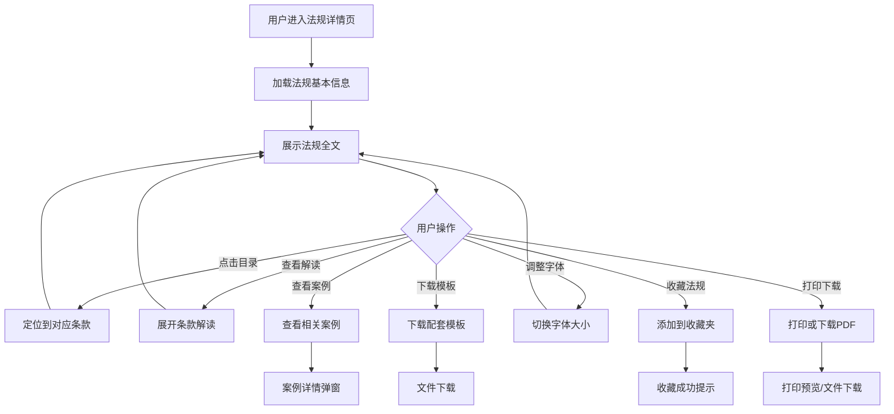

# 法规详情

#### 1. 功能描述
提供法规详情查看功能，支持法规全文展示、目录导航、条款解读、相关案例、配套模板下载等功能。帮助用户深入理解法规内容和实际应用。

##### 1.1 业务功能流程图



#### 2. 业务规则

##### 2.1 法规内容展示规则
| 规则编号 | 规则名称 | 规则描述 | 适用范围 |
| :--- | :--- | :--- | :--- |
| BR-001 | 层级展示 | 按编、章、节、条层级展示法规结构 | 全文展示 |
| BR-002 | 核心条款标识 | 重要条款显示"核心"标识 | 全文展示 |
| BR-003 | 条款解读 | 核心条款提供专家解读内容 | 核心条款 |
| BR-004 | 风险提示 | 特定条款显示合规风险提示 | 风险条款 |

##### 2.2 字体大小规则
| 规则编号 | 规则名称 | 规则描述 |
| :--- | :--- | :--- |
| BR-005 | 字体切换 | 支持小(14px)、中(16px)、大(18px)三档切换 |
| BR-006 | 全局生效 | 字体大小设置影响全文展示 |

##### 2.3 收藏规则
| 规则编号 | 规则名称 | 规则描述 |
| :--- | :--- | :--- |
| BR-007 | 收藏状态 | 实时显示当前用户是否已收藏该法规 |
| BR-008 | 本地存储 | 收藏数据存储在localStorage中 |
| BR-009 | 状态同步 | 跨页面同步收藏状态变化 |

##### 2.4 目录导航规则
| 规则编号 | 规则名称 | 规则描述 |
| :--- | :--- | :--- |
| BR-010 | 目录生成 | 根据法规结构自动生成目录 |
| BR-011 | 点击跳转 | 点击目录项平滑滚动到对应位置 |
| BR-012 | 当前定位 | 高亮显示当前浏览位置对应的目录项 |

#### 3. 数据模型

##### 3.1 实体：RegulationDetail（法规详情）

| 字段名 | 类型 | 必填 | 说明 |
| :--- | :--- | :--- | :--- |
| id | string | 是 | 法规唯一标识 |
| title | string | 是 | 法规标题 |
| publishDate | string | 是 | 发布日期（YYYY-MM-DD） |
| effectiveDate | string | 是 | 施行日期（YYYY-MM-DD） |
| docNumber | string | 是 | 发文字号 |
| level | string | 是 | 效力级别 |
| issuingAuthority | string | 是 | 制定机关 |
| citationCode | string | 是 | 法宝引证码 |
| category | string | 是 | 法规类别 |
| topics | string[] | 是 | 专题分类数组 |
| status | enum | 是 | 法规状态：effective / revised / abolished |
| articles | Article[] | 是 | 法规条款数组 |
| relatedCases | Case[] | 是 | 相关案例数组 |
| templates | Template[] | 是 | 配套模板数组 |

##### 3.2 实体：Article（法规条款）

| 字段名 | 类型 | 必填 | 说明 |
| :--- | :--- | :--- | :--- |
| id | string | 是 | 条款唯一标识 |
| type | enum | 否 | 条款类型：article（条）/ part（编）/ chapter（章）/ section（节） |
| title | string | 是 | 条款标题，如"第二十条" |
| text | string | 否 | 条款正文内容 |
| isCore | boolean | 否 | 是否为核心条款 |
| interpretation | object | 否 | 条款解读信息 |
| interpretation.title | string | 是 | 解读标题 |
| interpretation.content | string | 是 | 解读内容 |
| risk | object | 否 | 风险提示信息 |
| risk.title | string | 是 | 风险提示标题 |
| risk.link | string | 是 | 查看详情链接 |

##### 3.3 实体：Case（相关案例）

| 字段名 | 类型 | 必填 | 说明 |
| :--- | :--- | :--- | :--- |
| id | string | 是 | 案例唯一标识 |
| title | string | 是 | 案例标题 |
| tag | string | 是 | 案例标签（指导性案例/地方法院等） |
| caseNumber | string | 是 | 案号 |
| views | number | 是 | 浏览次数 |

##### 3.4 实体：Template（配套模板）

| 字段名 | 类型 | 必填 | 说明 |
| :--- | :--- | :--- | :--- |
| id | string | 是 | 模板唯一标识 |
| title | string | 是 | 模板标题 |
| type | enum | 是 | 文件类型：docx / pdf |

#### 4. 功能详述

##### 4.1 顶部信息栏

**功能说明**：
- 固定在页面顶部，展示法规基本信息
- 提供字体大小切换、打印、下载等工具按钮

**展示信息**：
| 信息项 | 说明 | 示例 |
| :--- | :--- | :--- |
| 效力级别 | 法规的法律层级 | 法律、行政法规 |
| 法规状态 | 当前生效状态 | 现行有效、已废止 |
| 发布日期 | 法规发布时间 | 发布：2020-05-28 |
| 施行日期 | 法规生效时间 | 施行：2021-01-01 |

**工具按钮**：
| 按钮 | 功能 | 说明 |
| :--- | :--- | :--- |
| 字体大小 | 切换字体 | 小/中/大三档切换 |
| 打印 | 打印法规 | 调用浏览器打印功能 |
| 下载 | 下载PDF | 下载法规PDF文件 |

##### 4.2 左侧目录导航

**功能说明**：
- 固定在左侧，展示法规的层级结构目录
- 支持点击跳转到对应位置
- 高亮显示当前浏览位置

**目录结构**：
```
第一编 总则
├── 第一章 基本规定
│   └── 第七条
├── 第二章 自然人
│   ├── 第一节 民事权利能力和民事行为能力
│   ├── 第二节 监护
│   └── ...
├── 第三章 法人
└── ...
第二编 物权
├── 第一分编 通则
└── ...
```

**交互逻辑**：
1. 用户点击目录项
2. 页面平滑滚动到对应条款位置
3. 当前浏览的条款在目录中高亮显示
4. 支持展开/收起编、章层级

##### 4.3 法规全文展示

**功能说明**：
- 展示法规的完整内容
- 按编、章、节、条层级组织
- 核心条款特殊标识

**内容层级**：
| 层级 | 类型 | 样式 | 示例 |
| :--- | :--- | :--- | :--- |
| 编 | part | 大标题 | 第一编 总则 |
| 章 | chapter | 中标题 | 第一章 基本规定 |
| 节 | section | 小标题 | 第一节 一般规定 |
| 条 | article | 正文 | 第七条 民事主体从事民事活动... |

**核心条款标识**：
- 核心条款显示"核心"标签
- 点击可展开查看专家解读
- 有风险提示的条款显示警告图标

##### 4.4 条款解读功能

**功能说明**：
- 为核心条款提供专家解读
- 解读内容包括法理精释、实务指导等

**解读展示**：
| 字段 | 说明 |
| :--- | :--- |
| 解读标题 | 如"法理精释"、"专家解读" |
| 解读内容 | 详细的解读说明文字 |

**示例**：
```
第七条 民事主体从事民事活动，应当遵循诚信原则，秉持诚实，恪守承诺。

[法理精释]
诚信原则被视为民法的"帝王条款"，贯穿民事活动全过程。在商业交易中，这意味着不能欺诈、恶意磋商。
```

##### 4.5 风险提示功能

**功能说明**：
- 对特定条款显示合规风险提示
- 提供查看应对方案的链接

**提示内容**：
| 字段 | 说明 |
| :--- | :--- |
| 风险提示标题 | 如"涉及合规风险：出资期限新规" |
| 查看链接 | 跳转到应对方案页面 |

**示例**：
```
⚠️ 合规警示：诉讼时效管理
查看时效管理指南 →
```

##### 4.6 相关案例展示

**功能说明**：
- 展示与当前法规相关的司法案例
- 包括指导性案例、典型案例等

**案例列表字段**：
| 字段名称 | 字段说明 | 说明 |
| :--- | :--- | :--- |
| 案例标题 | 案例名称 | 如"最高法院：关于适用民法典总则编若干问题的解释" |
| 标签 | 案例类型 | 指导性案例、典型案例、司法解释等 |
| 案号 | 案件编号 | 如"法释〔2022〕6号" |
| 浏览量 | 查看次数 | 用户浏览统计 |

**交互逻辑**：
- 点击案例标题查看详情
- 案例以卡片形式展示
- 支持查看更多相关案例

##### 4.7 配套模板下载

**功能说明**：
- 提供与法规相关的实用模板下载
- 支持Word和PDF格式

**模板列表字段**：
| 字段名称 | 字段说明 | 说明 |
| :--- | :--- | :--- |
| 模板名称 | 文件标题 | 如"最新公司章程修订模版.docx" |
| 文件类型 | 格式标识 | docx或pdf图标 |

**交互逻辑**：
- 点击模板名称直接下载
- 显示文件类型图标
- 下载完成后提示成功

##### 4.8 收藏功能

**功能说明**：
- 支持将法规添加到用户收藏夹
- 实时显示收藏状态

**交互逻辑**：
1. 用户点击收藏按钮（星形图标）
2. 如果未收藏，添加到收藏夹，显示"已添加至收藏"提示
3. 如果已收藏，从收藏夹移除，显示"已取消收藏"提示
4. 收藏状态实时同步到其他页面

**收藏信息**：
| 字段 | 说明 |
| :--- | :--- |
| 法规ID | 唯一标识 |
| 法规标题 | 收藏显示名称 |
| 描述 | 发文字号、效力级别等信息 |
| 类型 | regulation（法规类型） |
| 收藏日期 | 添加时间 |
| 标签 | 效力级别、法规状态等 |

#### 5. 异常场景处理

| 异常场景 | 场景说明 | 系统行为 | 提醒方式 | 操作选项 |
| :--- | :--- | :--- | :--- | :--- |
| 法规不存在 | 访问的法规ID无效 | 显示404页面 | 页面提示"法规不存在" | 返回法规列表 |
| 加载失败 | 数据加载出错 | 显示错误提示 | 弹窗提示错误信息 | 重试或返回 |
| 打印失败 | 浏览器打印出错 | 显示错误提示 | 提示打印失败 | 重试或取消 |
| 下载失败 | 文件下载出错 | 显示错误提示 | 提示下载失败 | 重试或取消 |

#### 6. 权限控制

| 功能 | 游客 | 普通用户 | VIP用户 |
| :--- | :--- | :--- | :--- |
| 查看法规全文 | ✓ | ✓ | ✓ |
| 查看条款解读 | ✓ | ✓ | ✓ |
| 查看相关案例 | ✓ | ✓ | ✓ |
| 下载配套模板 | ✗ | 限制次数 | 无限制 |
| 收藏法规 | ✗ | ✓ | ✓ |
| 打印法规 | ✓ | ✓ | ✓ |
| 下载PDF | ✓ | ✓ | ✓ |

#### 7. 数据关联

| 关联功能 | 关联方式 | 说明 |
| :--- | :--- | :--- |
| 法规查询 | 返回按钮 | 点击返回跳转到法规查询页 |
| 收藏夹 | 收藏功能 | 收藏的法规显示在收藏夹中 |
| 相关案例 | 案例链接 | 点击案例跳转到案例详情 |
| 应对方案 | 风险链接 | 点击风险提示链接跳转到方案页 |
