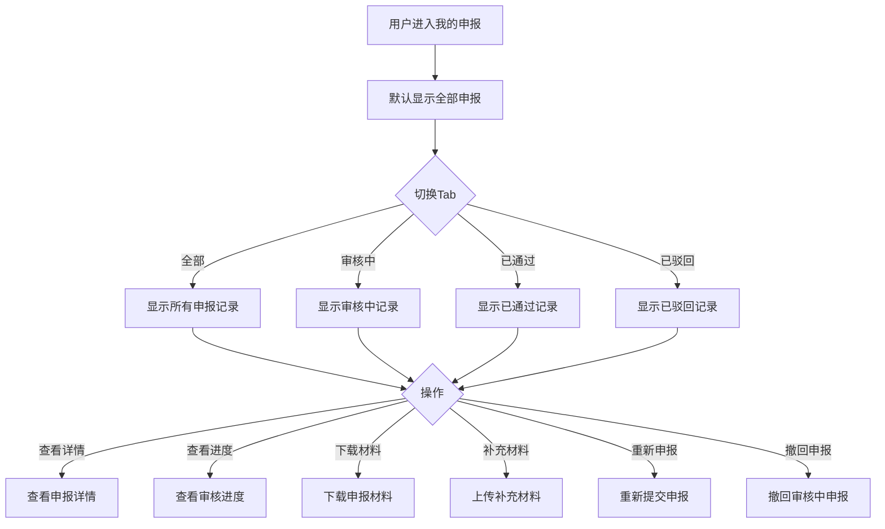

# 我的申报

#### 1. 功能描述
提供用户申报记录的统一管理功能，支持查看所有申报项目的状态、进度、结果，支持查看详情、下载材料、补充材料、重新申报等操作。按状态分类展示申报记录，方便用户跟踪申报进展。

##### 1.1 业务功能流程图

#### 2. 业务规则

##### 2.1 申报状态规则
| 规则编号 | 规则名称 | 规则描述 | 状态流转 |
| :--- | :--- | :--- | :--- |
| BR-001 | 草稿状态 | 已填写但未提交的申报 | 草稿 → 已提交 |
| BR-002 | 已提交 | 申报已提交待初审 | 已提交 → 审核中 |
| BR-003 | 审核中 | 正在审核过程中 | 审核中 → 已通过/已驳回 |
| BR-004 | 已通过 | 审核通过 | 已通过 → 待拨付/已拨付 |
| BR-005 | 已驳回 | 审核未通过 | 已驳回 → 重新申报 |
| BR-006 | 待补充 | 需要补充材料 | 待补充 → 审核中 |

##### 2.2 操作权限规则
| 规则编号 | 规则名称 | 规则描述 |
| :--- | :--- | :--- |
| BR-007 | 草稿操作 | 草稿支持编辑、删除、提交 |
| BR-008 | 审核中操作 | 审核中支持查看进度、撤回 |
| BR-009 | 已通过操作 | 已通过支持查看详情、下载批复 |
| BR-010 | 已驳回操作 | 已驳回支持查看原因、重新申报 |
| BR-011 | 待补充操作 | 待补充支持上传补充材料 |

##### 2.3 数据保留规则
| 规则编号 | 规则名称 | 规则描述 |
| :--- | :--- | :--- |
| BR-012 | 记录保留 | 申报记录永久保留 |
| BR-013 | 材料保留 | 申报材料保留3年 |
| BR-014 | 下载限制 | 已拨付项目材料可长期下载 |

#### 3. 数据模型

##### 3.1 实体：MyApplication（我的申报）

| 字段名 | 类型 | 必填 | 说明 |
| :--- | :--- | :--- | :--- |
| id | string | 是 | 申报记录ID |
| projectId | string | 是 | 项目ID |
| projectName | string | 是 | 项目名称 |
| policyName | string | 是 | 政策名称 |
| subsidyAmount | string | 是 | 申报金额 |
| status | enum | 是 | 状态：draft/submitted/auditing/passed/rejected/supplement |
| submitTime | string | 否 | 提交时间 |
| auditTime | string | 否 | 审核时间 |
| resultTime | string | 否 | 结果通知时间 |
| materials | object[] | 是 | 申报材料列表 |
| auditLog | object[] | 否 | 审核记录 |
| result | string | 否 | 审核结果说明 |
| rejectReason | string | 否 | 驳回原因 |
| supplementReason | string | 否 | 补充材料说明 |

#### 4. 功能详述

##### 4.1 Tab切换功能

**功能说明**：
- 支持按状态筛选查看申报记录
- 默认显示"全部"Tab

**Tab列表**：
| Tab名称 | 说明 | 显示内容 |
| :--- | :--- | :--- |
| 全部 | 显示所有申报 | 所有状态的申报记录 |
| 草稿箱 | 未提交的申报 | 草稿状态的申报 |
| 审核中 | 正在审核 | 审核中状态的申报 |
| 已通过 | 审核通过 | 已通过状态的申报 |
| 已驳回 | 审核未通过 | 已驳回状态的申报 |
| 待补充 | 需补充材料 | 待补充状态的申报 |

##### 4.2 申报记录列表

**列表字段**：
| 字段名称 | 字段说明 | 是否可编辑 | 字段类型 | 说明 |
| :--- | :--- | :--- | :--- | :--- |
| 项目名称 | 申报项目名称 | 否 | 文本 | 项目的标题 |
| 政策名称 | 所属政策 | 否 | 文本 | 关联的政策名称 |
| 申报金额 | 申请金额 | 否 | 文本 | 如"50万元" |
| 申报状态 | 当前状态 | 否 | 标签 | 不同状态不同颜色 |
| 提交时间 | 提交日期 | 否 | 日期时间 | 格式：YYYY-MM-DD HH:mm |
| 审核时间 | 审核日期 | 否 | 日期时间 | 审核完成时间 |
| 操作 | 操作按钮 | - | - | 根据状态显示不同操作 |

**状态标签样式**：
| 状态 | 标签颜色 | 说明 |
| :--- | :--- | :--- |
| 草稿 | 灰色 | 未提交的申报 |
| 已提交 | 蓝色 | 刚提交的申报 |
| 审核中 | 橙色 | 正在审核中 |
| 已通过 | 绿色 | 审核已通过 |
| 已驳回 | 红色 | 审核未通过 |
| 待补充 | 黄色 | 需要补充材料 |

##### 4.3 申报详情查看

**功能说明**：
- 查看申报的详细信息
- 包含申报内容、材料、进度等

**详情内容**：
| 内容模块 | 说明 |
| :--- | :--- |
| 基本信息 | 项目信息、申报金额、提交时间 |
| 申报内容 | 填写的申报表单数据 |
| 申报材料 | 上传的材料清单和预览 |
| 审核进度 | 当前审核环节和处理时间 |
| 审核意见 | 审核人员的意见和建议 |
| 结果通知 | 审核结果和后续指引 |

##### 4.4 审核进度查询

**功能说明**：
- 以时间轴形式展示审核流程
- 实时了解当前审核环节

**进度节点**：
| 节点 | 说明 | 时间显示 |
| :--- | :--- | :--- |
| 提交申报 | 用户提交申报 | 提交时间 |
| 系统初审 | 系统自动初审 | 初审时间 |
| 人工审核 | 人工审核材料 | 审核时间 |
| 审核完成 | 审核结果通知 | 完成时间 |

**进度状态**：
- 已完成节点：绿色勾选图标
- 进行中节点：蓝色加载图标
- 待处理节点：灰色等待图标

##### 4.5 材料管理功能

**功能说明**：
- 支持查看和下载已上传的材料
- 支持上传补充材料

**材料操作**：
| 操作 | 说明 | 适用状态 |
| :--- | :--- | :--- |
| 预览 | 在线预览材料 | 所有状态 |
| 下载 | 下载材料到本地 | 所有状态 |
| 补充 | 上传补充材料 | 待补充 |
| 替换 | 替换已有材料 | 草稿、待补充 |

##### 4.6 重新申报功能

**功能说明**：
- 已驳回的申报可以修改后重新提交
- 保留原有申报数据，减少重复填写

**操作流程**：
1. 用户点击"重新申报"按钮
2. 系统加载原有申报数据到表单
3. 用户根据驳回原因修改内容
4. 重新提交申报
5. 系统生成新的申报记录

##### 4.7 撤回申报功能

**功能说明**：
- 审核中的申报可以撤回
- 撤回后回到草稿状态

**操作流程**：
1. 用户点击"撤回"按钮
2. 弹出确认对话框
3. 确认后申报状态变为"草稿"
4. 可以编辑后重新提交

#### 5. 异常场景处理

| 异常场景 | 场景说明 | 系统行为 | 提醒方式 | 操作选项 |
| :--- | :--- | :--- | :--- | :--- |
| 列表为空 | 无申报记录 | 显示空状态 | 提示"暂无申报记录" | 去申报项目 |
| 接口异常 | 数据加载失败 | 显示错误提示 | 提示"获取数据失败" | 重试 |
| 下载失败 | 材料下载失败 | 显示错误提示 | 提示"下载失败" | 重试 |
| 撤回失败 | 撤回操作失败 | 显示错误提示 | 提示"撤回失败" | 重试 |
| 补充失败 | 材料上传失败 | 显示错误提示 | 提示"上传失败" | 重试 |

#### 6. 权限控制

| 功能 | 游客 | 普通会员 | VIP会员 |
| :--- | :--- | :--- | :--- |
| 查看列表 | ✗ | ✓（仅自己） | ✓（仅自己） |
| 查看详情 | ✗ | ✓（仅自己） | ✓（仅自己） |
| 下载材料 | ✗ | ✓ | ✓ |
| 补充材料 | ✗ | ✓ | ✓ |
| 重新申报 | ✗ | ✓ | ✓ |
| 撤回申报 | ✗ | ✓ | ✓ |

#### 7. 数据关联

| 关联功能 | 关联方式 | 说明 |
| :--- | :--- | :--- |
| 申报管理 | 页面跳转 | 跳转到申报项目列表 |
| 项目详情 | 点击跳转 | 查看项目详细信息 |
| 消息中心 | 消息通知 | 审核进度消息通知 |
| 材料下载 | 文件下载 | 下载申报材料 |
