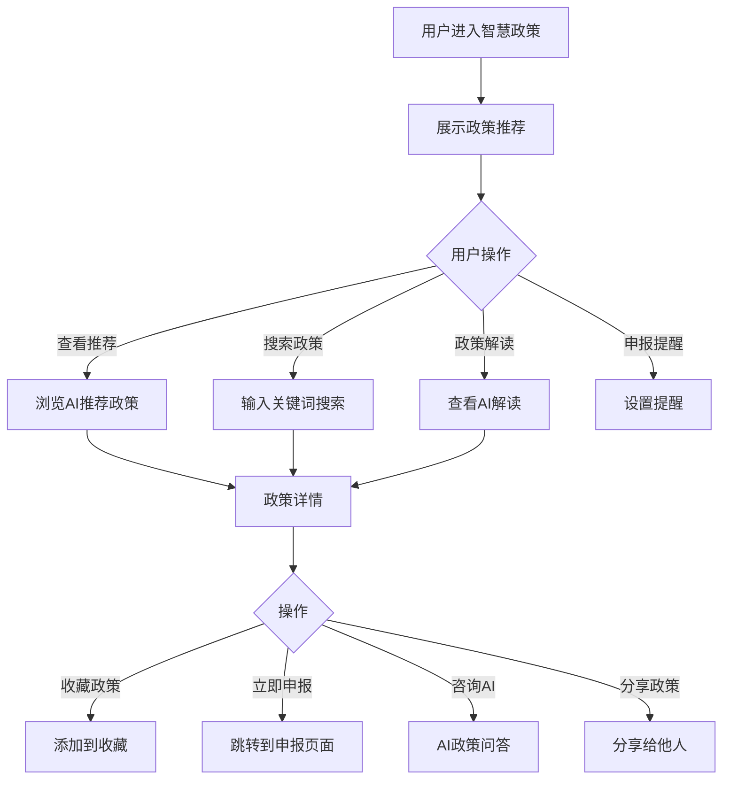

# 智慧政策

#### 1. 功能描述
提供智能化政策查询和推荐功能，通过AI技术分析企业画像，精准匹配适用的政策信息，支持政策解读、申报提醒、智能问答等功能，帮助企业及时获取和享受政策红利。

##### 1.1 业务功能流程图

#### 2. 业务规则

##### 2.1 政策匹配规则
| 规则编号 | 规则名称 | 规则描述 | 适用范围 |
| :--- | :--- | :--- | :--- |
| BR-001 | 企业画像匹配 | 根据企业行业、规模、地区匹配适用政策 | 推荐算法 |
| BR-002 | 政策时效性 | 优先推荐最新发布的政策 | 推荐排序 |
| BR-003 | 申报期限提醒 | 临近截止日期的政策优先展示 | 推荐排序 |
| BR-004 | 历史行为分析 | 根据用户浏览历史优化推荐 | 个性化推荐 |

##### 2.2 政策解读规则
| 规则编号 | 规则名称 | 规则描述 |
| :--- | :--- | :--- |
| BR-005 | 自动解读 | AI自动提取政策要点进行解读 |
| BR-006 | 申报条件解析 | 解析政策的申报条件和要求 |
| BR-007 | 补贴金额计算 | 根据企业情况估算可获补贴 |
| BR-008 | 申报流程说明 | 提供详细的申报步骤指导 |

##### 2.3 提醒规则
| 规则编号 | 规则名称 | 规则描述 |
| :--- | :--- | :--- |
| BR-009 | 截止提醒 | 政策申报截止前7天、3天、1天提醒 |
| BR-010 | 新策提醒 | 符合企业的新政策发布时提醒 |
| BR-011 | 续期提醒 | 政策到期续期提醒 |

#### 3. 数据模型

##### 3.1 实体：Policy（政策信息）

| 字段名 | 类型 | 必填 | 说明 |
| :--- | :--- | :--- | :--- |
| id | string | 是 | 政策唯一标识 |
| title | string | 是 | 政策标题 |
| policyNo | string | 是 | 政策文号 |
| publishOrg | string | 是 | 发布机关 |
| publishDate | string | 是 | 发布日期 |
| effectiveDate | string | 是 | 生效日期 |
| expiryDate | string | 否 | 截止日期 |
| policyType | string | 是 | 政策类型（补贴/税收优惠/资质认定等） |
| industry | string[] | 是 | 适用行业 |
| enterpriseScale | string[] | 是 | 适用企业规模 |
| region | string[] | 是 | 适用地区 |
| summary | string | 是 | 政策摘要 |
| content | string | 是 | 政策正文 |
| applicationConditions | string[] | 是 | 申报条件 |
| subsidyAmount | string | 否 | 补贴金额说明 |
| applicationMaterials | string[] | 是 | 申报材料清单 |
| applicationProcess | string | 是 | 申报流程 |
| contactInfo | object | 是 | 联系方式 |
| status | enum | 是 | 状态：有效/已过期/即将截止 |
| viewCount | number | 是 | 浏览次数 |
| matchScore | number | 否 | 匹配分数 |

##### 3.2 实体：PolicyInterpretation（政策解读）

| 字段名 | 类型 | 必填 | 说明 |
| :--- | :--- | :--- | :--- |
| id | string | 是 | 解读ID |
| policyId | string | 是 | 关联政策ID |
| keyPoints | string[] | 是 | 核心要点 |
| detailedAnalysis | string | 是 | 详细解读 |
| applicationGuide | string | 是 | 申报指南 |
| commonQuestions | object[] | 是 | 常见问题 |
| subsidyCalculation | string | 否 | 补贴计算示例 |

#### 4. 功能详述

##### 4.1 AI智能推荐

**功能说明**：
- 基于企业画像智能推荐适用政策
- 展示匹配度和推荐理由

**推荐维度**：
| 维度 | 说明 |
| :--- | :--- |
| 行业匹配 | 政策适用行业与企业行业匹配 |
| 规模匹配 | 政策适用规模与企业规模匹配 |
| 地区匹配 | 政策适用地区与企业地区匹配 |
| 时效性 | 政策的发布时间和有效期 |
| 热度 | 其他企业的关注度 |

**推荐卡片信息**：
| 字段名称 | 说明 |
| :--- | :--- |
| 政策标题 | 政策名称 |
| 匹配度 | 与企业的匹配百分比 |
| 政策类型 | 补贴/税收优惠等 |
| 补贴金额 | 可获得的补贴金额 |
| 截止日期 | 申报截止日期 |
| 推荐理由 | AI生成的推荐理由 |

##### 4.2 政策搜索功能

**搜索字段**：
| 字段名称 | 字段说明 | 是否必填 | 字段类型 | 说明 |
| :--- | :--- | :--- | :--- | :--- |
| 关键词 | 搜索内容 | 否 | 文本输入 | 支持政策标题、文号、内容搜索 |

**筛选条件**：
| 筛选维度 | 选项类型 | 选项内容 |
| :--- | :--- | :--- |
| 政策类型 | 多选 | 财政补贴、税收优惠、资质认定、人才政策等 |
| 适用行业 | 多选 | 制造业、服务业、科技业等 |
| 发布时间 | 单选 | 最近一周、最近一月、最近三月、全部 |
| 申报状态 | 单选 | 申报中、即将截止、已截止 |

##### 4.3 政策解读功能

**功能说明**：
- AI自动解读政策内容
- 提取核心要点和申报关键信息

**解读内容**：
| 内容模块 | 说明 |
| :--- | :--- |
| 核心要点 | 政策的核心内容和亮点 |
| 适用对象 | 哪些企业可以申请 |
| 申报条件 | 需要满足的条件 |
| 补贴标准 | 补贴金额和计算方式 |
| 申报材料 | 需要准备的材料清单 |
| 申报流程 | 详细的申报步骤 |
| 注意事项 | 申报时的注意要点 |

##### 4.4 申报提醒功能

**功能说明**：
- 用户可以设置政策申报提醒
- 系统通过多种方式发送提醒

**提醒方式**：
| 方式 | 说明 |
| :--- | :--- |
| 站内消息 | 系统消息提醒 |
| 短信提醒 | 手机短信通知 |
| 邮件提醒 | 邮件通知 |
| 微信提醒 | 微信公众号通知 |

**提醒时间**：
| 时间节点 | 说明 |
| :--- | :--- |
| 截止前7天 | 首次提醒 |
| 截止前3天 | 二次提醒 |
| 截止前1天 | 最后提醒 |

##### 4.5 AI政策问答

**功能说明**：
- 用户可以通过问答方式了解政策
- AI基于政策知识库回答问题

**问答示例**：
| 问题类型 | 示例 |
| :--- | :--- |
| 条件咨询 | "我们企业是否符合申报条件？" |
| 金额咨询 | "我们能获得多少补贴？" |
| 材料咨询 | "需要准备哪些材料？" |
| 流程咨询 | "申报流程是怎样的？" |

#### 5. 异常场景处理

| 异常场景 | 场景说明 | 系统行为 | 提醒方式 | 操作选项 |
| :--- | :--- | :--- | :--- | :--- |
| 无匹配政策 | 企业暂无适用政策 | 显示空状态 | 提示"暂无匹配政策" | 建议完善企业信息 |
| 搜索无结果 | 关键词无匹配 | 显示空状态 | 提示"未找到相关政策" | 建议更换关键词 |
| 接口异常 | 数据加载失败 | 显示错误提示 | 提示"获取数据失败" | 重试 |
| AI解读失败 | 解读生成失败 | 显示错误提示 | 提示"解读生成失败" | 重试 |

#### 6. 权限控制

| 功能 | 游客 | 普通会员 | VIP会员 |
| :--- | :--- | :--- | :--- |
| 浏览政策 | ✓ | ✓ | ✓ |
| 搜索筛选 | ✓ | ✓ | ✓ |
| 查看解读 | 部分 | ✓ | ✓ |
| AI问答 | 限制次数 | 限制次数 | 无限制 |
| 设置提醒 | ✗ | ✓ | ✓ |
| 精准推荐 | 基础 | 进阶 | 完整 |

#### 7. 数据关联

| 关联功能 | 关联方式 | 说明 |
| :--- | :--- | :--- |
| 政策详情 | 点击跳转 | 查看政策详细信息 |
| 申报管理 | 跳转页面 | 跳转到申报页面 |
| 收藏夹 | 收藏功能 | 收藏的政策显示在收藏夹 |
| 企业画像 | 数据基础 | 基于企业信息生成推荐 |
