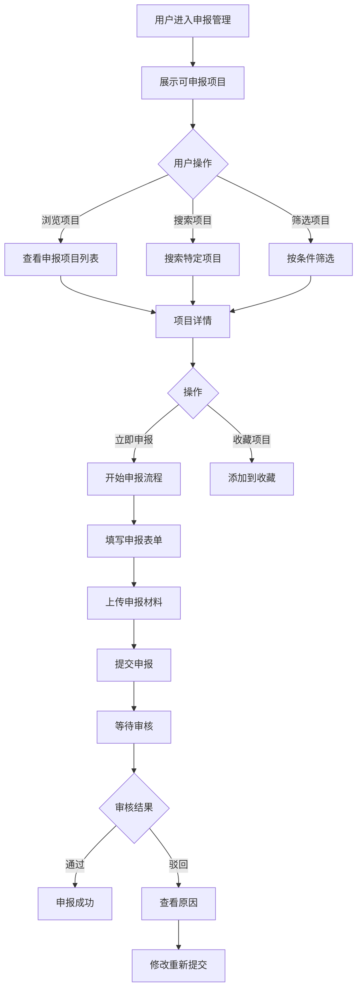

# 申报管理

#### 1. 功能描述
提供政策申报的全流程管理功能，包括申报项目浏览、在线申报、材料上传、进度查询、结果通知等功能。支持多种申报类型的在线办理，简化企业申报流程。

##### 1.1 业务功能流程图

#### 2. 业务规则

##### 2.1 申报资格规则
| 规则编号 | 规则名称 | 规则描述 | 适用范围 |
| :--- | :--- | :--- | :--- |
| BR-001 | 企业认证 | 申报前需完成企业实名认证 | 所有申报 |
| BR-002 | 资格预审 | 系统自动预审企业基本资格 | 申报前 |
| BR-003 | 重复申报 | 同一项目同一企业只能申报一次 | 申报时 |
| BR-004 | 截止时间 | 超过截止时间的项目不能申报 | 申报时 |

##### 2.2 材料提交规则
| 规则编号 | 规则名称 | 规则描述 |
| :--- | :--- | :--- |
| BR-005 | 必填材料 | 标记为必填的材料必须上传 |
| BR-006 | 格式要求 | 材料需符合格式要求（PDF、图片等） |
| BR-007 | 大小限制 | 单个文件不超过20MB |
| BR-008 | 材料真实性 | 上传材料需真实有效 |

##### 2.3 审核流程规则
| 规则编号 | 规则名称 | 规则描述 |
| :--- | :--- | :--- |
| BR-009 | 初审环节 | 系统自动初审材料完整性 |
| BR-010 | 人工审核 | 复杂项目需人工审核 |
| BR-011 | 审核时限 | 一般项目5个工作日内完成审核 |
| BR-012 | 结果通知 | 审核结果通过站内消息和短信通知 |

#### 3. 数据模型

##### 3.1 实体：ApplicationProject（申报项目）

| 字段名 | 类型 | 必填 | 说明 |
| :--- | :--- | :--- | :--- |
| id | string | 是 | 项目唯一标识 |
| name | string | 是 | 项目名称 |
| policyId | string | 是 | 关联政策ID |
| projectType | string | 是 | 项目类型 |
| subsidyAmount | string | 是 | 补贴金额 |
| applicationStartDate | string | 是 | 申报开始日期 |
| applicationEndDate | string | 是 | 申报截止日期 |
| status | enum | 是 | 状态：未开始/申报中/即将截止/已截止 |
| requiredMaterials | object[] | 是 | 所需材料清单 |
| applicationConditions | string[] | 是 | 申报条件 |
| description | string | 是 | 项目说明 |
| viewCount | number | 是 | 浏览次数 |
| applicationCount | number | 是 | 申报次数 |

##### 3.2 实体：Application（申报记录）

| 字段名 | 类型 | 必填 | 说明 |
| :--- | :--- | :--- | :--- |
| id | string | 是 | 申报ID |
| projectId | string | 是 | 项目ID |
| enterpriseId | string | 是 | 企业ID |
| status | enum | 是 | 状态：草稿/已提交/审核中/已通过/已驳回 |
| submitTime | string | 否 | 提交时间 |
| materials | object[] | 是 | 已上传材料 |
| formData | object | 是 | 表单数据 |
| auditLog | object[] | 否 | 审核记录 |
| result | string | 否 | 审核结果说明 |

#### 4. 功能详述

##### 4.1 申报项目列表

**功能说明**：
- 展示当前可申报的项目列表
- 支持多种筛选和排序方式

**列表字段**：
| 字段名称 | 字段说明 | 是否可编辑 | 字段类型 | 说明 |
| :--- | :--- | :--- | :--- | :--- |
| 项目名称 | 申报项目名称 | 否 | 文本 | 项目的标题 |
| 补贴金额 | 可获补贴 | 否 | 文本 | 如"最高50万元" |
| 申报时间 | 时间范围 | 否 | 日期 | 开始日期-截止日期 |
| 剩余时间 | 距离截止 | 否 | 文本 | 如"剩余15天" |
| 申报状态 | 项目状态 | 否 | 标签 | 申报中/即将截止/已截止 |
| 已申报数 | 申报人数 | 否 | 数字 | 已申报的企业数量 |
| 操作 | 操作按钮 | - | - | 立即申报/查看详情 |

**排序方式**：
| 排序方式 | 说明 |
| :--- | :--- |
| 即将截止 | 按截止时间升序 |
| 补贴金额 | 按补贴金额降序 |
| 最新发布 | 按发布时间降序 |
| 最多申报 | 按申报人数降序 |

##### 4.2 项目详情

**功能说明**：
- 展示项目的详细信息
- 包含申报条件、流程、材料等

**详情内容**：
| 内容模块 | 说明 |
| :--- | :--- |
| 项目介绍 | 项目的背景和目标 |
| 补贴标准 | 补贴金额和计算方式 |
| 申报条件 | 企业需满足的条件 |
| 申报材料 | 需要准备的材料清单 |
| 申报流程 | 详细的申报步骤 |
| 联系方式 | 咨询联系方式 |
| 常见问题 | 申报常见问题解答 |

##### 4.3 在线申报流程

**功能说明**：
- 引导用户完成在线申报
- 分步骤填写信息和上传材料

**申报步骤**：
| 步骤 | 说明 | 内容 |
| :--- | :--- | :--- |
| 第一步 | 填写基本信息 | 企业基本信息、联系人信息 |
| 第二步 | 填写申报信息 | 项目相关的申报数据 |
| 第三步 | 上传材料 | 按要求上传申报材料 |
| 第四步 | 确认提交 | 预览并确认申报内容 |

**表单字段示例**：
| 字段名称 | 是否必填 | 字段类型 | 说明 |
| :--- | :--- | :--- | :--- |
| 企业名称 | 是 | 文本 | 自动填充 |
| 统一社会信用代码 | 是 | 文本 | 自动填充 |
| 联系人姓名 | 是 | 文本 | 联系人姓名 |
| 联系人电话 | 是 | 文本 | 联系人电话 |
| 申报金额 | 是 | 数字 | 申请的补贴金额 |
| 项目说明 | 是 | 多行文本 | 项目详细说明 |

##### 4.4 材料上传功能

**功能说明**：
- 支持批量上传申报材料
- 自动校验材料格式和大小

**材料要求**：
| 材料类型 | 格式要求 | 大小限制 | 示例 |
| :--- | :--- | :--- | :--- |
| 营业执照 | PDF/JPG/PNG | ≤5MB | 企业营业执照扫描件 |
| 财务报表 | PDF/Excel | ≤10MB | 近一年财务报表 |
| 项目证明 | PDF/JPG/PNG | ≤5MB | 项目相关证明材料 |
| 其他材料 | PDF/JPG/PNG | ≤5MB | 其他支持材料 |

**上传功能**：
- 支持拖拽上传
- 支持多文件选择
- 显示上传进度
- 支持删除和重新上传

##### 4.5 申报进度查询

**功能说明**：
- 实时查看申报审核进度
- 了解当前审核环节

**进度状态**：
| 状态 | 说明 | 图标颜色 |
| :--- | :--- | :--- |
| 已提交 | 申报材料已提交 | 蓝色 |
| 初审中 | 系统正在初审 | 蓝色 |
| 人工审核 | 等待人工审核 | 橙色 |
| 已通过 | 审核通过 | 绿色 |
| 已驳回 | 审核未通过 | 红色 |
| 待补充 | 需要补充材料 | 黄色 |

**进度展示**：
- 时间轴形式展示审核流程
- 显示每个环节的处理时间
- 显示当前审核人和联系方式

##### 4.6 申报记录管理

**功能说明**：
- 管理历史申报记录
- 支持查看详情和重新申报

**记录列表字段**：
| 字段名称 | 说明 |
| :--- | :--- |
| 项目名称 | 申报的项目名称 |
| 申报时间 | 提交申报的时间 |
| 申报金额 | 申请的补贴金额 |
| 审核状态 | 当前的审核状态 |
| 审核结果 | 通过/驳回/待审核 |
| 操作 | 查看详情/撤回/重新申报 |

#### 5. 异常场景处理

| 异常场景 | 场景说明 | 系统行为 | 提醒方式 | 操作选项 |
| :--- | :--- | :--- | :--- | :--- |
| 资格不符 | 企业不满足申报条件 | 禁止申报 | 提示"不符合申报条件" | 查看其他项目 |
| 材料不全 | 必填材料未上传 | 阻止提交 | 提示"请上传必填材料" | 补充材料 |
| 格式错误 | 材料格式不符合要求 | 上传失败 | 提示"文件格式错误" | 重新上传 |
| 超出截止 | 超过申报截止时间 | 禁止申报 | 提示"申报已截止" | 查看其他项目 |
| 重复申报 | 同一项目重复申报 | 阻止提交 | 提示"您已申报该项目" | 查看申报记录 |
| 审核驳回 | 申报被驳回 | 显示原因 | 提示"申报被驳回" | 修改重新提交 |

#### 6. 权限控制

| 功能 | 游客 | 普通会员 | VIP会员 |
| :--- | :--- | :--- | :--- |
| 浏览项目 | ✓ | ✓ | ✓ |
| 查看详情 | ✓ | ✓ | ✓ |
| 在线申报 | ✗ | ✓ | ✓ |
| 进度查询 | ✗ | ✓ | ✓ |
| 材料下载 | ✗ | ✓ | ✓ |
| 优先审核 | ✗ | ✗ | ✓ |

#### 7. 数据关联

| 关联功能 | 关联方式 | 说明 |
| :--- | :--- | :--- |
| 智慧政策 | 数据关联 | 从政策详情跳转申报 |
| 我的申报 | 页面跳转 | 查看申报记录和进度 |
| 消息中心 | 消息通知 | 申报进度消息通知 |
| 企业认证 | 前置条件 | 申报前需完成认证 |
