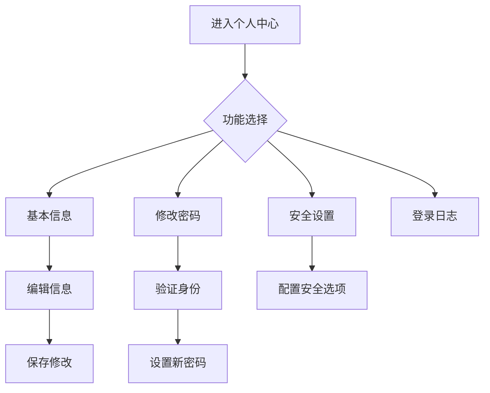

# 个人中心

> **文档状态**：已完成  
> **最后更新**：2026-03-24  
> **文档作者**：张博  
> **所属模块**：系统管理

---

## 修订记录

| 版本号 | 修订日期 | 修订内容 | 修订人 | 审核人 |
| :--- | :--- | :--- | :--- | :--- |
| v1.0.0 | 2026-03-24 | 初始版本，完成个人中心基础功能PRD | 张博 | - |
| v1.0.1 | 2026-03-28 | 优化信息修改流程，增加安全验证 | 张博 | 李明 |
| v1.1.0 | 2026-04-05 | 新增登录日志，完善安全设置 | 张博 | 王芳 |

---

## 1. 功能描述

个人中心功能为用户提供个人信息管理、密码修改、安全设置、登录日志查看等功能。

### 1.1 业务背景

用户需要管理自己的账号信息，包括修改个人资料、更换密码、查看登录记录等。个人中心功能提供一站式的个人信息管理服务。

### 1.2 业务功能流程图



---

## 2. 基本信息

### 2.1 信息展示

| 信息项 | 说明 | 是否可编辑 |
| :--- | :--- | :--- |
| 用户头像 | 个人头像 | 是 |
| 用户账号 | 登录账号 | 否 |
| 用户姓名 | 真实姓名 | 是 |
| 所属部门 | 部门信息 | 否 |
| 角色 | 系统角色 | 否 |
| 手机号 | 联系电话 | 是 |
| 邮箱 | 邮箱地址 | 是 |
| 注册时间 | 账号注册时间 | 否 |

### 2.2 编辑信息

| 可编辑项 | 校验规则 |
| :--- | :--- |
| 用户姓名 | 2-20个字符 |
| 手机号 | 11位手机号，需短信验证 |
| 邮箱 | 邮箱格式，需邮件验证 |
| 头像 | 图片格式，最大2MB |

---

## 3. 修改密码

### 3.1 修改流程

| 步骤 | 说明 |
| :--- | :--- |
| 1. 验证身份 | 输入原密码或短信验证码 |
| 2. 设置新密码 | 输入新密码 |
| 3. 确认密码 | 再次输入新密码 |
| 4. 完成修改 | 密码修改成功 |

### 3.2 密码规则

| 规则项 | 规则内容 |
| :--- | :--- |
| 长度 | 8-20位 |
| 复杂度 | 必须包含字母和数字 |
| 强度 | 密码强度实时检测 |
| 历史密码 | 不能使用最近3次使用过的密码 |

---

## 4. 安全设置

### 4.1 安全选项

| 设置项 | 说明 | 默认状态 |
| :--- | :--- | :--- |
| 登录保护 | 异地登录需验证 | 开启 |
| 短信通知 | 重要操作短信通知 | 开启 |
| 邮件通知 | 重要操作邮件通知 | 关闭 |
| 登录设备管理 | 查看和管理登录设备 | - |

### 4.2 设备管理

| 信息项 | 说明 |
| :--- | :--- |
| 设备名称 | 设备标识 |
| 登录时间 | 最后登录时间 |
| 登录地点 | 登录IP地址 |
| 操作 | 下线设备 |

---

## 5. 登录日志

### 5.1 日志内容

| 字段 | 说明 |
| :--- | :--- |
| 登录时间 | 登录时间戳 |
| 登录IP | IP地址 |
| 登录地点 | IP归属地 |
| 登录设备 | 设备类型和浏览器 |
| 登录状态 | 成功/失败 |

### 5.2 日志查询

| 查询条件 | 说明 |
| :--- | :--- |
| 时间范围 | 最近7天、30天、90天 |
| 登录状态 | 全部、成功、失败 |

---

## 6. 数据模型

```typescript
interface UserProfile {
  id: string;
  avatar?: string;
  username: string;
  realName: string;
  departmentName: string;
  roleNames: string[];
  phone: string;
  email?: string;
  registerTime: string;
}

interface PasswordChangeRequest {
  oldPassword?: string;
  verificationCode?: string;
  newPassword: string;
  confirmPassword: string;
}

interface LoginLog {
  id: string;
  loginTime: string;
  ip: string;
  location: string;
  device: string;
  status: 'success' | 'failed';
  failReason?: string;
}

interface SecuritySettings {
  loginProtection: boolean;
  smsNotification: boolean;
  emailNotification: boolean;
  devices: DeviceInfo[];
}

interface DeviceInfo {
  id: string;
  name: string;
  lastLoginTime: string;
  lastLoginIp: string;
  isCurrent: boolean;
}
```

---

## 7. 接口需求

| 接口名称 | 请求方式 | 接口路径 | 功能说明 |
| :--- | :--- | :--- | :--- |
| 获取个人信息 | GET | /api/profile | 获取当前用户信息 |
| 更新个人信息 | PUT | /api/profile | 更新个人信息 |
| 上传头像 | POST | /api/profile/avatar | 上传用户头像 |
| 修改密码 | PUT | /api/profile/password | 修改登录密码 |
| 发送验证码 | POST | /api/profile/verify-code | 发送验证短信 |
| 获取安全设置 | GET | /api/profile/security | 获取安全设置 |
| 更新安全设置 | PUT | /api/profile/security | 更新安全设置 |
| 获取登录日志 | GET | /api/profile/login-logs | 获取登录日志 |
| 下线设备 | DELETE | /api/profile/devices/:id | 下线指定设备 |

---

**文档结束**
