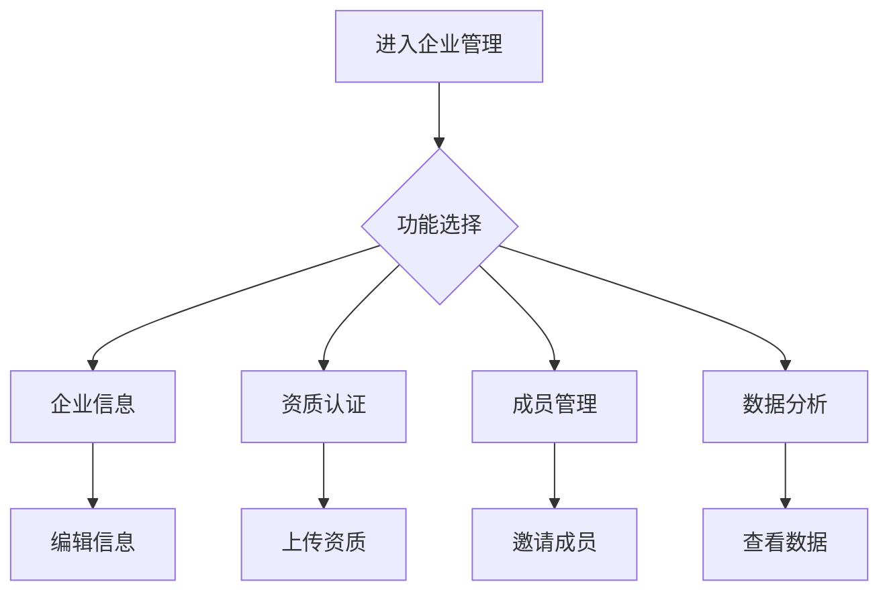

# 企业管理

> **文档状态**：已完成  
> **最后更新**：2026-03-24  
> **文档作者**：张博  
> **所属模块**：系统管理

---

## 修订记录

| 版本号 | 修订日期 | 修订内容 | 修订人 | 审核人 |
| :--- | :--- | :--- | :--- | :--- |
| v1.0.0 | 2026-03-24 | 初始版本，完成企业管理基础功能PRD | 张博 | - |
| v1.0.1 | 2026-03-28 | 优化认证流程，增加资质管理 | 张博 | 李明 |
| v1.1.0 | 2026-04-05 | 新增企业画像，完善数据分析 | 张博 | 王芳 |

---

## 1. 功能描述

企业管理功能为企业提供信息维护、资质认证、成员管理、数据分析等能力，帮助企业完善档案信息，提升平台信用等级。

### 1.1 业务背景

企业在平台上的各类操作都需要基于企业档案信息。企业管理功能帮助企业维护基本信息、上传资质证明、管理企业成员，为其他功能模块提供数据支撑。

### 1.2 业务功能流程图



---

## 2. 企业信息

### 2.1 基本信息

| 字段名称 | 是否必填 | 字段类型 | 说明 |
| :--- | :--- | :--- | :--- |
| 企业名称 | 是 | 文本 | 营业执照名称 |
| 统一信用代码 | 是 | 文本 | 18位信用代码 |
| 企业类型 | 是 | 选择 | 企业性质 |
| 所属行业 | 是 | 多选 | 主营业务行业 |
| 成立日期 | 是 | 日期 | 成立时间 |
| 注册资本 | 是 | 数字 | 注册资本金额 |
| 注册地址 | 是 | 级联选择 | 省-市-区-详细地址 |
| 企业官网 | 否 | 文本 | 官方网站 |
| 企业简介 | 否 | 文本域 | 企业介绍 |

### 2.2 联系信息

| 字段名称 | 是否必填 | 字段类型 | 说明 |
| :--- | :--- | :--- | :--- |
| 联系人 | 是 | 文本 | 联系人姓名 |
| 联系电话 | 是 | 文本 | 联系电话 |
| 联系邮箱 | 是 | 文本 | 联系邮箱 |
| 企业Logo | 否 | 图片 | 企业标识 |

---

## 3. 资质认证

### 3.1 资质类型

| 资质类型 | 说明 | 认证状态 |
| :--- | :--- | :--- |
| 营业执照 | 企业营业执照 | 已认证/待认证/未上传 |
| 税务登记 | 税务登记证 | 已认证/待认证/未上传 |
| 组织机构代码 | 组织机构代码证 | 已认证/待认证/未上传 |
| 行业资质 | 行业特定资质 | 已认证/待认证/未上传 |
| 荣誉证书 | 企业荣誉证书 | 已认证/待认证/未上传 |

### 3.2 认证流程

| 步骤 | 说明 |
| :--- | :--- |
| 1. 上传材料 | 上传资质证明文件 |
| 2. 提交审核 | 提交认证申请 |
| 3. 平台审核 | 平台工作人员审核 |
| 4. 审核结果 | 通过/驳回 |
| 5. 认证完成 | 更新认证状态 |

---

## 4. 成员管理

### 4.1 成员列表

| 字段名称 | 说明 | 操作 |
| :--- | :--- | :--- |
| 成员姓名 | 成员真实姓名 | - |
| 账号 | 登录账号 | - |
| 角色 | 企业内角色 | 编辑 |
| 部门 | 所属部门 | 编辑 |
| 加入时间 | 加入企业时间 | - |
| 状态 | 启用/禁用 | 启用/禁用 |
| 操作 | - | 编辑/移除 |

### 4.2 邀请成员

| 方式 | 说明 |
| :--- | :--- |
| 链接邀请 | 生成邀请链接，成员点击加入 |
| 邮箱邀请 | 发送邀请邮件到指定邮箱 |
| 手机号邀请 | 发送邀请短信到指定手机 |

---

## 5. 数据分析

### 5.1 分析维度

| 维度 | 说明 |
| :--- | :--- |
| 申报统计 | 政策申报数量、成功率 |
| 业务统计 | 供需发布、响应数量 |
| 融资统计 | 融资诊断次数、融资金额 |
| 活跃度 | 登录频次、功能使用 |

### 5.2 数据展示

| 展示方式 | 说明 |
| :--- | :--- |
| 数字卡片 | 关键指标数值 |
| 趋势图表 | 时间趋势分析 |
| 对比图表 | 与行业对比 |
| 排行榜 | 企业排名情况 |

---

## 6. 数据模型

```typescript
interface Enterprise {
  id: string;
  name: string;
  creditCode: string;
  type: string;
  industry: string[];
  establishDate: string;
  registeredCapital: number;
  address: Address;
  website?: string;
  description?: string;
  logo?: string;
  contact: ContactInfo;
  certifications: Certification[];
  members: Member[];
  status: 'active' | 'inactive';
  createTime: string;
}

interface Address {
  province: string;
  city: string;
  district: string;
  detail: string;
}

interface Certification {
  id: string;
  type: string;
  name: string;
  fileUrl: string;
  status: 'verified' | 'pending' | 'rejected' | 'unuploaded';
  submitTime?: string;
  verifyTime?: string;
}

interface Member {
  id: string;
  userId: string;
  name: string;
  username: string;
  role: string;
  department?: string;
  joinTime: string;
  status: 'enabled' | 'disabled';
}
```

---

## 7. 接口需求

| 接口名称 | 请求方式 | 接口路径 | 功能说明 |
| :--- | :--- | :--- | :--- |
| 获取企业信息 | GET | /api/enterprise | 获取企业信息 |
| 更新企业信息 | PUT | /api/enterprise | 更新企业信息 |
| 上传Logo | POST | /api/enterprise/logo | 上传企业Logo |
| 获取资质列表 | GET | /api/enterprise/certifications | 获取资质列表 |
| 上传资质 | POST | /api/enterprise/certifications | 上传资质文件 |
| 获取成员列表 | GET | /api/enterprise/members | 获取成员列表 |
| 邀请成员 | POST | /api/enterprise/members/invite | 邀请成员加入 |
| 移除成员 | DELETE | /api/enterprise/members/:id | 移除成员 |
| 获取企业数据 | GET | /api/enterprise/analytics | 获取企业数据分析 |

---

**文档结束**
