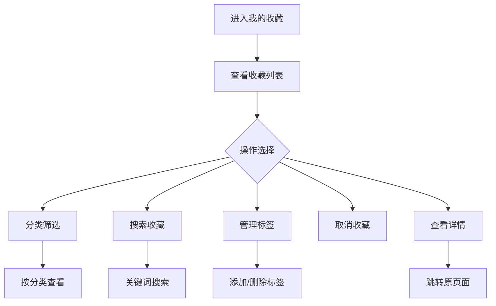

# 我的收藏

> **文档状态**：已完成  
> **最后更新**：2026-03-24  
> **文档作者**：张博  
> **所属模块**：系统管理

---

## 修订记录

| 版本号 | 修订日期 | 修订内容 | 修订人 | 审核人 |
| :--- | :--- | :--- | :--- | :--- |
| v1.0.0 | 2026-03-24 | 初始版本，完成我的收藏基础功能PRD | 张博 | - |
| v1.0.1 | 2026-03-28 | 优化分类管理，增加批量操作 | 张博 | 李明 |
| v1.1.0 | 2026-04-05 | 新增收藏标签，完善搜索功能 | 张博 | 王芳 |

---

## 1. 功能描述

我的收藏功能为用户提供跨模块的内容收藏管理能力，支持收藏政策、法规、业务信息等内容，并提供分类管理、标签管理、快速访问等功能。

### 1.1 业务背景

用户在使用系统过程中，会收藏感兴趣的政策、法规、业务信息等内容。我的收藏功能帮助用户统一管理所有收藏内容，方便后续查看和使用。

### 1.2 业务功能流程图



---

## 2. 收藏列表

### 2.1 列表字段

| 字段名称 | 字段说明 | 是否可编辑 | 字段类型 |
| :--- | :--- | :--- | :--- |
| 内容标题 | 收藏内容标题 | 否 | 文本 |
| 内容类型 | 政策/法规/业务等 | 否 | 标签 |
| 所属模块 | 来源模块 | 否 | 文本 |
| 收藏时间 | 收藏时间 | 否 | 日期 |
| 标签 | 自定义标签 | 是 | 标签组 |
| 操作 | 操作按钮 | 否 | 按钮组 |

### 2.2 内容类型

| 类型 | 说明 | 来源模块 |
| :--- | :--- | :--- |
| 政策 | 收藏的政策信息 | 政策中心 |
| 法规 | 收藏的法律法规 | 法律护航 |
| 业务 | 收藏的业务信息 | 产业管理 |
| 服务 | 收藏的服务信息 | 金融服务 |

---

## 3. 分类管理

### 3.1 分类列表

| 分类名称 | 说明 |
| :--- | :--- |
| 全部 | 显示所有收藏 |
| 政策 | 政策中心收藏 |
| 法规 | 法律护航收藏 |
| 业务 | 产业管理收藏 |
| 服务 | 金融服务收藏 |
| 未分类 | 未设置标签的收藏 |

### 3.2 标签管理

| 功能 | 说明 |
| :--- | :--- |
| 添加标签 | 为收藏添加自定义标签 |
| 删除标签 | 移除收藏的标签 |
| 标签筛选 | 按标签筛选收藏 |
| 热门标签 | 显示使用最多的标签 |

---

## 4. 数据模型

```typescript
interface Favorite {
  id: string;
  contentId: string;
  contentType: 'policy' | 'regulation' | 'business' | 'service';
  contentTitle: string;
  module: string;
  url: string;
  tags: string[];
  createTime: string;
}

interface FavoriteTag {
  id: string;
  name: string;
  count: number;
  color?: string;
}

interface FavoriteQuery {
  contentType?: string;
  tags?: string[];
  keyword?: string;
  startDate?: string;
  endDate?: string;
}
```

---

## 5. 接口需求

| 接口名称 | 请求方式 | 接口路径 | 功能说明 |
| :--- | :--- | :--- | :--- |
| 获取收藏列表 | GET | /api/favorites | 获取收藏列表 |
| 添加收藏 | POST | /api/favorites | 添加新收藏 |
| 取消收藏 | DELETE | /api/favorites/:id | 取消收藏 |
| 批量取消收藏 | POST | /api/favorites/batch-delete | 批量取消收藏 |
| 添加标签 | PUT | /api/favorites/:id/tags | 为收藏添加标签 |
| 删除标签 | DELETE | /api/favorites/:id/tags/:tag | 删除收藏标签 |
| 获取标签列表 | GET | /api/favorites/tags | 获取所有标签 |
| 获取收藏统计 | GET | /api/favorites/statistics | 获取收藏统计 |

---

**文档结束**
