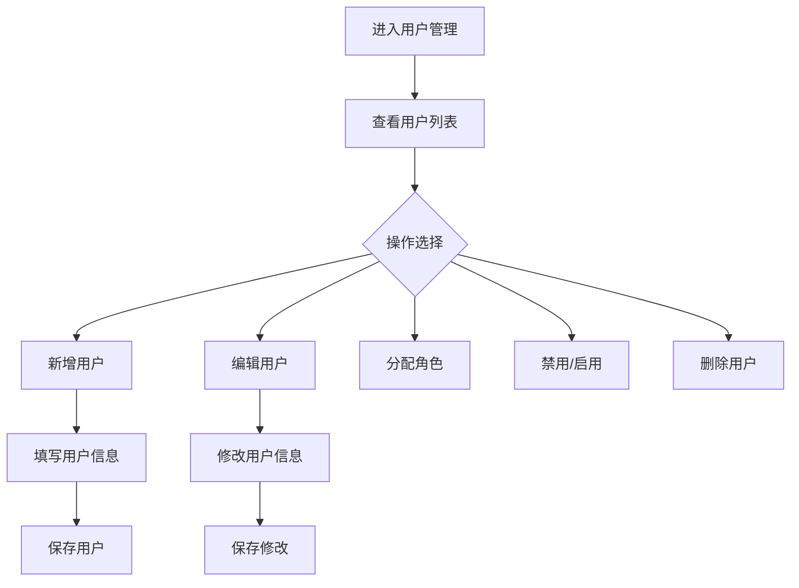

# 用户管理

> **文档状态**：已完成  
> **最后更新**：2026-03-24  
> **文档作者**：张博  
> **所属模块**：系统管理

---

## 修订记录

| 版本号 | 修订日期 | 修订内容 | 修订人 | 审核人 |
| :--- | :--- | :--- | :--- | :--- |
| v1.0.0 | 2026-03-24 | 初始版本，完成用户管理基础功能PRD | 张博 | - |
| v1.0.1 | 2026-03-28 | 优化用户查询，增加批量操作 | 张博 | 李明 |
| v1.1.0 | 2026-04-05 | 新增用户导入导出，完善权限控制 | 张博 | 王芳 |

---

## 1. 功能描述

用户管理功能为系统管理员提供企业用户的管理能力，包括用户查询、新增、编辑、禁用、删除、角色分配等功能。

### 1.1 业务背景

企业需要管理员工的系统账号，包括创建账号、分配权限、管理状态等。用户管理功能帮助管理员高效管理企业用户。

### 1.2 业务功能流程图



---

## 2. 列表展示

### 2.1 列表字段

| 字段名称 | 字段说明 | 是否可编辑 | 字段类型 |
| :--- | :--- | :--- | :--- |
| 用户账号 | 登录账号 | 否 | 文本 |
| 用户姓名 | 真实姓名 | 否 | 文本 |
| 所属部门 | 部门信息 | 否 | 文本 |
| 角色 | 分配的角色 | 是 | 标签 |
| 手机号 | 联系电话 | 否 | 文本 |
| 状态 | 账号状态 | 是 | 标签 |
| 创建时间 | 账号创建时间 | 否 | 日期 |
| 最后登录 | 最后登录时间 | 否 | 日期 |
| 操作 | 操作按钮 | 否 | 按钮组 |

### 2.2 状态说明

| 状态 | 说明 | 可操作 |
| :--- | :--- | :--- |
| 启用 | 账号正常使用 | 编辑/禁用/删除 |
| 禁用 | 账号被禁用 | 编辑/启用/删除 |
| 锁定 | 密码错误次数过多 | 解锁/编辑 |

---

## 3. 新增用户

### 3.1 新增表单字段

| 字段名称 | 是否必填 | 字段类型 | 说明 |
| :--- | :--- | :--- | :--- |
| 用户账号 | 是 | 文本 | 登录用户名，唯一 |
| 用户姓名 | 是 | 文本 | 真实姓名 |
| 登录密码 | 是 | 密码 | 初始密码 |
| 确认密码 | 是 | 密码 | 确认密码 |
| 所属部门 | 是 | 选择 | 部门列表 |
| 角色 | 是 | 多选 | 分配角色 |
| 手机号 | 是 | 文本 | 手机号码 |
| 邮箱 | 否 | 文本 | 邮箱地址 |
| 状态 | 是 | 单选 | 启用/禁用 |

### 3.2 数据校验

| 校验项 | 校验规则 | 错误提示 |
| :--- | :--- | :--- |
| 用户账号 | 6-20位字母数字 | 账号格式不正确 |
| 密码 | 8-20位，包含字母数字 | 密码强度不足 |
| 手机号 | 11位手机号 | 手机号格式不正确 |
| 邮箱 | 邮箱格式 | 邮箱格式不正确 |
| 账号唯一性 | 系统中不存在 | 账号已存在 |

---

## 4. 编辑用户

### 4.1 可编辑字段

| 字段名称 | 是否可编辑 | 说明 |
| :--- | :--- | :--- |
| 用户姓名 | 是 | 修改真实姓名 |
| 所属部门 | 是 | 变更部门 |
| 角色 | 是 | 重新分配角色 |
| 手机号 | 是 | 修改手机号 |
| 邮箱 | 是 | 修改邮箱 |
| 状态 | 是 | 启用/禁用 |
| 重置密码 | 是 | 重置为默认密码 |

---

## 5. 数据模型

```typescript
interface User {
  id: string;
  username: string;
  realName: string;
  departmentId: string;
  departmentName: string;
  roleIds: string[];
  roleNames: string[];
  phone: string;
  email?: string;
  status: 'enabled' | 'disabled' | 'locked';
  createTime: string;
  lastLoginTime?: string;
  lastLoginIp?: string;
}

interface UserFormData {
  username: string;
  realName: string;
  password?: string;
  departmentId: string;
  roleIds: string[];
  phone: string;
  email?: string;
  status: 'enabled' | 'disabled';
}
```

---

## 6. 接口需求

| 接口名称 | 请求方式 | 接口路径 | 功能说明 |
| :--- | :--- | :--- | :--- |
| 获取用户列表 | GET | /api/users | 获取用户列表 |
| 新增用户 | POST | /api/users | 创建新用户 |
| 获取用户详情 | GET | /api/users/:id | 获取用户详情 |
| 更新用户 | PUT | /api/users/:id | 更新用户信息 |
| 删除用户 | DELETE | /api/users/:id | 删除用户 |
| 禁用用户 | PUT | /api/users/:id/disable | 禁用用户 |
| 启用用户 | PUT | /api/users/:id/enable | 启用用户 |
| 重置密码 | PUT | /api/users/:id/reset-password | 重置密码 |
| 批量操作 | POST | /api/users/batch | 批量操作 |

---

## 7. 异常场景处理

| 异常场景 | 系统行为 | 提醒方式 |
| :--- | :--- | :--- |
| 账号已存在 | 阻止创建，提示错误 | 表单提示 |
| 手机号已绑定 | 阻止保存，提示错误 | 表单提示 |
| 删除管理员 | 阻止删除，提示错误 | Toast提示 |
| 批量操作失败 | 部分成功，显示失败列表 | 弹窗提示 |

---

**文档结束**
