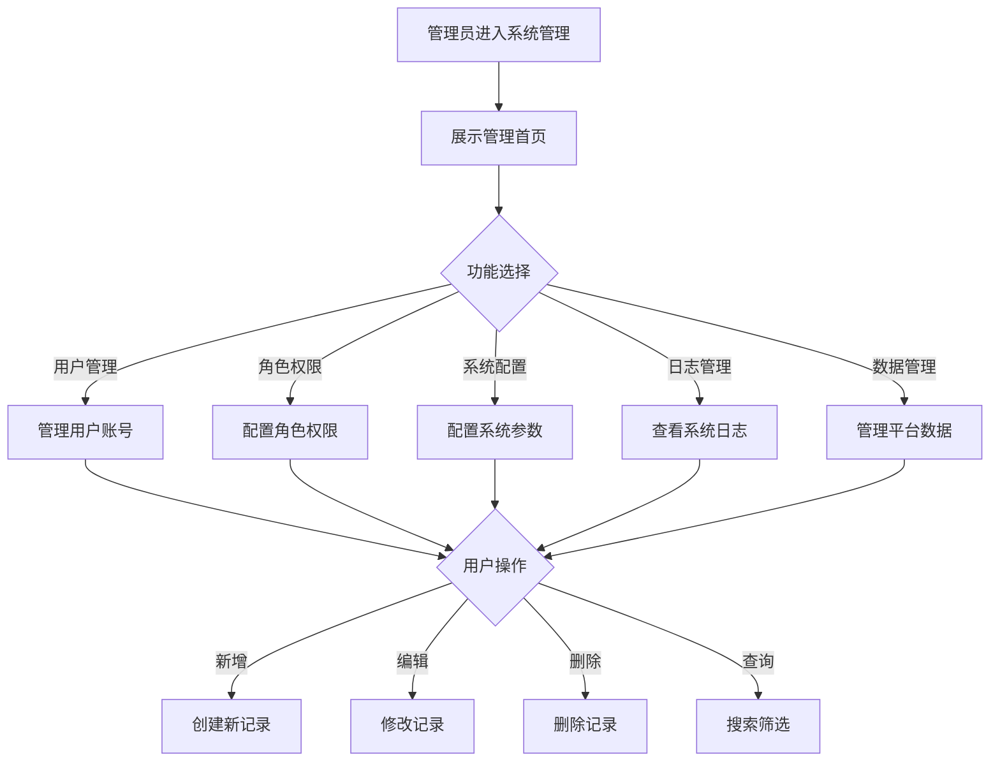

# 系统管理

#### 1. 功能描述
提供系统后台管理功能，包括用户管理、角色权限管理、系统配置、日志管理、数据管理等功能。供系统管理员维护平台正常运行和管理平台数据。

##### 1.1 业务功能流程图

#### 2. 业务规则

##### 2.1 管理员权限规则
| 规则编号 | 规则名称 | 规则描述 | 适用范围 |
| :--- | :--- | :--- | :--- |
| BR-001 | 超级管理员 | 拥有所有权限 | 系统初始化 |
| BR-002 | 分级授权 | 支持创建不同级别的管理员 | 权限管理 |
| BR-003 | 操作审计 | 所有管理操作记录日志 | 安全审计 |
| BR-004 | 敏感操作 | 敏感操作需二次确认 | 安全控制 |

##### 2.2 数据安全规则
| 规则编号 | 规则名称 | 规则描述 |
| :--- | :--- | :--- |
| BR-005 | 数据备份 | 定期自动备份系统数据 |
| BR-006 | 数据恢复 | 支持数据恢复到指定时间点 |
| BR-007 | 敏感数据 | 敏感数据加密存储 |
| BR-008 | 访问控制 | 敏感数据访问需授权 |

##### 2.3 系统配置规则
| 规则编号 | 规则名称 | 规则描述 |
| :--- | :--- | :--- |
| BR-009 | 配置生效 | 配置修改后实时或定时生效 |
| BR-010 | 配置版本 | 支持配置版本管理和回滚 |
| BR-011 | 配置验证 | 配置修改前验证有效性 |
| BR-012 | 配置备份 | 自动备份配置变更历史 |

#### 3. 功能模块

##### 3.1 用户管理

**功能说明**：
- 管理平台用户账号
- 包括用户增删改查、状态管理

**用户列表字段**：
| 字段名称 | 说明 |
| :--- | :--- |
| 用户ID | 用户唯一标识 |
| 用户名 | 登录账号 |
| 真实姓名 | 用户真实姓名 |
| 手机号 | 绑定手机号 |
| 邮箱 | 绑定邮箱 |
| 角色 | 用户角色 |
| 状态 | 启用/禁用 |
| 注册时间 | 账号注册时间 |
| 最后登录 | 最后登录时间 |

**用户操作**：
| 操作 | 说明 |
| :--- | :--- |
| 新增用户 | 创建新用户账号 |
| 编辑用户 | 修改用户信息 |
| 删除用户 | 删除用户账号 |
| 重置密码 | 重置用户密码 |
| 启用/禁用 | 控制账号状态 |
| 分配角色 | 设置用户角色 |

##### 3.2 角色权限管理

**功能说明**：
- 管理系统角色和权限
- 支持自定义角色和权限分配

**系统预设角色**：
| 角色 | 权限范围 |
| :--- | :--- |
| 超级管理员 | 所有权限 |
| 运营管理员 | 内容管理、用户管理 |
| 审核管理员 | 内容审核、举报处理 |
| 财务管理员 | 财务管理、数据统计 |
| 客服管理员 | 用户服务、问题处理 |

**权限类型**：
| 权限类型 | 说明 |
| :--- | :--- |
| 菜单权限 | 可访问的菜单 |
| 操作权限 | 可执行的操作 |
| 数据权限 | 可查看的数据范围 |
| 字段权限 | 可查看的字段 |

**权限操作**：
| 操作 | 说明 |
| :--- | :--- |
| 新增角色 | 创建新角色 |
| 编辑角色 | 修改角色权限 |
| 删除角色 | 删除角色（需无用户关联） |
| 分配权限 | 为角色分配权限 |

##### 3.3 系统配置

**功能说明**：
- 配置系统运行参数
- 管理业务规则和开关

**配置分类**：
| 分类 | 说明 | 示例 |
| :--- | :--- | :--- |
| 基础配置 | 系统基础参数 | 站点名称、LOGO等 |
| 业务配置 | 业务规则配置 | 审核流程、积分规则等 |
| 安全配置 | 安全相关配置 | 密码策略、登录限制等 |
| 第三方配置 | 第三方服务配置 | 短信、支付、存储等 |

**配置项示例**：
| 配置项 | 说明 | 默认值 |
| :--- | :--- | :--- |
| 站点名称 | 平台显示名称 | 璟智通 |
| 登录失败次数 | 允许登录失败次数 | 5 |
| 密码有效期 | 密码强制修改周期 | 90天 |
| 会话超时 | 登录会话超时时间 | 30分钟 |
| 上传限制 | 文件上传大小限制 | 20MB |

##### 3.4 日志管理

**功能说明**：
- 查看系统运行日志
- 包括操作日志、登录日志、错误日志

**日志类型**：
| 类型 | 说明 | 记录内容 |
| :--- | :--- | :--- |
| 操作日志 | 用户操作记录 | 操作人、时间、内容、结果 |
| 登录日志 | 登录行为记录 | 账号、IP、时间、结果 |
| 错误日志 | 系统错误记录 | 错误信息、堆栈、时间 |
| 审计日志 | 安全审计记录 | 敏感操作记录 |

**日志查询**：
| 查询条件 | 说明 |
| :--- | :--- |
| 时间范围 | 查询时间段 |
| 操作人 | 指定用户 |
| 操作类型 | 操作分类 |
| 关键词 | 内容搜索 |
| 结果状态 | 成功/失败 |

**日志保留**：
| 类型 | 保留期限 |
| :--- | :--- |
| 操作日志 | 1年 |
| 登录日志 | 6个月 |
| 错误日志 | 3个月 |
| 审计日志 | 3年 |

##### 3.5 数据管理

**功能说明**：
- 管理平台业务数据
- 支持数据查询、导出、清理

**数据分类**：
| 分类 | 说明 |
| :--- | :--- |
| 用户数据 | 用户相关信息 |
| 业务数据 | 各业务模块数据 |
| 日志数据 | 系统日志数据 |
| 配置数据 | 系统配置数据 |

**数据操作**：
| 操作 | 说明 |
| :--- | :--- |
| 数据查询 | 查询指定数据 |
| 数据导出 | 导出数据到文件 |
| 数据导入 | 批量导入数据 |
| 数据清理 | 清理过期数据 |
| 数据备份 | 备份指定数据 |

##### 3.6 内容管理

**功能说明**：
- 管理平台内容
- 包括公告、帮助文档、轮播图等

**内容类型**：
| 类型 | 说明 |
| :--- | :--- |
| 公告管理 | 平台公告发布管理 |
| 帮助中心 | 帮助文档管理 |
| 轮播图 | 首页轮播图管理 |
| 协议管理 | 用户协议管理 |

**内容操作**：
| 操作 | 说明 |
| :--- | :--- |
| 新增内容 | 创建新内容 |
| 编辑内容 | 修改内容 |
| 删除内容 | 删除内容 |
| 发布/下架 | 控制内容状态 |
| 排序调整 | 调整展示顺序 |

#### 4. 异常场景处理

| 异常场景 | 场景说明 | 系统行为 | 提醒方式 | 操作选项 |
| :--- | :--- | :--- | :--- | :--- |
| 权限不足 | 无权限执行操作 | 阻止操作 | 提示"权限不足" | 申请权限 |
| 操作冲突 | 数据被他人修改 | 阻止提交 | 提示"数据已变更" | 刷新重试 |
| 数据异常 | 数据校验失败 | 阻止操作 | 提示"数据异常" | 检查数据 |
| 系统错误 | 系统运行错误 | 记录日志 | 提示"系统错误" | 联系技术 |
| 会话超时 | 登录会话过期 | 跳转登录 | 提示"会话超时" | 重新登录 |

#### 5. 权限控制

| 功能 | 超级管理员 | 运营管理员 | 审核管理员 | 财务管理员 | 客服管理员 |
| :--- | :--- | :--- | :--- | :--- | :--- |
| 用户管理 | ✓ | ✓ | ✗ | ✗ | ✗ |
| 角色管理 | ✓ | ✗ | ✗ | ✗ | ✗ |
| 系统配置 | ✓ | ✗ | ✗ | ✗ | ✗ |
| 日志查看 | ✓ | ✓ | ✗ | ✗ | ✗ |
| 数据管理 | ✓ | ✓ | ✗ | ✓ | ✗ |
| 内容管理 | ✓ | ✓ | ✓ | ✗ | ✓ |
| 审核管理 | ✓ | ✓ | ✓ | ✗ | ✗ |
| 财务管理 | ✓ | ✗ | ✗ | ✓ | ✗ |

#### 6. 数据关联

| 关联功能 | 关联方式 | 说明 |
| :--- | :--- | :--- |
| 用户详情 | 查看详情 | 查看用户详细信息 |
| 角色详情 | 查看详情 | 查看角色权限详情 |
| 业务数据 | 数据管理 | 管理各业务模块数据 |
| 系统监控 | 监控页面 | 查看系统运行状态 |
