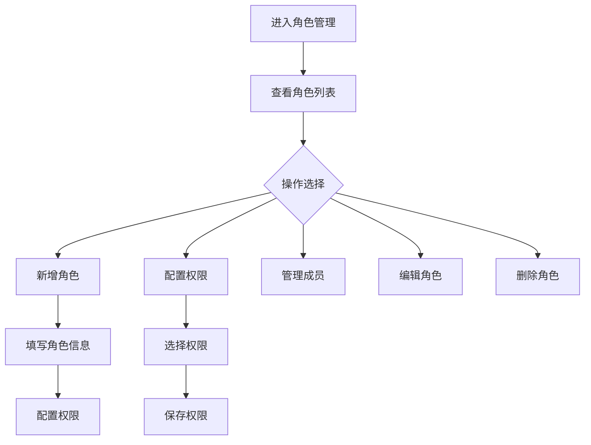

# 角色管理

> **文档状态**：已完成  
> **最后更新**：2026-03-24  
> **文档作者**：张博  
> **所属模块**：系统管理

---

## 修订记录

| 版本号 | 修订日期 | 修订内容 | 修订人 | 审核人 |
| :--- | :--- | :--- | :--- | :--- |
| v1.0.0 | 2026-03-24 | 初始版本，完成角色管理基础功能PRD | 张博 | - |
| v1.0.1 | 2026-03-28 | 优化权限配置，增加权限预览 | 张博 | 李明 |
| v1.1.0 | 2026-04-05 | 新增角色复制功能，完善权限继承 | 张博 | 王芳 |

---

## 1. 功能描述

角色管理功能为系统管理员提供角色定义和权限配置能力，支持创建角色、分配权限、管理角色成员等功能。

### 1.1 业务背景

企业需要根据员工职责分配不同的系统权限。角色管理功能通过角色-权限-用户的关联模型，实现灵活的权限控制。

### 1.2 业务功能流程图



---

## 2. 列表展示

### 2.1 列表字段

| 字段名称 | 字段说明 | 是否可编辑 | 字段类型 |
| :--- | :--- | :--- | :--- |
| 角色名称 | 角色标识名称 | 否 | 文本 |
| 角色编码 | 系统编码 | 否 | 文本 |
| 角色描述 | 角色说明 | 否 | 文本 |
| 成员数量 | 拥有该角色的用户数 | 否 | 数字 |
| 创建时间 | 角色创建时间 | 否 | 日期 |
| 状态 | 角色状态 | 是 | 标签 |
| 操作 | 操作按钮 | 否 | 按钮组 |

---

## 3. 角色配置

### 3.1 基本信息

| 字段名称 | 是否必填 | 字段类型 | 说明 |
| :--- | :--- | :--- | :--- |
| 角色名称 | 是 | 文本 | 角色显示名称 |
| 角色编码 | 是 | 文本 | 系统唯一编码 |
| 角色描述 | 否 | 文本域 | 角色功能说明 |
| 数据权限 | 是 | 单选 | 全部/本部门/本人 |

### 3.2 权限配置

| 权限类型 | 说明 | 选项 |
| :--- | :--- | :--- |
| 菜单权限 | 可访问的菜单 | 系统所有菜单 |
| 操作权限 | 可执行的操作 | 增删改查等 |
| 数据权限 | 可查看的数据范围 | 全部/部门/个人 |
| 字段权限 | 可见的字段 | 敏感字段控制 |

---

## 4. 权限体系

### 4.1 系统权限列表

| 模块 | 权限项 |
| :--- | :--- |
| 首页 | 查看首页 |
| 政策中心 | 查看政策、申报管理、我的申报 |
| 法律护航 | AI问答、法规查询 |
| 产业管理 | 业务大厅、需求大厅、业务管理 |
| 金融服务 | 融资诊断、诊断报告 |
| 系统管理 | 用户管理、角色管理、个人中心、我的收藏、企业管理 |

### 4.2 操作权限

| 操作 | 说明 |
| :--- | :--- |
| 查询 | 查看列表和详情 |
| 新增 | 创建新数据 |
| 编辑 | 修改已有数据 |
| 删除 | 删除数据 |
| 导出 | 导出数据 |
| 审核 | 审核操作 |
| 分配 | 分配权限或资源 |

---

## 5. 数据模型

```typescript
interface Role {
  id: string;
  name: string;
  code: string;
  description?: string;
  dataScope: 'all' | 'department' | 'self';
  menuIds: string[];
  permissionIds: string[];
  memberCount: number;
  status: 'enabled' | 'disabled';
  createTime: string;
}

interface Permission {
  id: string;
  name: string;
  code: string;
  type: 'menu' | 'button' | 'api';
  parentId?: string;
  path?: string;
}
```

---

## 6. 接口需求

| 接口名称 | 请求方式 | 接口路径 | 功能说明 |
| :--- | :--- | :--- | :--- |
| 获取角色列表 | GET | /api/roles | 获取角色列表 |
| 新增角色 | POST | /api/roles | 创建新角色 |
| 获取角色详情 | GET | /api/roles/:id | 获取角色详情 |
| 更新角色 | PUT | /api/roles/:id | 更新角色信息 |
| 删除角色 | DELETE | /api/roles/:id | 删除角色 |
| 获取权限树 | GET | /api/permissions/tree | 获取权限树 |
| 获取角色成员 | GET | /api/roles/:id/members | 获取角色成员 |
| 分配成员 | POST | /api/roles/:id/members | 分配角色成员 |

---

**文档结束**
