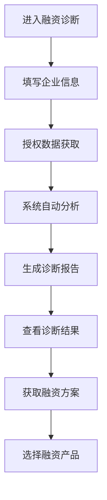

# 融资诊断

> **文档状态**：已完成  
> **最后更新**：2026-03-24  
> **文档作者**：张博  
> **所属模块**：金融服务

---

## 修订记录

| 版本号 | 修订日期 | 修订内容 | 修订人 | 审核人 |
| :--- | :--- | :--- | :--- | :--- |
| v1.0.0 | 2026-03-24 | 初始版本，完成融资诊断基础功能PRD | 张博 | - |
| v1.0.1 | 2026-03-28 | 优化诊断模型，增加多维度评估 | 张博 | 李明 |
| v1.1.0 | 2026-04-05 | 新增融资方案推荐，完善报告生成 | 张博 | 王芳 |

---

## 1. 功能描述

融资诊断功能为企业提供全面的融资能力评估服务，通过多维度数据分析，评估企业融资可行性，并推荐合适的融资方案。

### 1.1 业务背景

企业在发展过程中经常面临资金需求，但不同企业的融资条件和能力差异很大。融资诊断功能帮助企业了解自身融资能力，找到最适合的融资方式。

### 1.2 业务功能流程图



---

## 2. 信息填写

### 2.1 企业基本信息

| 字段名称 | 是否必填 | 字段类型 | 说明 |
| :--- | :--- | :--- | :--- |
| 企业名称 | 是 | 文本 | 自动填充 |
| 统一信用代码 | 是 | 文本 | 自动填充 |
| 成立时间 | 是 | 日期 | 企业成立日期 |
| 注册资本 | 是 | 数字 | 注册资本金额 |
| 所属行业 | 是 | 选择 | 主营业务行业 |
| 企业规模 | 是 | 选择 | 员工人数规模 |
| 年营业收入 | 是 | 数字 | 上年度营收 |

### 2.2 融资需求信息

| 字段名称 | 是否必填 | 字段类型 | 说明 |
| :--- | :--- | :--- | :--- |
| 融资金额 | 是 | 数字 | 计划融资金额 |
| 融资用途 | 是 | 多选 | 流动资金、设备采购等 |
| 融资期限 | 是 | 选择 | 短期、中期、长期 |
| 可接受利率 | 是 | 选择 | 利率范围 |
| 担保方式 | 是 | 多选 | 抵押、质押、信用等 |
| 期望放款时间 | 是 | 选择 | 紧急程度 |

---

## 3. 诊断评估

### 3.1 评估维度

| 维度 | 权重 | 评估内容 |
| :--- | :--- | :--- |
| 企业信用 | 25% | 征信记录、历史还款、司法风险 |
| 经营状况 | 25% | 营收增长、盈利能力、现金流 |
| 资产状况 | 20% | 固定资产、流动资产、负债率 |
| 行业前景 | 15% | 行业发展、政策支持、竞争态势 |
| 管理能力 | 15% | 管理团队、治理结构、合规情况 |

### 3.2 评分标准

| 等级 | 分数范围 | 说明 |
| :--- | :--- | :--- |
| 优秀 | 90-100分 | 融资条件优秀，多种融资渠道可选 |
| 良好 | 75-89分 | 融资条件良好，主流渠道可融资 |
| 一般 | 60-74分 | 融资条件一般，需优化后融资 |
| 较差 | 40-59分 | 融资条件较差，建议改善经营 |
| 差 | 0-39分 | 暂不适合融资，需大幅提升 |

---

## 4. 融资方案推荐

### 4.1 方案类型

| 方案类型 | 适用企业 | 特点 |
| :--- | :--- | :--- |
| 银行贷款 | 信用良好企业 | 利率低、额度高、周期长 |
| 供应链金融 | 有稳定供应链企业 | 基于应收账款、存货融资 |
| 股权融资 | 高成长企业 | 引入投资者、稀释股权 |
| 政府贴息 | 符合条件企业 | 利率优惠、政策扶持 |
| 融资租赁 | 设备需求企业 | 以租代购、分期付款 |
| 小额贷款 | 小微企业 | 门槛低、放款快、额度小 |

### 4.2 方案匹配

```
1. 根据诊断评分筛选可行方案
2. 根据企业需求匹配最优方案
3. 计算预期融资额度和利率
4. 评估融资成功概率
5. 生成个性化融资建议
```

---

## 5. 数据模型

```typescript
interface FinancingDiagnosis {
  id: string;
  enterpriseId: string;
  basicInfo: EnterpriseBasicInfo;
  financingNeeds: FinancingNeeds;
  creditScore: number;
  operationScore: number;
  assetScore: number;
  industryScore: number;
  managementScore: number;
  totalScore: number;
  rating: 'excellent' | 'good' | 'average' | 'poor' | 'bad';
  recommendedProducts: FinancingProduct[];
  diagnosisReport: DiagnosisReport;
  createTime: string;
}

interface EnterpriseBasicInfo {
  name: string;
  creditCode: string;
  establishDate: string;
  registeredCapital: number;
  industry: string;
  scale: string;
  annualRevenue: number;
}

interface FinancingNeeds {
  amount: number;
  purpose: string[];
  term: string;
  acceptableRate: string;
  guaranteeType: string[];
  urgency: string;
}

interface FinancingProduct {
  id: string;
  name: string;
  type: string;
  minAmount: number;
  maxAmount: number;
  rateRange: [number, number];
  termRange: [number, number];
  requirements: string[];
  matchScore: number;
}
```

---

## 6. 接口需求

| 接口名称 | 请求方式 | 接口路径 | 功能说明 |
| :--- | :--- | :--- | :--- |
| 提交诊断信息 | POST | /api/financing/diagnosis | 提交企业信息和融资需求 |
| 获取诊断结果 | GET | /api/financing/diagnosis/:id | 获取诊断结果 |
| 获取推荐方案 | GET | /api/financing/recommendations | 获取融资方案推荐 |
| 获取诊断历史 | GET | /api/financing/history | 获取历史诊断记录 |
| 生成诊断报告 | POST | /api/financing/report | 生成诊断报告PDF |

---

## 7. 异常场景处理

| 异常场景 | 系统行为 | 提醒方式 |
| :--- | :--- | :--- |
| 企业信息获取失败 | 提示手动填写 | 表单提示 |
| 征信查询失败 | 跳过信用评估维度 | Toast提示 |
| 诊断计算超时 | 显示简化版结果 | 页面提示 |
| 无匹配方案 | 推荐改善建议 | 页面提示 |

---

**文档结束**
