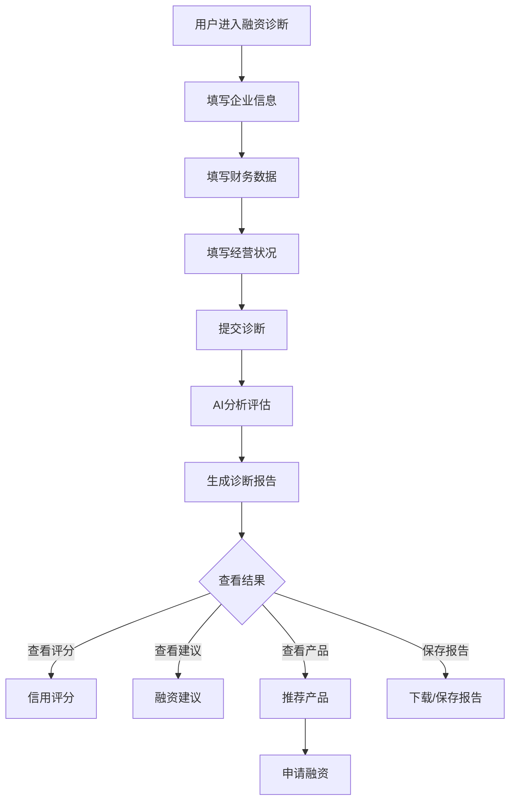

# 融资诊断

#### 1. 功能描述
提供企业融资需求智能诊断功能，通过分析企业基本信息、财务数据、经营状况等，评估企业融资能力，匹配适合的融资产品，提供融资方案建议。

##### 1.1 业务功能流程图

#### 2. 业务规则

##### 2.1 数据采集规则
| 规则编号 | 规则名称 | 规则描述 | 适用范围 |
| :--- | :--- | :--- | :--- |
| BR-001 | 必填信息 | 企业基本信息为必填项 | 诊断表单 |
| BR-002 | 数据真实性 | 填写的数据需真实有效 | 诊断表单 |
| BR-003 | 数据保密 | 企业敏感数据加密存储 | 数据安全 |
| BR-004 | 授权同意 | 诊断前需同意数据使用协议 | 法律合规 |

##### 2.2 评分规则
| 规则编号 | 规则名称 | 规则描述 |
| :--- | :--- | :--- |
| BR-005 | 多维度评分 | 从信用、财务、经营多维度评分 |
| BR-006 | 动态权重 | 根据行业特点动态调整评分权重 |
| BR-007 | 对标分析 | 与同类型企业进行对比分析 |
| BR-008 | 风险预警 | 识别潜在风险并预警 |

##### 2.3 产品匹配规则
| 规则编号 | 规则名称 | 规则描述 |
| :--- | :--- | :--- |
| BR-009 | 资质匹配 | 根据企业资质匹配合适产品 |
| BR-010 | 额度匹配 | 根据融资需求匹配额度范围 |
| BR-011 | 利率排序 | 按利率从低到高推荐产品 |
| BR-012 | 成功率排序 | 按申请成功率排序 |

#### 3. 数据模型

##### 3.1 实体：EnterpriseInfo（企业信息）

| 字段名 | 类型 | 必填 | 说明 |
| :--- | :--- | :--- | :--- |
| enterpriseName | string | 是 | 企业名称 |
| creditCode | string | 是 | 统一社会信用代码 |
| industry | string | 是 | 所属行业 |
| establishDate | string | 是 | 成立日期 |
| registeredCapital | number | 是 | 注册资本（万元） |
| employeeCount | number | 是 | 员工人数 |
| annualRevenue | number | 是 | 年营业收入（万元） |
| businessScope | string | 是 | 经营范围 |
| region | string | 是 | 所在地区 |

##### 3.2 实体：FinancialData（财务数据）

| 字段名 | 类型 | 必填 | 说明 |
| :--- | :--- | :--- | :--- |
| totalAssets | number | 是 | 资产总额 |
| totalLiabilities | number | 是 | 负债总额 |
| netAssets | number | 是 | 净资产 |
| annualProfit | number | 是 | 年利润总额 |
| cashFlow | number | 是 | 经营现金流 |
| accountsReceivable | number | 否 | 应收账款 |
| inventory | number | 否 | 存货 |

##### 3.3 实体：DiagnosisResult（诊断结果）

| 字段名 | 类型 | 必填 | 说明 |
| :--- | :--- | :--- | :--- |
| id | string | 是 | 诊断ID |
| creditScore | number | 是 | 信用评分（0-100） |
| financialScore | number | 是 | 财务评分（0-100） |
| operationScore | number | 是 | 经营评分（0-100） |
| overallScore | number | 是 | 综合评分（0-100） |
| riskLevel | enum | 是 | 风险等级：低/中/高 |
| financingCapacity | string | 是 | 融资能力评估 |
| recommendedAmount | string | 是 | 建议融资额度 |
| suggestions | string[] | 是 | 改进建议 |
| matchedProducts | object[] | 是 | 匹配产品列表 |

#### 4. 功能详述

##### 4.1 企业信息填写

**功能说明**：
- 收集企业基本信息
- 用于企业画像分析

**表单字段**：
| 字段名称 | 是否必填 | 字段类型 | 说明 |
| :--- | :--- | :--- | :--- |
| 企业名称 | 是 | 文本 | 企业全称 |
| 统一社会信用代码 | 是 | 文本 | 18位信用代码 |
| 所属行业 | 是 | 下拉选择 | 制造业、服务业、科技业等 |
| 成立日期 | 是 | 日期选择 | 企业成立时间 |
| 注册资本 | 是 | 数字 | 万元 |
| 员工人数 | 是 | 数字 | 人 |
| 年营业收入 | 是 | 数字 | 万元 |
| 经营范围 | 是 | 多行文本 | 主营业务描述 |
| 所在地区 | 是 | 级联选择 | 省市区 |

##### 4.2 财务数据填写

**功能说明**：
- 收集企业财务数据
- 用于财务健康度分析

**表单字段**：
| 字段名称 | 是否必填 | 字段类型 | 说明 |
| :--- | :--- | :--- | :--- |
| 资产总额 | 是 | 数字 | 万元 |
| 负债总额 | 是 | 数字 | 万元 |
| 净资产 | 是 | 数字 | 万元（自动计算） |
| 年利润总额 | 是 | 数字 | 万元 |
| 经营现金流 | 是 | 数字 | 万元 |
| 应收账款 | 否 | 数字 | 万元 |
| 存货 | 否 | 数字 | 万元 |

**自动计算**：
- 净资产 = 资产总额 - 负债总额
- 资产负债率 = 负债总额 / 资产总额

##### 4.3 经营状况填写

**功能说明**：
- 收集企业经营信息
- 用于经营能力评估

**表单字段**：
| 字段名称 | 是否必填 | 字段类型 | 说明 |
| :--- | :--- | :--- | :--- |
| 主要客户 | 是 | 多行文本 | 前五大客户 |
| 主要供应商 | 是 | 多行文本 | 前五大供应商 |
| 竞争优势 | 是 | 多行文本 | 核心竞争力 |
| 发展规划 | 是 | 多行文本 | 未来3年规划 |
| 融资用途 | 是 | 多行文本 | 资金用途说明 |
| 期望额度 | 是 | 数字 | 期望融资金额（万元） |
| 期望期限 | 是 | 下拉选择 | 1年/2年/3年/3年以上 |

##### 4.4 诊断报告生成

**功能说明**：
- AI分析企业数据生成诊断报告
- 多维度评估企业融资能力

**评分维度**：
| 维度 | 权重 | 说明 |
| :--- | :--- | :--- |
| 信用评分 | 30% | 企业信用状况评估 |
| 财务评分 | 40% | 财务健康度评估 |
| 经营评分 | 30% | 经营能力评估 |

**评分等级**：
| 分数区间 | 等级 | 说明 |
| :--- | :--- | :--- |
| 90-100 | 优秀 | 融资能力强 |
| 80-89 | 良好 | 融资能力较好 |
| 70-79 | 一般 | 融资能力一般 |
| 60-69 | 较差 | 融资能力较弱 |
| <60 | 差 | 融资能力差 |

**风险等级**：
| 等级 | 颜色 | 说明 |
| :--- | :--- | :--- |
| 低风险 | 绿色 | 企业经营稳健 |
| 中风险 | 黄色 | 存在一定风险 |
| 高风险 | 红色 | 风险较高需谨慎 |

##### 4.5 融资产品推荐

**功能说明**：
- 根据诊断结果推荐适合的融资产品
- 按匹配度排序展示

**产品信息**：
| 字段名称 | 说明 |
| :--- | :--- |
| 产品名称 | 融资产品名称 |
| 产品类型 | 信用贷/抵押贷/供应链金融等 |
| 额度范围 | 可贷金额范围 |
| 利率范围 | 年化利率范围 |
| 期限范围 | 贷款期限 |
| 申请条件 | 申请资质要求 |
| 匹配度 | 与企业匹配度 |

**排序方式**：
| 排序方式 | 说明 |
| :--- | :--- |
| 匹配度 | 默认排序，按匹配度高低 |
| 利率 | 按利率从低到高 |
| 额度 | 按额度从高到低 |

##### 4.6 改进建议

**功能说明**：
- 根据诊断结果提供改进建议
- 帮助企业提升融资能力

**建议类型**：
| 类型 | 说明 | 示例 |
| :--- | :--- | :--- |
| 财务建议 | 财务结构优化 | "建议降低资产负债率至60%以下" |
| 经营建议 | 经营能力提升 | "建议拓展客户群体，降低客户集中度" |
| 信用建议 | 信用状况改善 | "建议按时还款，维护良好信用记录" |

#### 5. 异常场景处理

| 异常场景 | 场景说明 | 系统行为 | 提醒方式 | 操作选项 |
| :--- | :--- | :--- | :--- | :--- |
| 信息不完整 | 必填项未填写 | 阻止提交 | 提示"请完善必填信息" | 补充信息 |
| 数据异常 | 财务数据不合理 | 提示警告 | 提示"数据异常，请检查" | 检查修改 |
| 诊断失败 | AI分析失败 | 显示错误 | 提示"诊断失败，请重试" | 重试 |
| 无匹配产品 | 暂无适合产品 | 显示空状态 | 提示"暂无匹配产品" | 查看建议 |

#### 6. 权限控制

| 功能 | 游客 | 普通会员 | VIP会员 |
| :--- | :--- | :--- | :--- |
| 填写诊断 | ✗ | ✓ | ✓ |
| 生成报告 | ✗ | ✓ | ✓ |
| 查看报告 | ✗ | ✓ | ✓ |
| 下载报告 | ✗ | 限制次数 | 无限制 |
| 查看产品 | ✗ | ✓ | ✓ |
| 申请融资 | ✗ | ✓ | ✓ |

#### 7. 数据关联

| 关联功能 | 关联方式 | 说明 |
| :--- | :--- | :--- |
| 诊断报告 | 报告详情 | 查看详细诊断报告 |
| 融资产品 | 产品列表 | 查看推荐产品详情 |
| 融资申请 | 跳转申请 | 跳转到融资申请页面 |
| 企业信息 | 数据复用 | 复用已填企业信息 |
