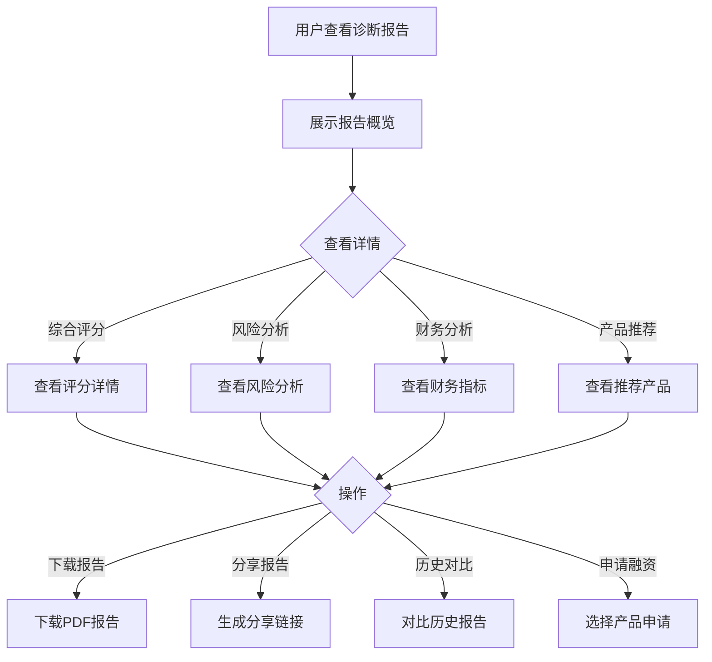

# 诊断分析报告

#### 1. 功能描述
提供融资诊断的详细分析报告查看功能，展示企业融资能力的多维度评估结果、风险分析、改进建议、融资产品推荐等内容。支持报告下载、分享、历史对比等功能。

##### 1.1 业务功能流程图

#### 2. 业务规则

##### 2.1 报告生成规则
| 规则编号 | 规则名称 | 规则描述 | 适用范围 |
| :--- | :--- | :--- | :--- |
| BR-001 | 报告有效期 | 诊断报告有效期为30天 | 报告使用 |
| BR-002 | 报告版本 | 每次诊断生成新版本报告 | 版本管理 |
| BR-003 | 历史保留 | 保留最近12个月的诊断报告 | 数据保留 |
| BR-004 | 报告加密 | PDF报告添加水印和加密 | 数据安全 |

##### 2.2 报告内容规则
| 规则编号 | 规则名称 | 规则描述 |
| :--- | :--- | :--- |
| BR-005 | 数据准确性 | 报告数据需准确反映诊断结果 |
| BR-006 | 建议可行性 | 改进建议需具有可操作性 |
| BR-007 | 风险提示 | 明确标注潜在风险 |
| BR-008 | 免责声明 | 报告末尾附加免责声明 |

##### 2.3 分享规则
| 规则编号 | 规则名称 | 规则描述 |
| :--- | :--- | :--- |
| BR-009 | 分享权限 | 仅报告所有者可以分享 |
| BR-010 | 分享有效期 | 分享链接有效期7天 |
| BR-011 | 查看限制 | 分享报告仅可查看，不可下载 |
| BR-012 | 撤销分享 | 支持随时撤销分享链接 |

#### 3. 数据模型

##### 3.1 实体：DiagnosisReport（诊断报告）

| 字段名 | 类型 | 必填 | 说明 |
| :--- | :--- | :--- | :--- |
| id | string | 是 | 报告ID |
| enterpriseId | string | 是 | 企业ID |
| diagnosisId | string | 是 | 诊断ID |
| reportVersion | number | 是 | 报告版本号 |
| generateTime | string | 是 | 生成时间 |
| validUntil | string | 是 | 有效期至 |
| overallScore | number | 是 | 综合评分 |
| creditAnalysis | object | 是 | 信用分析 |
| financialAnalysis | object | 是 | 财务分析 |
| operationAnalysis | object | 是 | 经营分析 |
| riskAnalysis | object | 是 | 风险分析 |
| suggestions | object[] | 是 | 改进建议 |
| productRecommendations | object[] | 是 | 产品推荐 |
| industryComparison | object | 是 | 行业对比 |

##### 3.2 实体：ReportHistory（报告历史）

| 字段名 | 类型 | 必填 | 说明 |
| :--- | :--- | :--- | :--- |
| id | string | 是 | 历史记录ID |
| enterpriseId | string | 是 | 企业ID |
| reportId | string | 是 | 报告ID |
| reportVersion | number | 是 | 版本号 |
| overallScore | number | 是 | 综合评分 |
| generateTime | string | 是 | 生成时间 |

#### 4. 功能详述

##### 4.1 报告概览

**功能说明**：
- 展示报告的核心信息摘要
- 快速了解诊断结果

**概览内容**：
| 内容项 | 说明 | 展示方式 |
| :--- | :--- | :--- |
| 综合评分 | 总体融资能力评分 | 仪表盘/进度条 |
| 评分等级 | 优秀/良好/一般/较差 | 标签/徽章 |
| 风险等级 | 低/中/高风险 | 颜色标识 |
| 建议额度 | 建议融资额度 | 数字展示 |
| 报告时间 | 生成时间 | 时间戳 |
| 有效期 | 报告有效期 | 倒计时/日期 |

##### 4.2 综合评分详情

**功能说明**：
- 展示多维度评分详情
- 可视化展示评分分布

**评分维度**：
| 维度 | 权重 | 得分 | 说明 |
| :--- | :--- | :--- | :--- |
| 信用评分 | 30% | 0-100 | 企业信用状况 |
| 财务评分 | 40% | 0-100 | 财务健康度 |
| 经营评分 | 30% | 0-100 | 经营能力 |

**可视化图表**：
| 图表类型 | 说明 |
| :--- | :--- |
| 雷达图 | 多维度能力展示 |
| 进度条 | 单项得分展示 |
| 仪表盘 | 综合得分展示 |

##### 4.3 风险分析

**功能说明**：
- 分析企业潜在风险
- 提供风险预警和应对建议

**风险类型**：
| 风险类型 | 说明 | 等级 |
| :--- | :--- | :--- |
| 信用风险 | 信用记录、逾期情况 | 高/中/低 |
| 财务风险 | 资产负债、现金流 | 高/中/低 |
| 经营风险 | 客户集中度、市场竞争 | 高/中/低 |
| 行业风险 | 行业周期、政策影响 | 高/中/低 |

**风险展示**：
| 展示内容 | 说明 |
| :--- | :--- |
| 风险清单 | 识别出的风险点列表 |
| 风险等级 | 每个风险的风险等级 |
| 影响程度 | 对融资的影响程度 |
| 应对建议 | 降低风险的建议措施 |

##### 4.4 财务指标分析

**功能说明**：
- 详细分析企业财务指标
- 与行业平均水平对比

**核心指标**：
| 指标名称 | 计算公式 | 行业标准 | 企业数值 |
| :--- | :--- | :--- | :--- |
| 资产负债率 | 负债/资产 | <60% | 实际值 |
| 流动比率 | 流动资产/流动负债 | >1.5 | 实际值 |
| 净利润率 | 净利润/营业收入 | 行业均值 | 实际值 |
| ROE | 净利润/净资产 | >10% | 实际值 |
| 营收增长率 | (本年-上年)/上年 | >10% | 实际值 |

**对比分析**：
| 对比维度 | 说明 |
| :--- | :--- |
| 行业平均 | 与同行业平均水平对比 |
| 行业优秀 | 与行业优秀水平对比 |
| 历史趋势 | 企业自身历史趋势 |

##### 4.5 行业对比分析

**功能说明**：
- 与同行业企业进行对比
- 了解企业在行业中的位置

**对比维度**：
| 维度 | 说明 |
| :--- | :--- |
| 规模对比 | 营收、资产规模对比 |
| 盈利对比 | 利润率、ROE对比 |
| 效率对比 | 周转率、人均产出对比 |
| 成长对比 | 增长率对比 |

**排名展示**：
| 排名类型 | 说明 |
| :--- | :--- |
| 综合排名 | 在同类企业中的综合排名 |
| 单项排名 | 各指标的单项排名 |
| 百分位 | 超过同行业的百分比 |

##### 4.6 改进建议

**功能说明**：
- 根据诊断结果提供改进建议
- 按优先级和可行性排序

**建议分类**：
| 分类 | 说明 | 示例 |
| :--- | :--- | :--- |
| 紧急建议 | 需立即改进 | "资产负债率过高，建议降低负债" |
| 重要建议 | 建议尽快改进 | "建议拓展客户群体" |
| 优化建议 | 可逐步优化 | "建议完善财务制度" |

**建议详情**：
| 字段 | 说明 |
| :--- | :--- |
| 问题描述 | 存在的问题 |
| 改进目标 | 期望达到的目标 |
| 具体措施 | 可操作的改进措施 |
| 预期效果 | 改进后的预期效果 |
| 实施难度 | 实施的难易程度 |

##### 4.7 融资产品推荐

**功能说明**：
- 展示推荐的融资产品
- 按匹配度排序

**产品卡片信息**：
| 字段名称 | 说明 |
| :--- | :--- |
| 产品名称 | 融资产品名称 |
| 产品类型 | 信用贷/抵押贷/供应链金融等 |
| 额度范围 | 可贷金额范围 |
| 利率范围 | 年化利率范围 |
| 期限范围 | 贷款期限 |
| 匹配度 | 与企业匹配度百分比 |
| 申请条件 | 申请资质要求 |
| 产品优势 | 产品特点优势 |

**排序方式**：
| 排序方式 | 说明 |
| :--- | :--- |
| 匹配度 | 默认排序，按匹配度高低 |
| 利率 | 按利率从低到高 |
| 额度 | 按额度从高到低 |
| 成功率 | 按申请成功率排序 |

##### 4.8 历史对比功能

**功能说明**：
- 对比不同时间的诊断报告
- 了解企业融资能力变化

**对比内容**：
| 对比项 | 说明 |
| :--- | :--- |
| 评分变化 | 各项评分的变化趋势 |
| 指标变化 | 关键财务指标的变化 |
| 风险变化 | 风险等级的变化 |
| 建议执行 | 历史建议的执行情况 |

**可视化展示**：
| 图表类型 | 说明 |
| :--- | :--- |
| 趋势图 | 评分变化趋势 |
| 对比表 | 关键指标对比 |
| 改进曲线 | 改进效果展示 |

##### 4.9 报告下载功能

**功能说明**：
- 支持下载PDF格式的诊断报告
- 报告包含完整分析内容

**下载选项**：
| 选项 | 说明 |
| :--- | :--- |
| 完整报告 | 包含所有分析内容 |
| 精简报告 | 仅包含核心内容 |
| 数据报表 | 仅包含数据表格 |

**报告格式**：
- PDF格式
- 添加企业水印
- 加密保护
- 页眉页脚包含报告信息

##### 4.10 报告分享功能

**功能说明**：
- 生成分享链接供他人查看
- 支持设置分享权限

**分享设置**：
| 设置项 | 说明 |
| :--- | :--- |
| 有效期 | 链接有效时间（1/3/7天） |
| 查看密码 | 可选设置查看密码 |
| 查看次数 | 限制最大查看次数 |
| 下载权限 | 是否允许下载 |

**分享方式**：
| 方式 | 说明 |
| :--- | :--- |
| 链接分享 | 复制分享链接 |
| 二维码分享 | 生成分享二维码 |
| 邮件分享 | 发送邮件邀请 |

#### 5. 异常场景处理

| 异常场景 | 场景说明 | 系统行为 | 提醒方式 | 操作选项 |
| :--- | :--- | :--- | :--- | :--- |
| 报告过期 | 超过有效期 | 显示过期提示 | 提示"报告已过期，请重新诊断" | 重新诊断 |
| 数据缺失 | 部分数据无法获取 | 显示警告 | 提示"部分数据缺失" | 补充数据 |
| 下载失败 | PDF生成失败 | 显示错误 | 提示"下载失败，请重试" | 重试 |
| 分享失败 | 链接生成失败 | 显示错误 | 提示"分享失败" | 重试 |
| 对比失败 | 历史数据缺失 | 显示提示 | 提示"无历史数据可供对比" | 查看当前报告 |

#### 6. 权限控制

| 功能 | 游客 | 普通会员 | VIP会员 |
| :--- | :--- | :--- | :--- |
| 查看报告 | ✗ | ✓（仅自己） | ✓（仅自己） |
| 下载报告 | ✗ | 限制次数 | 无限制 |
| 分享报告 | ✗ | ✓ | ✓ |
| 历史对比 | ✗ | 最近3个月 | 最近12个月 |
| 查看产品 | ✗ | ✓ | ✓ |
| 申请融资 | ✗ | ✓ | ✓ |

#### 7. 数据关联

| 关联功能 | 关联方式 | 说明 |
| :--- | :--- | :--- |
| 融资诊断 | 数据来源 | 基于诊断结果生成报告 |
| 融资产品 | 产品详情 | 查看推荐产品详情 |
| 融资申请 | 跳转申请 | 跳转到融资申请页面 |
| 历史报告 | 对比查看 | 对比历史诊断报告 |
