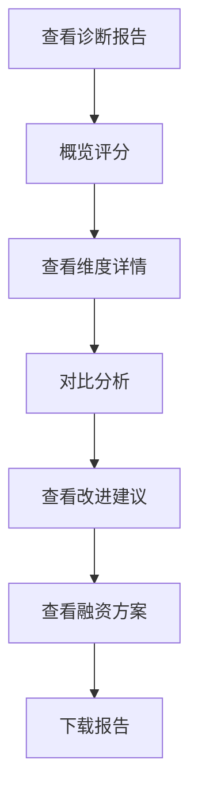

# 诊断分析报告

> **文档状态**：已完成  
> **最后更新**：2026-03-24  
> **文档作者**：张博  
> **所属模块**：金融服务

---

## 修订记录

| 版本号 | 修订日期 | 修订内容 | 修订人 | 审核人 |
| :--- | :--- | :--- | :--- | :--- |
| v1.0.0 | 2026-03-24 | 初始版本，完成诊断分析报告基础功能PRD | 张博 | - |
| v1.0.1 | 2026-03-28 | 优化报告模板，增加可视化图表 | 张博 | 李明 |
| v1.1.0 | 2026-04-05 | 新增对比分析，完善建议内容 | 张博 | 王芳 |

---

## 1. 功能描述

诊断分析报告功能为用户提供详细的融资诊断结果展示，包括评分详情、维度分析、改进建议、融资方案对比等内容，支持在线查看和下载PDF报告。

### 1.1 业务背景

用户在完成融资诊断后，需要详细了解诊断结果，包括各维度得分情况、与行业对比、存在的问题以及改进建议。诊断分析报告功能提供全面、专业的报告展示服务。

### 1.2 业务功能流程图



---

## 2. 报告内容

### 2.1 报告概览

| 内容项 | 说明 | 展示方式 |
| :--- | :--- | :--- |
| 综合评分 | 总体融资能力评分 | 仪表盘/进度条 |
| 评级等级 | 优秀/良好/一般/较差/差 | 等级徽章 |
| 诊断日期 | 诊断完成时间 | 文本 |
| 报告编号 | 唯一报告编号 | 文本 |

### 2.2 维度分析

| 维度 | 得分 | 权重 | 说明 |
| :--- | :--- | :--- | :--- |
| 企业信用 | 0-100分 | 25% | 征信记录、还款历史 |
| 经营状况 | 0-100分 | 25% | 营收、利润、现金流 |
| 资产状况 | 0-100分 | 20% | 资产负债、抵押物 |
| 行业前景 | 0-100分 | 15% | 行业趋势、政策支持 |
| 管理能力 | 0-100分 | 15% | 团队、治理、合规 |

### 2.3 对比分析

| 对比项 | 说明 |
| :--- | :--- |
| 行业平均 | 与同行业企业平均得分对比 |
| 历史趋势 | 企业历次诊断得分变化趋势 |
| 目标差距 | 与优秀标准的差距分析 |

---

## 3. 改进建议

### 3.1 建议分类

| 分类 | 说明 | 优先级 |
| :--- | :--- | :--- |
| 信用提升 | 改善征信记录的建议 | 高 |
| 经营优化 | 提升经营能力的建议 | 高 |
| 资产管理 | 优化资产结构的建议 | 中 |
| 合规完善 | 完善企业治理的建议 | 中 |

### 3.2 建议内容

每条建议包含：
- 问题描述
- 改进措施
- 预期效果
- 实施难度
- 参考案例

---

## 4. 融资方案详情

### 4.1 方案对比

| 对比项 | 方案A | 方案B | 方案C |
| :--- | :--- | :--- | :--- |
| 产品名称 | 银行贷款 | 供应链金融 | 政府贴息 |
| 可贷额度 | 500万 | 300万 | 200万 |
| 年利率 | 4.5% | 6.0% | 3.5% |
| 贷款期限 | 3年 | 1年 | 2年 |
| 担保要求 | 抵押 | 应收账款 | 信用 |
| 放款周期 | 15天 | 7天 | 30天 |
| 匹配度 | 95% | 85% | 90% |

### 4.2 方案详情

每个方案包含：
- 产品详细介绍
- 申请条件
- 所需材料
- 办理流程
- 联系方式
- 风险提示

---

## 5. 报告操作

| 操作 | 说明 |
| :--- | :--- |
| 在线查看 | 网页端查看完整报告 |
| 下载PDF | 下载PDF格式报告 |
| 分享报告 | 生成分享链接 |
| 打印报告 | 打印纸质报告 |
| 重新诊断 | 重新进行融资诊断 |

---

## 6. 数据模型

```typescript
interface DiagnosisReport {
  id: string;
  reportNo: string;
  diagnosisId: string;
  enterpriseId: string;
  overallScore: number;
  rating: string;
  dimensionScores: DimensionScore[];
  industryComparison: IndustryComparison;
  historicalTrend: HistoricalData[];
  improvementSuggestions: Suggestion[];
  financingPlans: FinancingPlan[];
  generateTime: string;
}

interface DimensionScore {
  dimension: string;
  score: number;
  weight: number;
  details: string;
}

interface Suggestion {
  category: string;
  priority: 'high' | 'medium' | 'low';
  problem: string;
  solution: string;
  expectedEffect: string;
  difficulty: string;
}
```

---

## 7. 接口需求

| 接口名称 | 请求方式 | 接口路径 | 功能说明 |
| :--- | :--- | :--- | :--- |
| 获取报告详情 | GET | /api/financing/report/:id | 获取报告详细内容 |
| 下载报告PDF | GET | /api/financing/report/:id/download | 下载PDF报告 |
| 获取历史报告 | GET | /api/financing/reports | 获取历史报告列表 |
| 分享报告 | POST | /api/financing/report/:id/share | 生成分享链接 |
| 对比报告 | POST | /api/financing/reports/compare | 对比多份报告 |

---

**文档结束**
