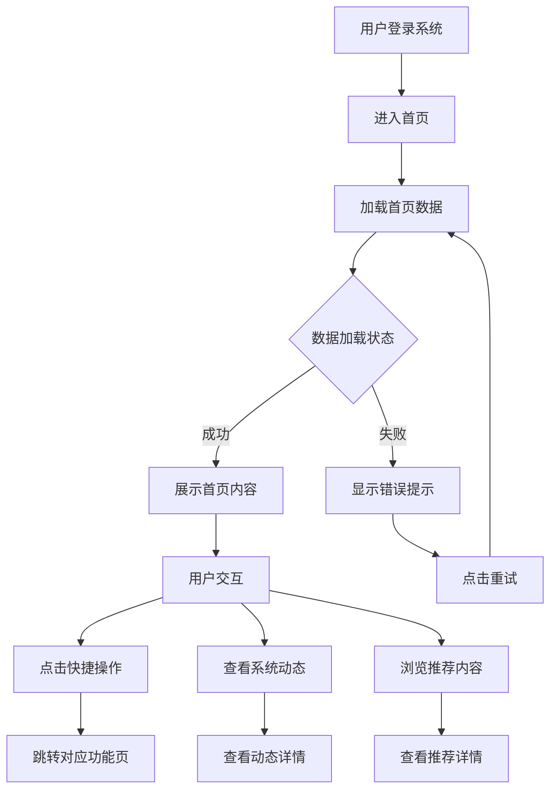
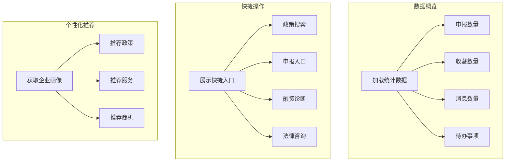

# 首页

> **文档状态**：已完成  
> **最后更新**：2026-03-24  
> **文档作者**：张博  
> **所属模块**：首页

---

## 修订记录

| 版本号 | 修订日期 | 修订内容 | 修订人 | 审核人 |
| :--- | :--- | :--- | :--- | :--- |
| v1.0.0 | 2026-03-24 | 初始版本，完成首页基础功能PRD | 张博 | - |
| v1.0.1 | 2026-03-28 | 优化数据概览展示，增加实时刷新机制 | 张博 | 李明 |
| v1.1.0 | 2026-04-05 | 新增个性化推荐算法，完善快捷操作入口 | 张博 | 王芳 |

---

## 1. 功能描述

首页作为用户登录后的主入口，提供企业数据概览、快捷操作入口、个性化推荐、系统动态等功能，帮助用户快速了解企业状态并进入常用功能模块。

### 1.1 业务背景

企业用户登录系统后，需要快速了解企业的整体运营状况，包括申报进度、消息通知、待办事项等关键信息。同时，用户需要便捷的入口快速进入常用功能模块。首页通过数据可视化、智能推荐、快捷操作等方式，提升用户的工作效率。

### 1.2 业务功能流程图



### 1.3 子功能流程图



---

## 2. 页面布局

### 2.1 页面结构

| 区域 | 位置 | 内容说明 | 占比 |
| :--- | :--- | :--- | :--- |
| Banner区 | 顶部 | 轮播展示重要通知和推荐内容 | 100%宽度 |
| 数据概览区 | Banner下方 | 展示企业关键数据统计 | 100%宽度 |
| 快捷操作区 | 左侧 | 常用功能快捷入口 | 70%宽度 |
| 系统动态区 | 右侧 | 平台公告和动态 | 30%宽度 |
| 推荐内容区 | 底部 | 个性化推荐内容 | 100%宽度 |

### 2.2 响应式布局

| 屏幕尺寸 | 布局调整 |
| :--- | :--- |
| ≥1440px | 标准布局，左右分栏 |
| ≥1024px | 快捷操作和系统动态上下排列 |
| <1024px | 单列布局，全部上下排列 |

---

## 3. 功能模块详述

### 3.1 Banner展示

#### 3.1.1 功能说明
轮播展示平台重要通知、活动推广、新功能上线等信息。

#### 3.1.2 展示规则

| 规则项 | 规则内容 |
| :--- | :--- |
| 轮播间隔 | 5秒自动切换 |
| 指示器 | 底部圆点指示器，可点击切换 |
| 手动切换 | 支持左右滑动和箭头点击 |
| 最大数量 | 最多展示5条Banner |
| 优先级 | 按发布时间和重要性排序 |

#### 3.1.3 Banner数据字段

| 字段名称 | 字段类型 | 是否必填 | 说明 |
| :--- | :--- | :--- | :--- |
| id | string | 是 | Banner唯一标识 |
| title | string | 是 | Banner标题 |
| imageUrl | string | 是 | Banner图片URL |
| linkUrl | string | 否 | 点击跳转链接 |
| sortOrder | number | 是 | 排序顺序 |
| isActive | boolean | 是 | 是否启用 |
| publishTime | string | 是 | 发布时间 |

---

### 3.2 数据概览

#### 3.2.1 功能说明
以卡片形式展示企业关键数据统计，帮助用户快速了解企业状态。

#### 3.2.2 展示指标

| 指标名称 | 指标说明 | 数据来源 | 更新频率 |
| :--- | :--- | :--- | :--- |
| 我的申报 | 当前进行中的申报数量 | 申报系统 | 实时 |
| 我的收藏 | 收藏的政策/服务数量 | 收藏系统 | 实时 |
| 未读消息 | 未读的系统消息数量 | 消息系统 | 实时 |
| 待办事项 | 需要处理的待办数量 | 待办系统 | 实时 |
| 企业积分 | 当前企业积分 | 积分系统 | 实时 |
| 认证状态 | 企业认证状态 | 认证系统 | 实时 |

#### 3.2.3 数据模型

```typescript
interface HomeStatistics {
  applicationCount: number;      // 申报数量
  favoriteCount: number;         // 收藏数量
  unreadMessageCount: number;    // 未读消息
  todoCount: number;             // 待办事项
  points: number;                // 企业积分
  certificationStatus: 'verified' | 'unverified' | 'pending';
}
```

---

### 3.3 快捷操作

#### 3.3.1 功能说明
提供常用功能的快捷入口，方便用户快速进入目标功能。

#### 3.3.2 快捷入口配置

| 入口名称 | 图标 | 跳转路径 | 显示条件 |
| :--- | :--- | :--- | :--- |
| 政策搜索 | SearchOutlined | /policy-center/main | 始终显示 |
| 我的申报 | FormOutlined | /application?view=status | 始终显示 |
| 申报管理 | PieChartOutlined | /application?view=management | 管理员显示 |
| 融资诊断 | FundOutlined | /supply-chain-finance/financing-diagnosis | 始终显示 |
| AI法律咨询 | RobotOutlined | /legal-support/ai-lawyer | 始终显示 |
| 业务大厅 | AppstoreOutlined | /industry/service-match/workbench | 始终显示 |
| 我的收藏 | HeartOutlined | /system/my-favorites | 始终显示 |
| 个人中心 | UserOutlined | /system/personal-center | 始终显示 |

#### 3.3.3 快捷入口数据模型

```typescript
interface QuickAction {
  id: string;
  name: string;
  icon: React.ReactNode;
  path: string;
  permission?: string;    // 权限要求
  sortOrder: number;
  isActive: boolean;
}
```

---

### 3.4 系统动态

#### 3.4.1 功能说明
展示平台最新公告、系统更新、活动通知等动态信息。

#### 3.4.2 动态类型

| 类型 | 说明 | 图标 |
| :--- | :--- | :--- |
| 系统公告 | 平台重要通知 | BellOutlined |
| 功能更新 | 新功能上线通知 | RocketOutlined |
| 活动推广 | 平台活动信息 | GiftOutlined |
| 政策提醒 | 政策到期提醒 | ClockCircleOutlined |

#### 3.4.3 动态数据字段

| 字段名称 | 字段类型 | 是否必填 | 说明 |
| :--- | :--- | :--- | :--- |
| id | string | 是 | 动态唯一标识 |
| type | string | 是 | 动态类型 |
| title | string | 是 | 动态标题 |
| summary | string | 是 | 动态摘要 |
| content | string | 否 | 详细内容 |
| publishTime | string | 是 | 发布时间 |
| isRead | boolean | 是 | 是否已读 |
| linkUrl | string | 否 | 详情链接 |

#### 3.4.4 展示规则

| 规则项 | 规则内容 |
| :--- | :--- |
| 展示数量 | 最多展示5条最新动态 |
| 排序规则 | 按发布时间倒序 |
| 未读标识 | 未读动态显示红点标识 |
| 查看更多 | 点击跳转系统动态列表页 |
| 自动刷新 | 每5分钟自动刷新一次 |

---

### 3.5 个性化推荐

#### 3.5.1 功能说明
基于企业画像和用户行为，智能推荐相关政策、服务、商机。

#### 3.5.2 推荐类型

| 推荐类型 | 说明 | 数据来源 |
| :--- | :--- | :--- |
| 政策推荐 | 匹配企业资质的政策 | 政策中心 |
| 服务推荐 | 企业可能需要的服务 | 产业管理 |
| 商机推荐 | 相关的供需信息 | 产业管理 |
| 融资推荐 | 适合企业的融资产品 | 金融服务 |

#### 3.5.3 推荐算法逻辑

```
1. 获取企业画像（行业、规模、资质、地区）
2. 分析用户行为（浏览历史、收藏记录、申报记录）
3. 匹配相关资源（政策、服务、商机）
4. 计算匹配度评分
5. 按评分排序取Top N
6. 过滤已过期/已申报的内容
```

#### 3.5.4 推荐卡片展示

| 字段名称 | 字段类型 | 说明 |
| :--- | :--- | :--- |
| id | string | 推荐内容ID |
| type | string | 推荐类型 |
| title | string | 标题 |
| summary | string | 摘要描述 |
| matchScore | number | 匹配度分数（0-100） |
| tags | string[] | 标签列表 |
| publishTime | string | 发布时间 |
| deadline | string | 截止日期（政策类） |

---

## 4. 数据交互

### 4.1 接口列表

| 接口名称 | 请求方式 | 接口路径 | 功能说明 |
| :--- | :--- | :--- | :--- |
| 获取首页数据 | GET | /api/home/dashboard | 获取首页所有展示数据 |
| 获取Banner列表 | GET | /api/home/banners | 获取轮播图数据 |
| 获取统计数据 | GET | /api/home/statistics | 获取企业统计数据 |
| 获取快捷入口 | GET | /api/home/quick-actions | 获取快捷操作配置 |
| 获取系统动态 | GET | /api/home/dynamics | 获取系统动态列表 |
| 获取推荐内容 | GET | /api/home/recommendations | 获取个性化推荐 |
| 标记动态已读 | PUT | /api/home/dynamics/:id/read | 标记动态为已读 |

### 4.2 接口响应示例

**获取首页数据接口响应：**

```json
{
  "code": 200,
  "message": "success",
  "data": {
    "banners": [...],
    "statistics": {
      "applicationCount": 5,
      "favoriteCount": 12,
      "unreadMessageCount": 3,
      "todoCount": 2,
      "points": 1500,
      "certificationStatus": "verified"
    },
    "quickActions": [...],
    "dynamics": [...],
    "recommendations": [...]
  }
}
```

---

## 5. 业务规则

### 5.1 数据加载规则

| 规则编号 | 规则名称 | 规则描述 |
| :--- | :--- | :--- |
| BR-001 | 并行加载 | 首页各模块数据并行加载，互不阻塞 |
| BR-002 | 失败降级 | 单个模块加载失败不影响其他模块展示 |
| BR-003 | 缓存机制 | 首页数据缓存5分钟，减少重复请求 |
| BR-004 | 增量更新 | 动态和推荐内容支持增量更新 |

### 5.2 权限控制规则

| 规则编号 | 规则名称 | 规则描述 |
| :--- | :--- | :--- |
| BR-005 | 快捷入口权限 | 根据用户角色显示不同的快捷入口 |
| BR-006 | 数据权限 | 统计数据只展示当前用户有权限查看的数据 |
| BR-007 | 推荐权限 | 推荐内容过滤用户无权限查看的资源 |

### 5.3 展示规则

| 规则编号 | 规则名称 | 规则描述 |
| :--- | :--- | :--- |
| BR-008 | 空状态处理 | 数据为空时显示友好的空状态提示 |
| BR-009 | 加载状态 | 数据加载中显示骨架屏或loading状态 |
| BR-010 | 错误重试 | 加载失败提供重试按钮 |

---

## 6. 异常场景处理

| 异常场景 | 场景说明 | 系统行为 | 提醒方式 | 操作选项 |
| :--- | :--- | :--- | :--- | :--- |
| 首页数据加载失败 | 网络异常或服务器错误 | 显示错误提示，保留已加载数据 | Toast提示 | 重试按钮 |
| Banner加载失败 | 图片加载失败 | 显示默认占位图，其他Banner正常展示 | 无 | 自动跳过 |
| 统计数据加载失败 | 统计服务异常 | 显示"--"占位，其他模块正常 | 无 | 鼠标悬停提示错误 |
| 推荐内容加载失败 | 推荐服务异常 | 隐藏推荐模块或显示默认推荐 | 无 | 无 |
| 未登录访问 | 用户未登录 | 跳转登录页 | 无 | 登录按钮 |

---

## 7. 性能要求

| 性能指标 | 要求 | 说明 |
| :--- | :--- | :--- |
| 首屏加载时间 | ≤ 2s | 首页首屏内容加载完成时间 |
| 接口响应时间 | ≤ 500ms | 单个接口响应时间 |
| 并发请求数 | ≤ 6个 | 同时发起的请求数量限制 |
| 缓存命中率 | ≥ 80% | 首页数据缓存命中率 |

---

## 8. 安全要求

| 安全项 | 要求 |
| :--- | :--- |
| 数据脱敏 | 敏感数据（手机号、身份证号）脱敏展示 |
| XSS防护 | 动态内容渲染前进行XSS过滤 |
| 权限校验 | 每个数据请求都进行权限校验 |
| 防刷机制 | 接口调用频率限制，防止恶意刷取 |

---

**文档结束**
