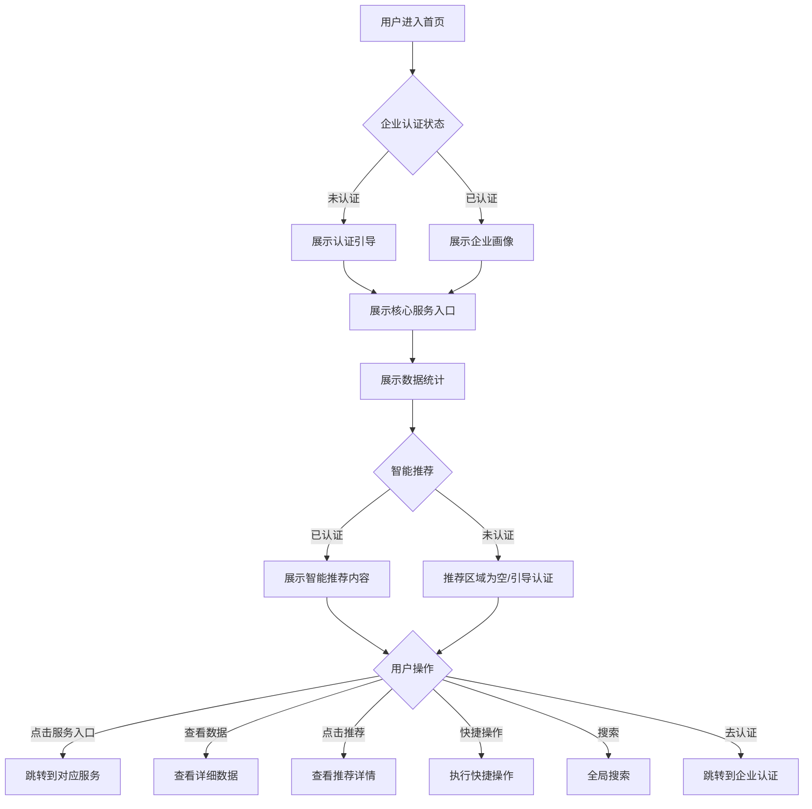

# 首页

#### 1. 功能描述
提供平台门户首页功能，展示平台核心服务入口、数据统计、推荐内容、快捷操作等。作为用户进入平台的第一界面，帮助用户快速了解平台功能并导航到所需服务。支持企业认证状态管理、企业画像展示和智能推荐功能。

##### 1.1 业务功能流程图



#### 2. 业务规则

##### 2.1 内容展示规则
| 规则编号 | 规则名称 | 规则描述 | 适用范围 |
| :--- | :--- | :--- | :--- |
| BR-001 | 个性化展示 | 根据用户角色和偏好展示不同内容 | 首页内容 |
| BR-002 | 数据实时性 | 统计数据实时或准实时更新 | 数据展示 |
| BR-003 | 推荐算法 | 基于用户行为智能推荐内容 | 推荐区域 |
| BR-004 | 缓存机制 | 首页数据适当缓存提高性能 | 数据加载 |

##### 2.2 企业认证规则
| 规则编号 | 规则名称 | 规则描述 |
| :--- | :--- | :--- |
| BR-005 | 认证状态 | 企业分为"未认证"和"已认证"两种状态 |
| BR-006 | 认证引导 | 未认证企业首页展示认证引导入口 |
| BR-007 | 画像展示 | 已认证企业展示企业画像卡片 |
| BR-008 | 信息复用 | 认证信息用于智能推荐匹配 |

##### 2.3 智能推荐规则
| 规则编号 | 规则名称 | 规则描述 |
| :--- | :--- | :--- |
| BR-009 | 推荐前置条件 | 仅已认证企业展示智能推荐内容 |
| BR-010 | 未认证状态 | 未认证企业推荐区域为空或显示认证引导 |
| BR-011 | 推荐匹配 | 根据企业认证信息匹配推荐内容 |
| BR-012 | 推荐类型 | 支持政策、法规、服务三类推荐 |

##### 2.4 快捷操作规则
| 规则编号 | 规则名称 | 规则描述 |
| :--- | :--- | :--- |
| BR-013 | 快捷入口 | 展示用户最常用的功能入口 |
| BR-014 | 最近访问 | 记录并展示最近访问的功能 |
| BR-015 | 待办提醒 | 展示用户的待办事项数量 |
| BR-016 | 消息通知 | 展示未读消息数量 |

#### 3. 数据模型

##### 3.1 实体：HomeData（首页数据）

| 字段名 | 类型 | 必填 | 说明 |
| :--- | :--- | :--- | :--- |
| userWelcome | string | 是 | 用户欢迎语 |
| enterpriseAuthStatus | enum | 是 | 企业认证状态：unauthenticated/authenticated |
| enterpriseProfile | object | 否 | 企业画像信息（已认证时必填） |
| statistics | object | 是 | 统计数据 |
| statistics.policyCount | number | 是 | 政策数量 |
| statistics.regulationCount | number | 是 | 法规数量 |
| statistics.serviceCount | number | 是 | 服务数量 |
| statistics.enterpriseCount | number | 是 | 企业数量 |
| quickEntries | object[] | 是 | 快捷入口列表 |
| recommendations | object[] | 否 | 推荐内容列表（未认证为空） |
| notifications | object[] | 是 | 通知公告列表 |
| todos | object[] | 否 | 待办事项列表 |

##### 3.2 实体：EnterpriseProfile（企业画像）

| 字段名 | 类型 | 必填 | 说明 |
| :--- | :--- | :--- | :--- |
| enterpriseName | string | 是 | 企业名称 |
| enterpriseType | string | 是 | 企业类型 |
| industry | string | 是 | 所属行业 |
| scale | string | 是 | 企业规模 |
| region | string | 是 | 所在地区 |
| businessScope | string[] | 是 | 经营范围 |
| tags | string[] | 否 | 企业标签 |
| logo | string | 否 | 企业Logo |

##### 3.3 实体：QuickEntry（快捷入口）

| 字段名 | 类型 | 必填 | 说明 |
| :--- | :--- | :--- | :--- |
| id | string | 是 | 入口ID |
| name | string | 是 | 入口名称 |
| icon | string | 是 | 图标 |
| route | string | 是 | 路由地址 |
| badge | number | 否 | 角标数字 |
| color | string | 否 | 主题颜色 |

##### 3.4 实体：Recommendation（推荐内容）

| 字段名 | 类型 | 必填 | 说明 |
| :--- | :--- | :--- | :--- |
| id | string | 是 | 内容ID |
| type | enum | 是 | 类型：policy/regulation/service |
| title | string | 是 | 内容标题 |
| summary | string | 是 | 内容摘要 |
| image | string | 否 | 封面图片 |
| url | string | 是 | 详情链接 |
| publishTime | string | 是 | 发布时间 |
| matchScore | number | 是 | 匹配度分数 |
| matchReason | string | 否 | 匹配原因说明 |

#### 4. 功能详述

##### 4.1 欢迎区域

**功能说明**：
- 展示平台欢迎语和品牌信息
- 根据用户登录状态和企业认证状态显示不同内容

**游客视图**：
```
欢迎来到璟智通
企业政策与法律服务一站式平台
[立即注册] [登录]
```

**登录用户视图**：
```
欢迎回来，{用户名}
今天是 {日期}，{问候语}
```

##### 4.2 企业认证状态区

**功能说明**：
- 展示企业认证状态
- 未认证企业显示认证引导
- 已认证企业显示企业画像

**未认证状态展示**：
| 元素 | 说明 |
| :--- | :--- |
| 状态标识 | "未认证"标签 |
| 提示文案 | "完成企业认证，解锁智能推荐" |
| 认证按钮 | "立即认证"按钮 |
| 认证权益 | 认证后可获得的服务列表 |

**已认证状态展示 - 企业画像卡片**：
| 字段 | 说明 |
| :--- | :--- |
| 企业Logo | 企业标识图片 |
| 企业名称 | 认证企业全称 |
| 企业类型 | 企业性质标签 |
| 所属行业 | 行业分类 |
| 企业规模 | 规模标签 |
| 所在地区 | 地区信息 |
| 经营范围 | 主营业务标签 |
| 企业标签 | 特色标签 |
| 编辑入口 | 修改企业信息 |

**认证引导流程**：
```
用户点击"立即认证" --> 跳转到企业认证页面 --> 填写认证信息 --> 提交审核 --> 认证完成返回首页
```

##### 4.3 核心服务入口

**功能说明**：
- 展示平台核心功能模块入口
- 帮助用户快速导航到所需服务

**服务入口列表**：
| 入口名称 | 图标 | 路由 | 说明 |
| :--- | :--- | :--- | :--- |
| 智慧政策 | BookOutlined | /policy-center/main | 智能政策推荐 |
| 法规查询 | SafetyOutlined | /legal-support/regulation-query | 法律法规查询 |
| AI 问答 | RobotOutlined | /legal-support/ai-lawyer | 智能法律问答 |
| 业务大厅 | AppstoreOutlined | /industry/service-match/workbench | 企业服务大厅 |
| 采购大厅 | ShoppingOutlined | /industry/service-match/procurement-hall | 采购需求大厅 |
| 融资诊断 | DollarOutlined | /supply-chain-finance/financing-diagnosis | 企业融资诊断 |

**入口展示**：
- 图标+文字卡片形式
- 悬停显示功能简介
- 点击跳转到对应页面

##### 4.4 平台数据统计

**功能说明**：
- 展示平台核心数据指标
- 增强平台可信度和吸引力

**统计数据**：
| 指标名称 | 说明 | 展示格式 |
| :--- | :--- | :--- |
| 政策数量 | 平台收录政策数 | 12,580+ |
| 法规数量 | 平台收录法规数 | 8,960+ |
| 服务数量 | 平台服务数量 | 3,520+ |
| 企业数量 | 入驻企业数量 | 5,680+ |
| 对接次数 | 成功对接次数 | 12,800+ |
| 融资金额 | 累计融资金额 | 50亿+ |

**展示效果**：
- 数字动态增长动画
- 数字大字体突出显示
- 下方显示指标名称

##### 4.5 智能推荐内容区

**功能说明**：
- 基于企业认证信息智能推荐内容
- 未认证企业显示认证引导
- 已认证企业展示个性化推荐

**未认证企业展示**：
```
┌─────────────────────────────────────┐
│  🤔 暂无智能推荐                      │
│                                      │
│  完成企业认证后，我们将根据您的企业    │
│  信息为您智能匹配适合的政策、法规和    │
│  服务                                  │
│                                      │
│  [立即认证]                          │
└─────────────────────────────────────┘
```

**已认证企业展示**：

**推荐类型**：
| 类型 | 说明 | 展示内容 |
| :--- | :--- | :--- |
| 推荐政策 | 适合企业的政策 | 政策标题、补贴金额、截止时间、匹配度 |
| 热门法规 | 近期热门法规 | 法规标题、浏览量、标签、匹配度 |
| 精选服务 | 优质企业服务 | 服务名称、企业名称、评分、匹配度 |

**推荐卡片信息**：
| 字段 | 说明 |
| :--- | :--- |
| 标题 | 内容标题 |
| 标签 | 类型标签 |
| 摘要 | 内容简介 |
| 匹配度 | 与企业匹配度百分比 |
| 匹配原因 | 为什么推荐（如"符合您的行业"） |
| 时间 | 发布时间 |
| 数据 | 浏览量/申请数等 |

**推荐算法说明**：
| 匹配维度 | 权重 | 说明 |
| :--- | :--- | :--- |
| 行业匹配 | 40% | 推荐内容与企业的行业相关性 |
| 地区匹配 | 30% | 推荐内容与企业的地区相关性 |
| 规模匹配 | 20% | 推荐内容适合的企业规模 |
| 经营范围 | 10% | 推荐内容与经营范围的匹配度 |

##### 4.6 快捷操作区

**功能说明**：
- 展示用户常用功能的快捷入口
- 显示待办事项和消息提醒

**快捷操作**：
| 操作 | 图标 | 说明 | 角标 |
| :--- | :--- | :--- | :--- |
| 我的申报 | FormOutlined | 查看申报记录 | 待办数量 |
| 我的收藏 | HeartOutlined | 查看收藏内容 | 新收藏数 |
| 消息中心 | BellOutlined | 查看系统消息 | 未读数量 |
| 个人中心 | UserOutlined | 查看个人信息 | - |
| 我的企业 | BankOutlined | 管理企业信息 | - |
| 发布服务 | PlusOutlined | 发布服务供给 | - |

##### 4.7 通知公告区

**功能说明**：
- 展示平台重要通知和公告
- 展示行业动态和资讯

**公告类型**：
| 类型 | 说明 |
| :--- | :--- |
| 平台公告 | 平台功能更新、维护通知 |
| 政策动态 | 最新政策发布、解读 |
| 行业资讯 | 行业相关新闻和动态 |
| 活动推广 | 平台活动、优惠推广 |

**公告列表字段**：
| 字段 | 说明 |
| :--- | :--- |
| 标题 | 公告标题 |
| 类型 | 公告类型标签 |
| 时间 | 发布时间 |
| 是否置顶 | 置顶标识 |

##### 4.8 全局搜索

**功能说明**：
- 提供全平台内容搜索入口
- 支持搜索政策、法规、服务等

**搜索字段**：
| 字段名称 | 字段说明 | 是否必填 | 字段类型 | 说明 |
| :--- | :--- | :--- | :--- | :--- |
| 搜索关键词 | 搜索内容 | 否 | 文本输入 | 支持模糊搜索 |

**搜索范围**：
| 范围 | 说明 |
| :--- | :--- |
| 政策 | 搜索政策标题、内容 |
| 法规 | 搜索法规标题、条款 |
| 服务 | 搜索服务名称、企业 |
| 全部 | 搜索所有类型内容 |

**搜索建议**：
- 输入时显示热门搜索词
- 显示搜索历史记录
- 支持搜索联想

##### 4.9 轮播Banner

**功能说明**：
- 展示平台重要推广内容
- 支持多图轮播

**Banner内容**：
| 内容 | 说明 |
| :--- | :--- |
| 平台介绍 | 平台功能和服务介绍 |
| 活动推广 | 平台活动、优惠推广 |
| 新功能上线 | 新功能发布宣传 |
| 成功案例 | 平台成功案例展示 |

**Banner规格**：
- 尺寸：1200x400px
- 格式：JPG/PNG
- 支持点击跳转
- 自动轮播+手动切换

#### 5. 异常场景处理

| 异常场景 | 场景说明 | 系统行为 | 提醒方式 | 操作选项 |
| :--- | :--- | :--- | :--- | :--- |
| 数据加载失败 | 首页数据加载失败 | 显示默认数据 | 提示"数据加载失败" | 重试加载 |
| 接口异常 | 统计接口异常 | 显示缓存数据 | 静默处理 | 自动重试 |
| 网络异常 | 网络连接失败 | 显示离线页面 | 提示"网络异常" | 检查网络 |
| 认证状态获取失败 | 无法获取认证状态 | 默认显示未认证 | 提示"认证状态获取失败" | 刷新页面 |
| 推荐内容加载失败 | 推荐接口异常 | 显示空状态 | 提示"推荐内容加载失败" | 重试加载 |

#### 6. 权限控制

| 功能 | 游客 | 普通会员 | VIP会员 |
| :--- | :--- | :--- | :--- |
| 查看首页 | ✓ | ✓ | ✓ |
| 查看统计 | ✓ | ✓ | ✓ |
| 企业认证入口 | ✗ | ✓ | ✓ |
| 查看企业画像 | ✗ | ✓ | ✓ |
| 智能推荐 | ✗ | ✓（需认证） | ✓（需认证） |
| 快捷操作 | 部分 | ✓ | ✓ |
| 待办提醒 | ✗ | ✓ | ✓ |
| 消息通知 | ✗ | ✓ | ✓ |

#### 7. 数据关联

| 关联功能 | 关联方式 | 说明 |
| :--- | :--- | :--- |
| 企业认证 | 跳转认证 | 点击认证引导跳转到认证页面 |
| 企业画像 | 数据展示 | 展示企业认证信息 |
| 智慧政策 | 服务入口 | 点击跳转到政策中心 |
| 法规查询 | 服务入口 | 点击跳转到法规查询 |
| AI 问答 | 服务入口 | 点击跳转到AI问答 |
| 业务大厅 | 服务入口 | 点击跳转到业务大厅 |
| 采购大厅 | 服务入口 | 点击跳转到采购大厅 |
| 融资诊断 | 服务入口 | 点击跳转到融资诊断 |
| 个人中心 | 快捷操作 | 点击跳转到个人中心 |
| 消息中心 | 快捷操作 | 点击跳转到消息中心 |
